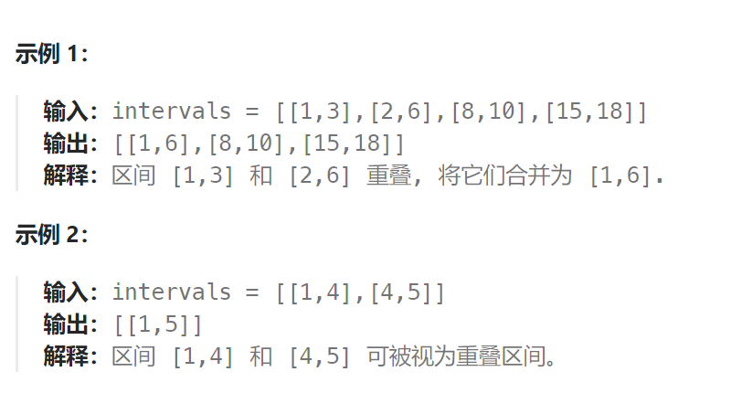

## 题目

以数组 `intervals` 表示若干个区间的集合，其中单个区间为 `intervals[i] = [starti, endi]` 。请你合并所有重叠的区间，并返回 *一个不重叠的区间数组，该数组需恰好覆盖输入中的所有区间* 。



## 题解

```go
func merge(intervals [][]int) [][]int {
    if len(intervals) == 1 {
        return intervals
    }
    sort.Slice(intervals ,func(i, j int) bool {
        return intervals[i][0] < intervals[j][0]  // 按照区间左边界升序排序
    })
    left, right := intervals[0][0], intervals[0][1]  // 下一个要返回的区间的左右边界
    res := make([][]int, 0)

    i := 1
    for ; i < len(intervals); i++ {
        cur := intervals[i]
        if cur[0] > right {   // 当前区间与上一个要返回的区间不重叠
            res = append(res, []int{left, right})
            left, right = cur[0], cur[1]
        } else {   // 当前区间与上一个要返回的区间重叠
            right = getMax(right, cur[1])    // 检查是否要扩展返回区间的右边界
        }
    }
    // 返回最后一个合并区间(每一个区间会在检测到下一个与其不重叠的区间时提交, 最后一个区间没有这个机会, 因此要额外返回)
    if i == len(intervals) {  
        res = append(res, []int{left, right})
    }
    return res
}
```

