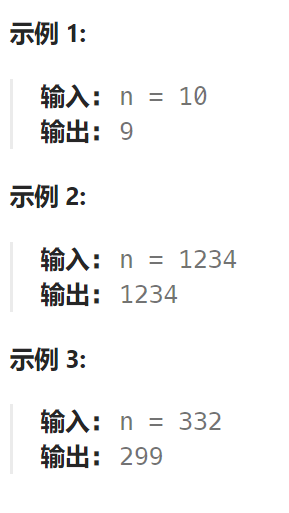

## 题目

当且仅当每个相邻位数上的数字 `x` 和 `y` 满足 `x <= y` 时，我们称这个整数是**单调递增**的。

给定一个整数 `n` ，返回 *小于或等于 `n` 的最大数字，且数字呈 **单调递增*** 。



## 题解

例如：98，一旦出现strNum[i - 1] > strNum[i]的情况（非单调递增），首先想让strNum[i - 1]--，然后strNum[i]给为9，这样这个整数就是89，即小于98的最大的单调递增整数。

此时是从前向后遍历还是从后向前遍历呢？

从前向后遍历的话，遇到strNum[i - 1] > strNum[i]的情况，让strNum[i - 1]减一，但此时如果strNum[i - 1]减一了，可能又小于strNum[i - 2]。

这么说有点抽象，举个例子，数字：332，从前向后遍历的话，那么就把变成了329，此时2又小于了第一位的3了，真正的结果应该是299。

那么从后向前遍历，就可以重复利用上次比较得出的结果了，从后向前遍历332的数值变化为：332 -> 329 -> 299

确定了遍历顺序之后，那么此时局部最优就可以推出全局，找不出反例，试试贪心。

```go
func monotoneIncreasingDigits(n int) int {
    nBytes := []byte(strconv.Itoa(n)) 
    for i := len(nBytes)-2; i >= 0; i-- {
        if nBytes[i] > nBytes[i+1] {
            nBytes[i]--
            nBytes[i+1] = '9'
        }
    }
    newN, _ := strconv.Atoi(string(nBytes))
    return newN
}
```

