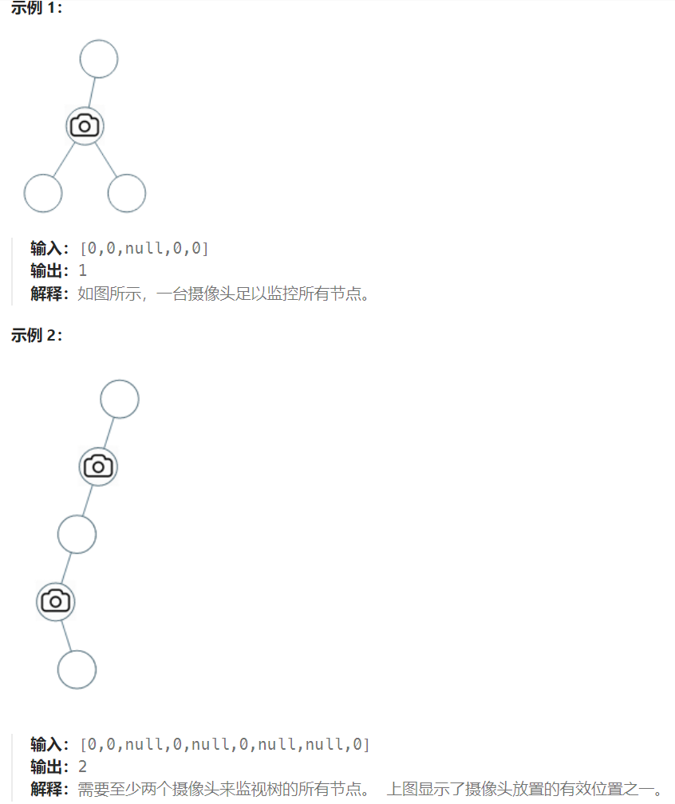

## 题目

给定一个二叉树，我们在树的节点上安装摄像头。

节点上的每个摄影头都可以监视**其父对象、自身及其直接子对象。**

计算监控树的所有节点所需的最小摄像头数量。



## 题解

从题目中示例，其实可以得到启发，**我们发现题目示例中的摄像头都没有放在叶子节点上！**

这是很重要的一个线索，摄像头可以覆盖上中下三层，如果把摄像头放在叶子节点上，就浪费的一层的覆盖。

所以把摄像头放在叶子节点的父节点位置，才能充分利用摄像头的覆盖面积。

**所以我们要从下往上看，局部最优：让叶子节点的父节点安摄像头，所用摄像头最少，整体最优：全部摄像头数量所用最少！**

此时，大体思路就是从低到上，先给**叶子节点父节点**放个摄像头，然后**隔两层节点放一个摄像头**，直至到二叉树头结点。

大致呈现如下分布：

​																							摄像头

​																							覆盖区域

​																							覆盖区域

​																							摄像头

​																							叶子节点


来看看这个状态应该如何转移，先来看看每个节点可能有几种状态：

有如下三种：

- 该节点无覆盖
- 本节点有覆盖 
- 本节点有摄像头

我们分别有三个数字来表示：

- 0：该节点无覆盖
- 1：本节点有覆盖
- 2：本节点有摄像头 

```go
type NodeInfo struct {
    camera int  // 当前节点为头结点的子树上的摄像头数量
    state int   // 当前节点的状态:  0: 不在监控范围内   1: 在监控范围内  2: 有摄像头
}
func minCameraCover(root *TreeNode) int {
    rootInfo := helper(root)
    if rootInfo.state == 0 {   // 重要：root 之上没有更上层的节点，尽管两个子节点都有覆盖，根节点也要额外放一个摄像头
        return rootInfo.camera + 1
    } else {
        return rootInfo.camera
    }
}
func helper(root *TreeNode) *NodeInfo {
    if root == nil {
        return &NodeInfo{0, 1}   // 不存在的节点视为在监控范围内
    }
    left := helper(root.Left)
    right := helper(root.Right)
    // 1. 左右都是在范围内，但是没有摄像头, 那么当前节点就是无覆盖的
    // 重要: 两个孩子节点都在覆盖范围内, 为了尽量节省摄像头的数量, 当前节点不能增加摄像头，由再上一层加摄像头来覆盖此节点
    if left.state == 1 && right.state == 1 {
        c := left.camera + right.camera
        return &NodeInfo{c, 0}
    }
    // 2. 左右只要一个节点不在覆盖范围内, 当前节点就必须需要一个摄像头
    if left.state == 0 || right.state == 0 {
        c := left.camera + right.camera + 1
        return &NodeInfo{c, 2}
    }
    // 3. 左右只要一个有摄像头, 且另一个不属于"不在覆盖范围内", 那么当前节点就是在覆盖范围内
    if left.state == 2 || right.state == 2 {
        c := left.camera + right.camera
        return &NodeInfo{c, 1}
    }
    return nil
}
```

