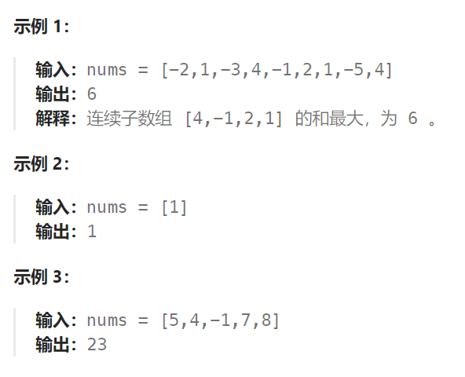

## 题目：

给你一个整数数组 `nums` ，请你找出一个具有最大和的连续子数组（子数组最少包含一个元素），返回其最大和。

**子数组** 是数组中的一个连续部分。



## 题解：

### 方法一：贪心算法

这里的贪心策略是：每次轮到 nums[i], 如果前面的累加和 < 0 (负收益), 那么就重新开启一个新的子数组

```go
func maxSubArray(nums []int) int {
    n := len(nums)
    if n == 1 {
        return nums[0]
    }
    maxSum := math.MinInt
    lastSum := 0
    // 每次轮到 nums[i], 如果前面的累加和 < 0 (负收益), 那么就重新开启一个新的子数组
    for i := 0; i < n; i++ {
        lastSum += nums[i]
        maxSum = getMax(maxSum, lastSum)
        if lastSum < 0 {
            lastSum = 0
        }
    }    
    return maxSum
}
func getMax(a, b int) int {
    if a > b {
        return a
    } else {
        return b
    }
}
```

### 方法二：动态规划

```go
func maxSubArray(nums []int) int {
    n := len(nums)
    dp := make([]int, n)
    dp[0] = nums[0]
    for i := 1; i < n; i++ {
        dp[i] = getMax(nums[i], dp[i-1] + nums[i])
    }
    maxVal := math.MinInt
    for i := range dp {
        if dp[i] > maxVal {
            maxVal = dp[i]
        }
    }
    return maxVal
}
func getMax(a, b int) int {
    if a > b {
        return a
    } else {
        return b
    }
}
```

