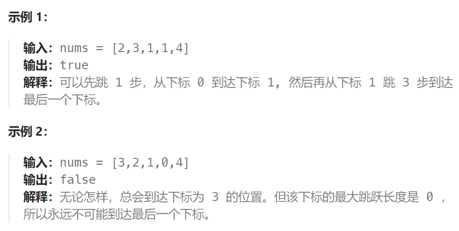

## 题目

给你一个非负整数数组 `nums` ，你最初位于数组的 **第一个下标** 。数组中的每个元素代表你在该位置可以跳跃的最大长度。

判断你是否能够到达最后一个下标，如果可以，返回 `true` ；否则，返回 `false` 。



## 题解

### 方法一：贪心算法

刚看到本题一开始可能想：当前位置元素如果是 3，我究竟是跳一步呢，还是两步呢，还是三步呢，究竟跳几步才是最优呢？

其实跳几步无所谓，关键在于可跳的覆盖范围！

只要目标位置在这个范围内，别管是怎么跳的，反正一定可以跳过来。

**那么这个问题就转化为跳跃覆盖范围究竟可不可以覆盖到终点！**

每次移动取最大跳跃步数（得到该位置的最大的覆盖范围），每移动一个单位，就更新最大覆盖范围。

**贪心算法局部最优解：每次取最大跳跃步数（取最大覆盖范围），整体最优解：最后得到整体最大覆盖范围，看是否能到终点**。

```go
func canJump(nums []int) bool {
    n := len(nums)
    far := 0   // 当前能到达的最远的下标
    for i := 0; i <= far; i++ {   // far 需要根据每次迭代的结果进行更新
        next := i + nums[i]
        if next >= n-1 {    // 能够直接到达最后一个下标
            return true
        }
        far = getMax(far, next)  // 从当前 0 ~ far 位置跳跃所能到达的下一个最远的下标
    }
    return false
}
// 或者
func canJump(nums []int) bool {
    n := len(nums)
    curfar := 0   // 当前能到达的最远的下标
    nextfar := 0  // 下一个最远边界下标
    for i := 0; i <= n-1; i++ {   
        nextfar = getMax(nextfar, i + nums[i])
        if i == curfar {
            curfar = nextfar
            if curfar >= n-1 {  // 能够直达终点
                return true
            }
        }
    }
    return false
}
func getMax(a, b int) int {
    if a > b {
        return a
    } else {
        return b
    }
}
```


### 方法二：动态规划

```go
func canJump(nums []int) bool {
    n := len(nums)
    // dp[i]表示: 能否到达索引位置 i
    dp := make([]bool, n)
    // base case: 初始位置就是 0，肯定能到达
    dp[0] = true

    for pos := 1; pos <= n-1; pos++ {
        dp[pos] = false
        for lastPos := 0; lastPos < pos; lastPos++ {
            if lastPos + nums[lastPos] < pos {   // 从lastPos无法一步跳到当前pos
                continue   // 尝试其他的lastPos
            } else {   // 从lastPos可以一步跳到当前pos
                dp[pos] = dp[pos] || dp[lastPos]
            }
        }
    }
    return dp[n-1]
}
```

