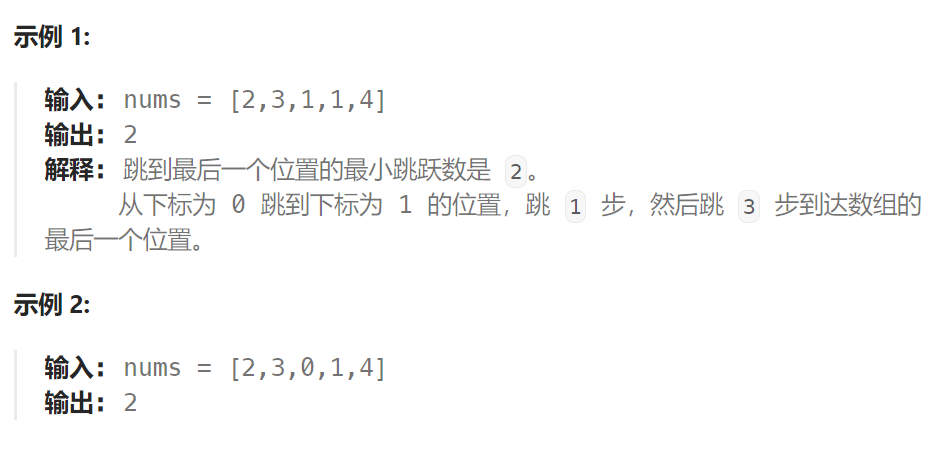

## 题目

给定一个长度为 `n` 的 **0 索引**整数数组 `nums`。初始位置为 `nums[0]`。

每个元素 `nums[i]` 表示从索引 `i` 向前跳转的最大长度。换句话说，如果你在 `nums[i]` 处，你可以跳转到任意 `nums[i + j]` 处:

- `0 <= j <= nums[i]` 
- `i + j < n`

返回到达 `nums[n - 1]` 的最小跳跃次数。生成的测试用例可以到达 `nums[n - 1]`。



## 题解

### 方法一：贪心算法

本题要计算最少步数，那么就要想清楚什么时候步数才一定要加一呢？

贪心的思路，局部最优：当前可移动距离尽可能多走，如果还没到终点，步数再加一。整体最优：一步尽可能多走，从而达到最少步数。

思路虽然是这样，但在写代码的时候还不能真的能跳多远就跳多远，那样就不知道下一步最远能跳到哪里了。

**所以真正解题的时候，要从覆盖范围出发，不管怎么跳，覆盖范围内一定是可以跳到的，以最小的步数增加覆盖范围，覆盖范围一旦覆盖了终点，得到的就是最少步数！**

**这里需要统计两个覆盖范围，当前这一步的最大覆盖和下一步最大覆盖**。

如果移动下标达到了当前这一步的最大覆盖最远距离了，还没有到终点的话，那么就必须再走一步来增加覆盖范围，直到覆盖范围覆盖了终点。

如图：


从图中可以看出来，就是移动下标达到了当前覆盖的最远距离下标时，步数就要加一，来增加覆盖距离。最后的步数就是最少步数。

这里还是有个特殊情况需要考虑，当移动下标达到了当前覆盖的最远距离下标时

- 如果当前覆盖最远距离下标不是是集合终点，步数就加一，还需要继续走。
- 如果当前覆盖最远距离下标就是是集合终点，步数不用加一，因为不能再往后走了。

```go
func jump(nums []int) int {
    n := len(nums)
    if n <= 1 {
        return 0
    }
    curBorder, nextBorder := 0,0  // 当前移动边界, 再移动一步后的移动边界
    res := 0   // 返回的最小步数
    for i := 0; i < n; i++ {
        nextBorder = getMax(nextBorder, i + nums[i]) // 在当前 curBorder范围 内再往后一步能到达的最远边界
        if i == curBorder {   // 当前已经到达了边界，但是还没有到达终点，因此需要再走一步
            res++
            curBorder = nextBorder   // 更新移动边界
            if curBorder >= n-1 {   // 再走一步后，终点在移动边界内部
                break
            }
        }
    }
    return res
}
func getMax(a, b int) int {
    if a > b {
        return a
    } else {
        return b
    }
}
```

### 方法二：动态规划

```go
func jump(nums []int) int {
    n := len(nums)
    // dp[i]表示: 到达索引位置 i 时需要的最小跳跃次数
    dp := make([]int, n)
    // base case: 初始位置就是 0，不需要跳跃
    dp[0] = 0  
    for pos := 1; pos <= n-1; pos++ {
        dp[pos] = math.MaxInt
        for lastPos := 0; lastPos < pos; lastPos++ {
            if lastPos + nums[lastPos] < pos {   // 从lastPos无法一步跳到当前pos
                continue   // 尝试其他的lastPos
            } else {   // 从lastPos可以一步跳到当前pos
                dp[pos] = getMin(dp[pos], dp[lastPos] + 1)
            }
        }
    }
    return dp[n-1]
}
func getMin(a, b int) int {
    if a < b {
        return a
    } else {
        return b
    }
}
```

