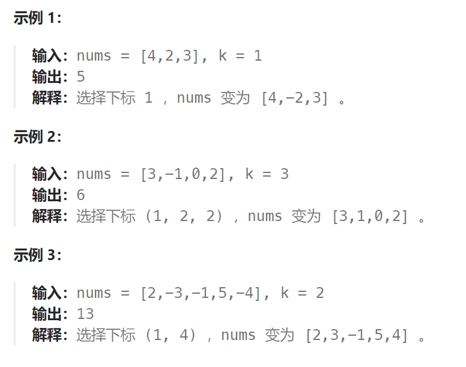

## 题目

给你一个整数数组 `nums` 和一个整数 `k` ，按以下方法修改该数组：

- 选择某个下标 `i` 并将 `nums[i]` 替换为 `-nums[i]` 。

重复这个过程恰好 `k` 次。可以多次选择同一个下标 `i` 。

以这种方式修改数组后，返回数组 **可能的最大和** 。



## 题解

本体是两个贪心的结合：

贪心一：局部最优：让绝对值大的负数变为正数，当前数值达到最大，整体最优：整个数组和达到最大。

贪心二：如果将负数都转变为正数了，K依然大于0，此时的问题是一个有序正整数序列，如何转变K次正负，让 数组和 达到最大。那么又是一个贪心：局部最优：只找数值最小的正整数进行反转，当前数值和可以达到最大（例如正整数数组{5, 3, 1}，反转1 得到-1 比 反转5得到的-5 大多了），全局最优：整个 数组和 达到最大。

那么本题的解题步骤为：

- 第一步：将数组按照绝对值大小从大到小排序，**注意要按照绝对值的大小**
- 第二步：从前向后遍历，遇到负数将其变为正数，同时K--
- 第三步：如果K还大于0，那么反复转变数值最小的元素，将K用完
- 第四步：求和

```go
func largestSumAfterKNegations(nums []int, k int) int {
    // 1.按照绝对值大小进行降序序排序
    sort.Slice(nums, func(i,j int) bool {return abs(nums[i]) > abs(nums[j])  })
    // 2.先将绝对值大的负数转化为正数(如果k仍大于零)
    for i := 0; i < len(nums); i++ {
        if k == 0 {
            break
        } else {
            if nums[i] < 0 {
                nums[i] = -nums[i]   // 把绝对值最大的负数先转化为正数
                k--
            }
        }
    }
    // 3.将绝对值小的正数转化为负数
    if k % 2 == 0 {
        return sum(nums)
    } else {
        nums[len(nums)-1] = -nums[len(nums)-1]  // 把绝对值最小的正数转化为负数
        return sum(nums)
    }
}

func sum(arr []int) int {
    sum := 0
    for i := 0; i < len(arr);i++ {
        sum += arr[i]
    }
    return sum
}

func abs(a int) int {
    if a < 0 {
        return -a
    } else {
        return a
    }
}
```

