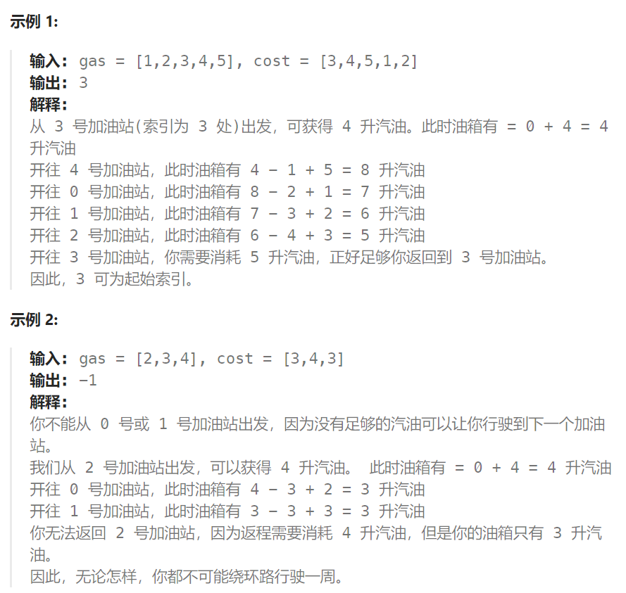

## 题目

在一条环路上有 `n` 个加油站，其中第 `i` 个加油站有汽油 `gas[i]` 升。

你有一辆油箱容量无限的的汽车，从第 `i` 个加油站开往第 `i+1` 个加油站需要消耗汽油 `cost[i]` 升。你从其中的一个加油站出发，开始时油箱为空。

给定两个整数数组 `gas` 和 `cost` ，如果你可以按顺序绕环路行驶一周，则返回出发时加油站的编号，否则返回 `-1` 。如果存在解，则 **保证** 它是 **唯一** 的。



## 题解

1. 每个加油站的剩余量rest[i]为gas[i] - cost[i]。

2. i从0开始累加rest[i]，和记为curSum，一旦curSum小于零，说明[0, i]区间都不能作为起始位置，原因：假设 0~i 之间的某个加油站 k 可以越过 i，我们知道从加油站 0 出发是可以到达1~ i - 1 间的任何一个加油站的，因此从 0 一定是可以到达 k 的，也就意味着：从 k 出发能够越过 i  ==  从 0 出发能够越过 i。这明显与条件相悖。

3. 那么起始位置从i+1算起，再从0计算curSum。
4. **从左向右开始，第一个**满足从 i 到最后一个加油站end，curSum 一直满足 >= 0的 i 才可能是我们想要的解，这是为什么呢？有没有可能真正的解实际存在这个起点之后呢？
5. 假设真正的解是 i ~ end 之间的某一个 x，那么 x 一定可以环绕一圈再到达 x，期间汽车肯定会越过 i。而 i 是可以到达 x 的，意味着如果从 i 出发也可以重新回到 i 。那么此题就会有至少两个解，违背题意。

```go
func canCompleteCircuit(gas []int, cost []int) int {
    curSum := 0
    totalSum := 0
    start := 0   // 从第 0 个加油站开始测试
    for i := 0; i < len(gas); i++ {
        rest := gas[i] - cost[i]
        curSum += rest
        totalSum += rest
        if curSum < 0 {  // [0,i] 之间的加油站都不能成为起点
            start = i+1     // 重新从 i+1 加油站开始测试
            curSum = 0      // 汽车油箱归零
        }
    }
    if totalSum < 0 {  // 总油耗 > 总油量
        return -1
    } else {
        return start  // start 是第一个满足从 start~len(gas)，期间 curSum 一直 >= 0
    }
}
```

