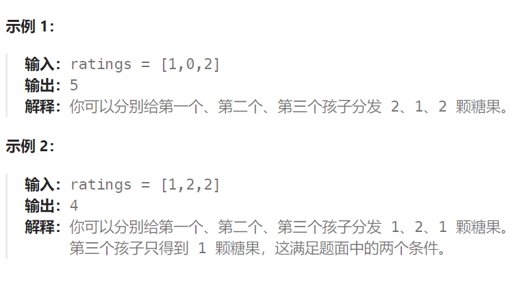

## 题目

`n` 个孩子站成一排。给你一个整数数组 `ratings` 表示每个孩子的评分。

你需要按照以下要求，给这些孩子分发糖果：

- 每个孩子至少分配到 `1` 个糖果。
- 相邻两个孩子评分更高的孩子会获得更多的糖果。

请你给每个孩子分发糖果，计算并返回需要准备的 **最少糖果数目** 。



## 题解

这道题目一定是要确定一边之后，再确定另一边，例如比较每一个孩子的左边，然后再比较右边，**如果两边一起考虑一定会顾此失彼**。

1. 先确定右边评分大于左边的情况（也就是从前向后遍历）。此时局部最优：只要右边评分比左边大，右边的孩子就多一个糖果，全局最优：相邻的孩子中，评分高的右孩子获得比左边孩子更多的糖果。如果ratings[i] > ratings[i - 1] 那么[i]的糖 一定要比[i - 1]的糖多一个，所以贪心：candyVec[i] = candyVec[i - 1] + 1
2. 再确定左孩子大于右孩子的情况（从后向前遍历）。如果 ratings[i] > ratings[i + 1]，此时candyVec[i]（第i个小孩的糖果数量）就有两个选择了，一个是candyVec[i + 1] + 1（从右边这个加1得到的糖果数量），一个是candyVec[i]（之前比较右孩子大于左孩子得到的糖果数量）。那么又要贪心了，局部最优：取candyVec[i + 1] + 1 和 candyVec[i] 最大的糖果数量，保证第i个小孩的糖果数量既大于左边的也大于右边的。全局最优：相邻的孩子中，评分高的孩子获得更多的糖果。

```go
func candy(ratings []int) int {
    candyAllo := make([]int, len(ratings))
    sum := 0
    // 1. 先正序遍历, 如果当前 ratings[i] > ratings[i-1], 能够保证 candyAllo[i] == candyAllo[i-1] + 1
    candyAllo[0] = 1
    for i := 1; i < len(candyAllo); i++ {
        if ratings[i] > ratings[i-1] {
            candyAllo[i] = candyAllo[i-1] + 1
        } else {  // ratings[i] <= ratings[i-1]
            candyAllo[i] = 1   // 不满足条件2, 使其满足条件1, 分配1糖果即可, 因为目标是糖果量最少
        }
    }
    // 2. 再倒序遍历, 如果 ratings[i] > ratings[i+1], 能够保证 candyAllo[i] == candyAllo[i+1] + 1
    // 同时也要继承 1 的结果，也就是说 candyAllo[i] = getMax(candyAllo[i], candyAllo[i+1] + 1)
    // 这样子，能够保证第i个小孩的左右都满足条件
    sum += candyAllo[len(candyAllo)-1]   // 最后一个孩子没有更右侧的比较对象，就用第一轮的糖果数
    for i := len(candyAllo)-2; i >= 0; i-- {
        if ratings[i] > ratings[i+1] {
            candyAllo[i] = getMax(candyAllo[i], candyAllo[i+1]+1)
        } 
        // 对于 ratings[i] <= ratings[i+1], 保持第一轮的 candyAllo[i] 即可
        sum += candyAllo[i]
    }
    return sum
}
func getMax(a, b int) int {
    if a > b {
        return a
    } else {
        return b
    }
}
```

