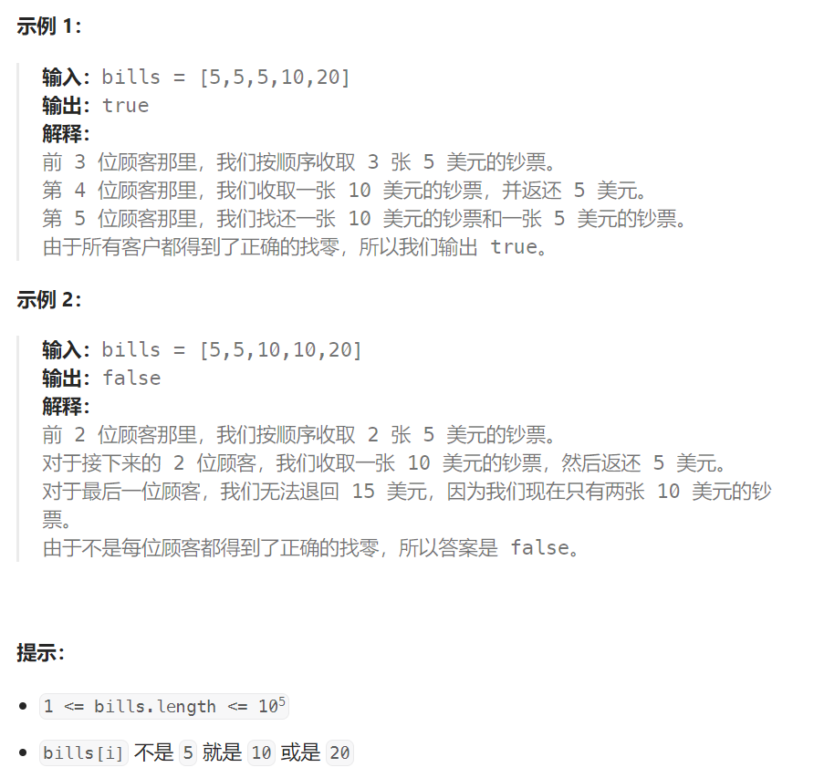

## 题目：

在柠檬水摊上，每一杯柠檬水的售价为 `5` 美元。顾客排队购买你的产品，（按账单 `bills` 支付的顺序）一次购买一杯。

每位顾客只买一杯柠檬水，然后向你付 `5` 美元、`10` 美元或 `20` 美元。你必须给每个顾客正确找零，也就是说净交易是每位顾客向你支付 `5` 美元。

注意，一开始你手头没有任何零钱。

给你一个整数数组 `bills` ，其中 `bills[i]` 是第 `i` 位顾客付的账。如果你能给每位顾客正确找零，返回 `true` ，否则返回 `false` 。



## 题解：

由于存在：`bills[i] ` 不是 `5` 就是 `10` 或是 `20`  这个限定条件，因此**可供我们做判断的空间其实非常少**

只需要维护三种金额的数量，5，10和20。

有如下三种情况：

- 情况一：账单是5，直接收下。
- 情况二：账单是10，消耗一个5，增加一个10
- 情况三：账单是20，优先消耗一个10和一个5，如果不够，再消耗三个5

此时大家就发现 情况一，情况二，都是固定策略，都不用我们来做分析了，而唯一不确定的其实在情况三。

而情况三逻辑也不复杂甚至感觉纯模拟就可以了，其实情况三这里是有**贪心**的。

账单是20的情况，为什么要优先消耗一个10和一个5呢？

**因为美元10只能给账单20找零，而美元5可以给账单10和账单20找零，美元5更万能！**

```go
func lemonadeChange(bills []int) bool {
    if bills[0] != 5 {
        return false
    }
    coinMap := make(map[int]int)  // 每种钱币的数量
    for i := 0; i < len(bills); i++ {
        if bills[i] == 5 {   // 获取钱币5，无需找零，直接收下
            coinMap[5]++
        } else if bills[i] == 10 {  // 获取钱币10，必须拿出一张5进行找零
            if coinMap[5] == 0 {
                return false
            } else {
                coinMap[5]--
                coinMap[10]++
            }
        } else {   // 获取钱币20，找零: 10+5(优先) 或者 5+5+5(其次，因为零钱越零碎越好)
            if coinMap[5] == 0 {   // 都要使用零钱5
                return false
            }
            if coinMap[10] != 0 {  // 优先返回 10+5
                coinMap[10]--
                coinMap[5]--
            } else {  // 其次返回 5+5+5
                if coinMap[5] < 3 {
                    return false
                } else {
                    coinMap[5] -= 3
                }
            }
            coinMap[20]++  // 其实不需要记录 20 的数量，因为没办法用20找零
        }  
    }
    return true   
}
```

