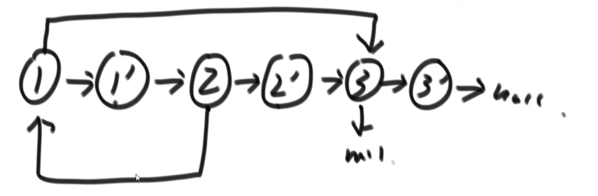
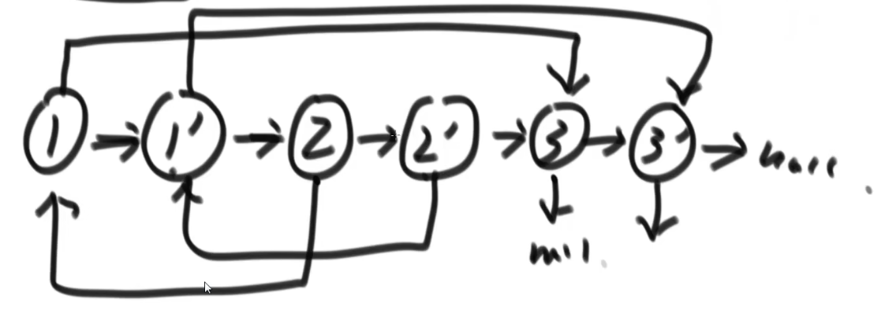

## 题目：

请实现 `copyRandomList` 函数，复制一个复杂链表。在复杂链表中，每个节点除了有一个 `next` 指针指向下一个节点，还有一个 `random` 指针指向链表中的任意节点或者 `null`。


## 题解：

### 方法一：哈希表

```go
func copyRandomList(head *Node) *Node {
    cloneMap := make(map[*Node]*Node)

    // 1.让链表的每一个节点都有一个自己的克隆节点(Val相等)
    cur := head
    for cur != nil {
        cloneNode := &Node{
            Val: cur.Val,
        }
        cloneMap[cur] = cloneNode
        cur = cur.Next
    }
    // 2.让每一个克隆节点将链表中源节点的指向关系复制下来
    cur = head
    for cur != nil {
        cloneMap[cur].Next = cloneMap[cur.Next] 
        cloneMap[cur].Random = cloneMap[cur.Random]
        cur = cur.Next
    }
    return cloneMap[head]
}
```

### 方法二：原地复制

如果考虑空间复杂度为O(1)，则需要用该方法：


> 1.首先新建三个克隆节点，分别克隆节点1、2、3的值
>
> 2.在原节点1、2之间插入克隆节点1；原节点2、3之间插入克隆节点2；原节点3、nil之间插入克隆节点3，如下：



> 3.接着每两个节点为一组，从头开始遍历链表。因为节点1的rand指向节点3，因此`节点1.next`（就是克隆节点1）的rand指向`节点3.next`（就是克隆节点3）；因为节点2的rand指向节点1，因此`节点2.next`（就是克隆节点2）的rand指向`节点1.next`（就是克隆节点1）…………
>
> 4.经过上述步骤就可以完成下面的链表结构：



> 5.最后将3个原节点（奇数点）删除，就可以得到复制的克隆链表