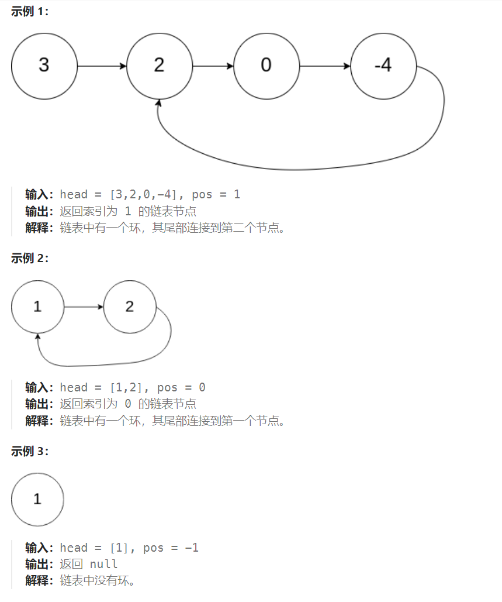

## 题目：

给定一个链表的头节点  `head` ，返回链表开始入环的第一个节点。 *如果链表无环，则返回 `null`。*

如果链表中有某个节点，可以通过连续跟踪 `next` 指针再次到达，则链表中存在环。 为了表示给定链表中的环，评测系统内部使用整数 `pos` 来表示链表尾连接到链表中的位置（**索引从 0 开始**）。如果 `pos` 是 `-1`，则在该链表中没有环。**注意：`pos` 不作为参数进行传递**，仅仅是为了标识链表的实际情况。

**不允许修改** 链表。



## 题解：

### 方法一：哈希表

路径记录法。使用一个`hashSet`，从头开始遍历整个链表。每遍历到一个节点，先判断当前节点的指针是否已经存在于`hashSet`中，如果不存在就将该节点的指针存入`hashSet`；如果已存在则返回该节点的指针(该指针是入环节点的地址)

```go
func detectCycle(head *ListNode) *ListNode {
    cycleMap := make(map[*ListNode]bool) // 记录遍历路径中遇到的节点
    
    cur := head
    for cur != nil {
        if cycleMap[cur] {   // 该节点在遍历路径中出现了第二次，那么此为入环点
            return cur
        }
        cycleMap[cur] = true
        cur = cur.Next
    }
    // 整个链表都遍历完了，没有发现入环点，则不是环形链表
    return nil
}
```

### 方法二：快慢指针

从单链表头部开始遍历，每次遍历慢指针递增一次，快指针递增两次。如果这是一个无环单链表，那么快指针将最先指向nil；如果这是一个有环链表，快慢指针最终将在环中相遇。

当快慢指针相遇时，将快指针调整回到单链表头结点处，然后快慢指针继续进行遍历，但是此时快慢指针每次遍历都递增一。最终快慢指针将在链表入环处相遇，此时返回这个入环节点。

```go
func detectCycle(head *ListNode) *ListNode {
    if head == nil || head.Next == nil {  // 0个和1个节点时不可能有环
        return nil
    }
    slow, fast := head, head

    for {
        if fast == nil || fast.Next == nil{  // 遍历可以结束，说明不是环形链表
            return nil
        }
        // slow != head 不能作为循环条件，因为head可能就是入环点，如示例2
        // if slow == fast && slow != head{  
        //     break
        // }
        slow = slow.Next
        fast = fast.Next.Next  // 不会出现内存访问错误
        if slow == fast {  // 快慢指针重合，说明是环形链表
            break
        }
    }
    fast = head  // fast 重新设置为 head
    // slow 和 fast 每次都只走一步，相遇点即是入环点
    for {
        if slow == fast {
            return slow
        }
        slow = slow.Next
        fast = fast.Next
    }
}
```

```java
public class Solution {
    public ListNode detectCycle(ListNode head) {
        ListNode slow = head;
        ListNode fast = head;

        while(fast != null && fast.next != null) {
            slow = slow.next;
            fast = fast.next.next;

            if (slow == fast) {
                break;
            }
        }
        if (fast == null || fast.next == null) {
            return null;
        }
        fast = head;

        while(slow != fast) {
            slow = slow.next;
            fast = fast.next;
        }
        return slow;
    }
}
```

