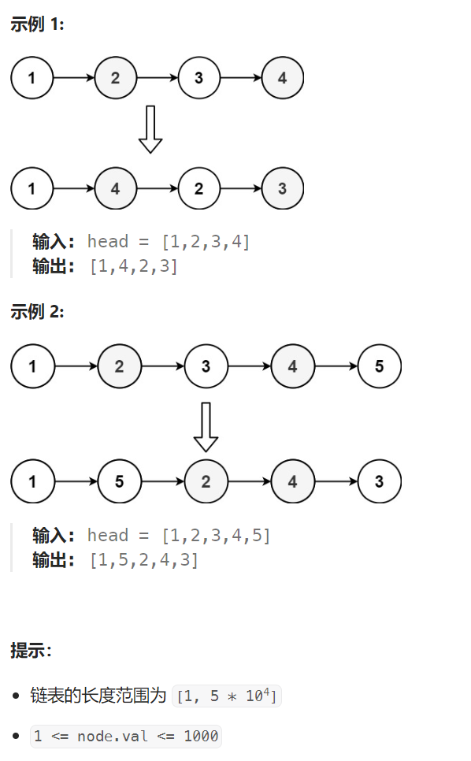

## 题目：

给定一个单链表 `L` 的头节点 `head` ，单链表 `L` 表示为：

` L0 → L1 → … → Ln-1 → Ln `
请将其重新排列后变为：

```
L0 → Ln → L1 → Ln-1 → L2 → Ln-2 → …
```

不能只是单纯的改变节点内部的值，而是需要实际的进行节点交换。



## 题解：

### 方法一：栈

```go
func reorderList(head *ListNode)  {
    if head.Next == nil {
        return
    }
    stack := make([]*ListNode, 0)
    // 1.链表所有节点入栈
    cur := head
    for cur != nil {
        stack = append(stack, cur)
        cur = cur.Next
    }
    // 2.根据链表长度为偶数和为奇数, 节点交换的次数不同
    n := len(stack)
    count := 0
    if n % 2 == 1 {
        count = n/2  // 交换次数
    } else {
        count = (n-1)/2
    }
    // 3.将 n-i 号节点移动到 i 号节点之后
    for i := 0; i < count; i++ {
        end := stack[n-1-i]   // 要交换到前面的节点
        lastPre := stack[n-1-(i+1)]   // 之前的前驱结点
        newPre := stack[i]   // 之后的前驱结点

        lastPre.Next = nil
        end.Next = newPre.Next
        newPre.Next = end
    }
}
```

### 方法二：栈+双指针

整个过程如下图：


先统计链表长度 len，然后：

1. 从第 len / 2 节点开始，将此后的所有节点放入栈 store 中；
2. 指针 ptr1 遍历前 [0, len / 2) 个节点，同时指针 ptr2 倒序遍历后 [len / 2, len) 个节点；
3. 按照合并两个链表的思路将 ptr1 和 ptr2 指向的节点串起来。

每步合并链表时，总是 ptr1 指向的节点在前， ptr2 指向的节点在后。

```go
func reorderList(head *ListNode)  {
    if head.Next == nil {
        return
    }
    // 1.统计链表的长度
    cur := head
    Len := 0
    for cur != nil {
        Len++
        cur = cur.Next
    }
    // 2.移动 cur 使其指向中间(偶数则是靠前的那一个)节点
    cur = head
    var next *ListNode = nil
    for i := 0; i < (Len-1)/2; i++ {
        next = cur.Next
        cur = next
    }
    tmp := cur.Next
    cur.Next = nil   // 让前半段与后半段分离
    // 3.反转[len/2, len) 后半段链表
    list2 := reverse(tmp, nil)
    // 4.第一段链表总是比第二段链表要长，因此遍历完第二段链表即可
    list1 := head  
    for list2 != nil {
        oneNext := list1.Next
        twoNext := list2.Next

        list1.Next = list2
        list2.Next = oneNext

        list1 = oneNext
        list2 = twoNext
    }
}
func reverse(head, tail *ListNode) *ListNode {
    if head == tail || head.Next == tail {
        return head
    }

    fir, sec := head, head.Next

    for sec != tail {
        fir.Next = fir.Next.Next
        sec.Next = head
        head = sec
        sec = fir.Next
    }
    return head
}
```

