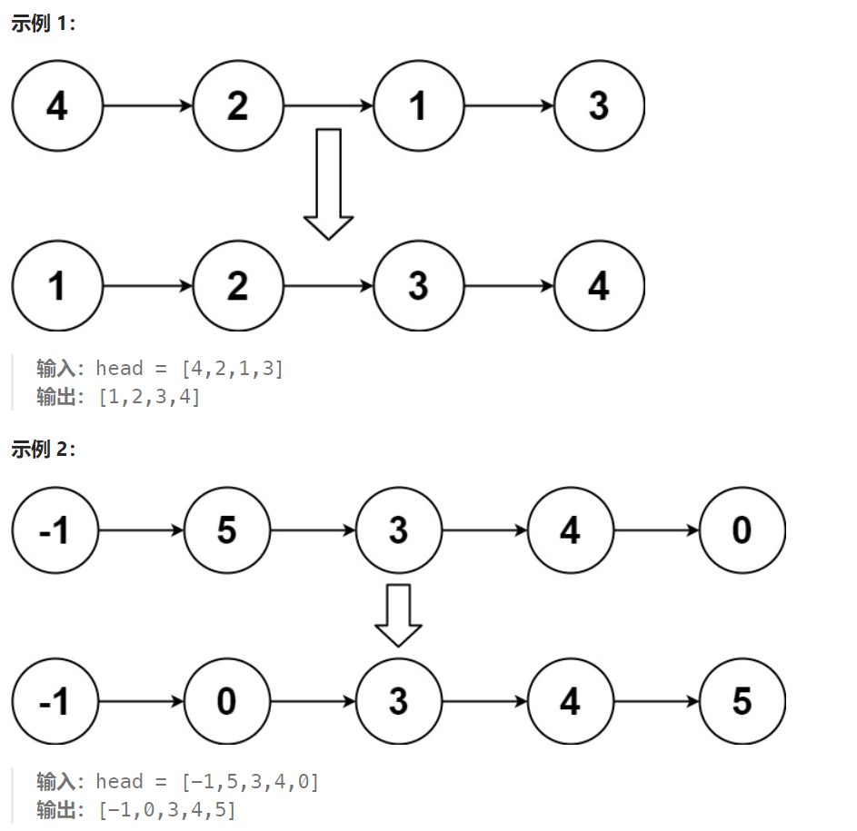

## 题目：

给你链表的头结点 `head` ，请将其按 **升序** 排列并返回 **排序后的链表** 。



## 题解：

对链表使用归并排序：

```go
func sortList(head *ListNode) *ListNode {
    return mergeSort(head, nil)
}
// 对链表进行归并排序，返回排序后的链表头
func mergeSort(head, tail *ListNode) *ListNode {
    if head == tail  {  // 链表长度为0
        return head
    }
    if head.Next == tail { // 链表长度为1
        head.Next = nil   // 将截断链表的尾结点直接设置为nil，方便遍历是判断链表是否结束(需要进行此操作，否则力扣内存溢出)
        return head
    }
    slow, fast := head, head // 快慢指针
    for fast != tail {
        slow = slow.Next   // 慢指针一次移动一步
        fast = fast.Next
        if fast != tail {
            fast = fast.Next  // 快指针一次移动两步
        }
    }
    // 慢指针指向链表中点，快指针指向链表尾部
    leftH := mergeSort(head, slow)   // head ~ slow-1 完成有序化(tail节点从slow变成nil)
    rightH := mergeSort(slow, tail)  // slow ~ tail-1 完成有序化(tail节点从tail变成nil)

    return merge(leftH, rightH)
}

func merge(leftH, rightH *ListNode) *ListNode {
    mockHead := &ListNode{}   // 新链表的哑结点
    var cur *ListNode = mockHead
    curLeft, curRight := leftH, rightH

    for curLeft != nil && curRight != nil {  // 左右链表有一个遍历完了就退出
        if curLeft.Val < curRight.Val {
            cur.Next = curLeft
            curLeft = curLeft.Next
        } else {
            cur.Next = curRight
            curRight = curRight.Next
        }
        cur = cur.Next 
    }
    if curLeft != nil {   // 左侧链表有剩余, 将左侧链表剩余部分衔接到新链表上
        cur.Next = curLeft
    } else if curRight != nil { // 右侧链表有剩余, 将右侧链表剩余部分衔接到新链表上
        cur.Next = curRight
    }
    return mockHead.Next
}
```

