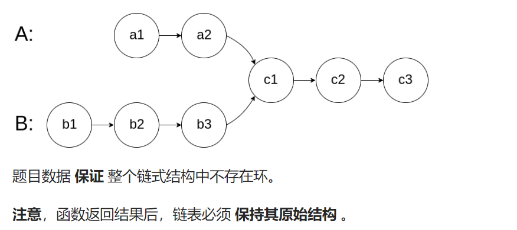

## 题目：

给你两个单链表的头节点 `headA` 和 `headB` ，请你找出并返回两个单链表相交的起始节点。如果两个链表不存在相交节点，返回 `null` 。

图示两个链表在节点 `c1` 开始相交**：**



## 题解：

```go
func getIntersectionNode(headA, headB *ListNode) *ListNode {
    lenA, lenB := 0,0
    endA, endB := headA, headB
    curA, curB := headA, headB
    // 1.获取 A 的长度和尾结点
    for curA != nil {
        lenA++
        if curA.Next == nil {
            endA = curA
        }
        curA = curA.Next
    }
    // 2.获取 B 的长度和尾结点
    for curB != nil {
        lenB++
        if curB.Next == nil {
            endB = curB
        }
        curB = curB.Next
    }
    // 尾结点不一样，说明必定不相交
    if endA != endB {  
        return nil
    }
    // 否则，必定相交
    // 双指针，长度更长的链表需要先移动 abs(lenA - lenB) 步
    diff := lenA - lenB
    curA, curB = headA, headB
    if diff == 0 {
        for curA != curB {   // 直到 curA == curB, 退出循环
            curA = curA.Next
            curB = curB.Next
        }
        return curA
    } else if diff > 0 {
        for i := 0; i < diff; i++ {  // curA 先走 diff 步
            curA = curA.Next
        }
        for curA != curB {   // 直到 curA == curB, 退出循环
            curA = curA.Next
            curB = curB.Next
        }
        return curA   
    } else {
        for i := 0; i < -diff; i++ {  // curB 先走 diff 步
            curB = curB.Next
        }
        for curA != curB {   // 直到 curA == curB, 退出循环
            curA = curA.Next
            curB = curB.Next
        }
        return curA   
    }
}
```

