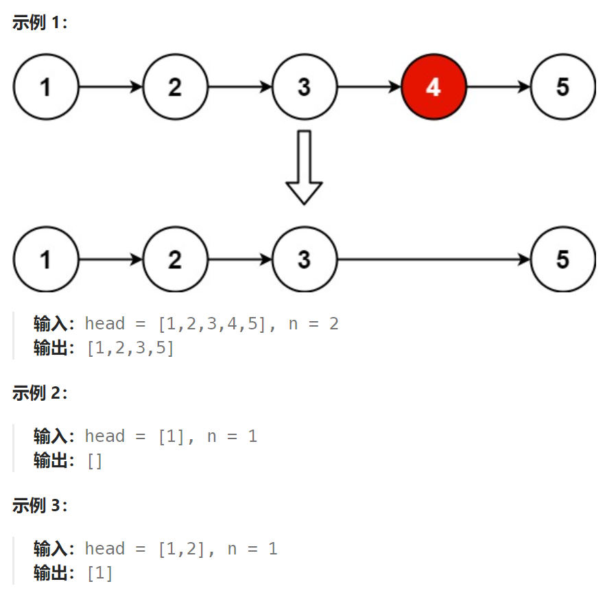

## 题目：

给你一个链表，删除链表的倒数第 `n` 个结点，并且返回链表的头结点。



## 题解：

哑结点、栈、快慢指针是解决链表问题最常见的3种手段。

### 方法一：倒数第N个节点就是正数第 L+1-N 个节点

```go
func removeNthFromEnd(head *ListNode, n int) *ListNode {
    if n < 0 {
        return head
    }
    // 考虑到头结点有被删除的可能，我们使用哑结点
    mockHead := &ListNode{Next: head}
    // 要删除倒数第 n 个节点，我们就需要找到倒数第 n+1 个节点
    // 倒数第 n+1 个节点 == 正数第 len + 1 - (n+1) == len - n 个节点

    // 1.获取链表长度
    length := 0
    for head != nil {
        length++
        head = head.Next
    }

    if n > length {
        return head
    }

    // 2.迭代到第 len-n 个节点, 从哑结点开始, 迭代次数就是 len-n
    cur := mockHead
    for i:=0; i < length-n; i++ {
        cur = cur.Next
    }
    cur.Next = cur.Next.Next

    return mockHead.Next
}
```

```java
class Solution {
    public ListNode removeNthFromEnd(ListNode head, int n) {
        int length = ListLength(head);

        ListNode mock = new ListNode(0, head);
        ListNode cur = mock;

        int count = length - n + 1;  // 倒数第 n 个 == 正数第 L-n+1 个
        if (count <= 0) {
            return mock.next;
        }
        for (int i = 0; i < count - 1; i++) {  // 移动到正数第 L-n 个节点上
            cur = cur.next;
        }
        cur.next = cur.next.next;

        return mock.next;
    }
    // 获取链表长度
    public int ListLength(ListNode head) {
        ListNode cur = head;
        int count = 0;
        while (cur != null) {
            count++;
            cur = cur.next;
        }
        return count;
    }
}
```


### 方法二：使用栈

在遍历链表的同时将所有节点依次入栈。根据栈「先进后出」的原则，我们弹出栈的第 n 个节点就是需要删除的节点，并且目前栈顶的节点就是待删除节点的前驱节点。

```go
func removeNthFromEnd(head *ListNode, n int) *ListNode {
    if n < 0 {
        return head
    }
    if head == nil {
        return head
    }
    stack := make([]*ListNode,0)
    mockHead := &ListNode{Next: head}   // 哑结点
	// 1.将包括哑结点在内的链表整体入栈
    var curNode *ListNode = mockHead
    for curNode != nil {
        stack = append(stack, curNode)
        curNode = curNode.Next
    }
    if n > len(stack)-1 {   // n 超出了链表节点个数
        return mockHead.Next
    }
    // 2.根据栈的先进后出原则，找到倒数第 n+1 个元素(并不需要真正将节点弹出栈) 
    var node *ListNode = nil   // node 需要指向倒数第 n + 1 个节点 
    // for i :=0; i< n; i++ {  // 弹出n个元素，还在栈顶的就是第 n+1 个节点
    //     stack = stack[:len(stack)-1]
    // }
    // node = stack[len(stack)-1]
    node = stack[len(stack)-1-n]
    node.Next = node.Next.Next

    return mockHead.Next
}
```

### 方法三：快慢指针

可以使用两个指针 first 和 second 同时对链表进行遍历，并且 first 比 second 超前 n 个节点。当 first 遍历到链表的末尾时，second 就恰好处于倒数第 n 个节点。

```go
func removeNthFromEnd(head *ListNode, n int) *ListNode {
    if n < 0 {
        return head
    }
    if head == nil {
        return head
    }
    mockNode := &ListNode{Next: head}   // 哑结点
    slow, fast := mockNode, mockNode
    // 要找到倒数第 n+1 个节点, 因此让 fast 先移动 n+1 步
    for i := 0; i <= n; i++ {
        fast = fast.Next
    }
    // 接着 slow 和 fast 同步移动，直到 fast == nil
    // 此时 slow 将指向倒数第 n+1 个节点
    for fast != nil {
        slow = slow.Next
        fast = fast.Next
    }
    slow.Next = slow.Next.Next

    return mockNode.Next
}
```

