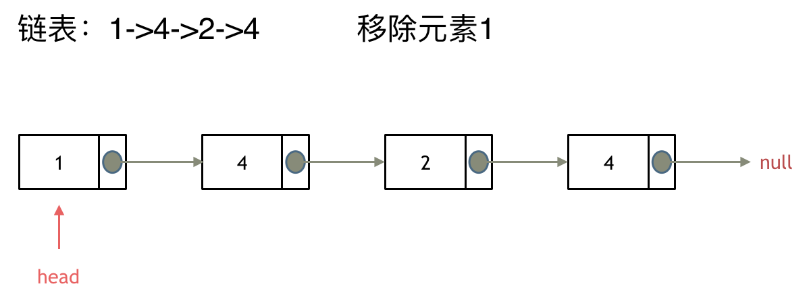

## 题目：

给你一个链表的头节点 `head` 和一个整数 `val` ，请你删除链表中所有满足 `Node.val == val` 的节点，并返回 **新的头节点** 。


## 题解：

### 方法一：**直接使用原来的链表来进行删除操作**

移除头结点和移除其他节点的操作是不一样的，因为链表的其他节点都是通过前一个节点来移除当前节点，而头结点没有前一个节点。

所以头结点如何移除呢，其实只要将头结点向后移动一位就可以，这样就从链表中移除了一个头结点。




```go
func removeElements(head *ListNode, val int) *ListNode {
    resHead := head   // 作为结果返回的链表头节点
    cur := head
    // 找出第一个 != val 的节点作为头结点
    for cur != nil && cur.Val == val{
        resHead = cur.Next
        cur = resHead
    }
    for cur != nil {   // 循环访问链表，直到结束
        if cur.Next != nil && cur.Next.Val == val {
            cur.Next = cur.Next.Next
        } else {  // 当且仅当下一节点 != val 时，移动到下一节点
            cur = cur.Next
        }
    }
    return resHead
}
```

### 方法二：**设置一个虚拟头结点在进行删除操作**

方法一中，在单链表中移除头结点 和 移除其他节点的操作方式是不一样，其实在写代码的时候也会发现，需要单独写一段逻辑来处理移除头结点的情况。

那么可不可以 以一种统一的逻辑来移除 链表的节点呢。

其实**可以设置一个虚拟头结点**，这样原链表的所有节点就都可以按照统一的方式进行移除了。


```go
func removeElements(head *ListNode, val int) *ListNode {
    // 创建一个虚拟头节点
    mockHead := &ListNode{Next: head}
    cur := mockHead
    for cur != nil {   // 循环访问链表，直到结束
        if cur.Next != nil && cur.Next.Val == val {
            cur.Next = cur.Next.Next
        } else {  // 当且仅当下一节点 != val 时，移动到下一节点
            cur = cur.Next
        }
    }
    return mockHead.Next
}
```

```java
class Solution {
    public ListNode removeElements(ListNode head, int val) {
        ListNode mock = new ListNode(0, head);

        ListNode cur = mock;
        while (cur.next != null) {
            if (cur.next.val == val) {  // 删除掉下一个 val 节点后, cur 不能继续向后，因为可能还要继续删除
                cur.next = cur.next.next;
            } else {   // 当且仅当下一节点不是 val 等值节点，cur 才会向后移动
                cur = cur.next;
            }
        }


        return mock.next;
    }
}
```

