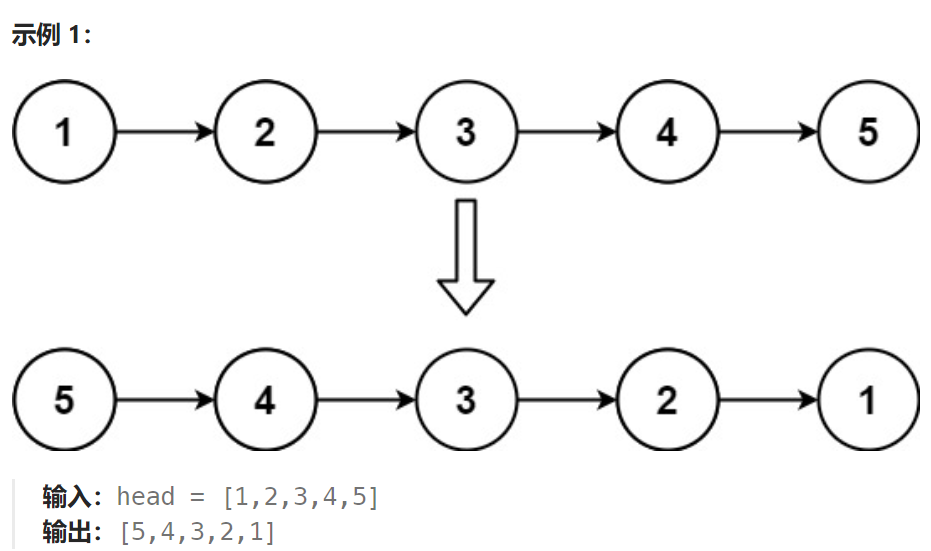

## 题目：

给你单链表的头节点 `head` ，请你反转链表，并返回反转后的链表。



## 题解：

### 方法一：迭代法

```go
// 依次遍历链表的各个节点，让其完成翻转
func reverseList(head *ListNode) *ListNode {
    if head == nil || head.Next == nil{
        return head
    }
    var pre *ListNode = nil
    mid, end :=  head, head.Next

    for {
        // 重要：先翻转, 再检测能否进行下一次，这样退出的时候就能保证所有的节点都完成了一次翻转
        mid.Next = pre  // 翻转节点指向
        if end == nil {
            return mid
        }
        pre = mid
        mid = end
        end = end.Next
    }
}
```

```java
class Solution {
    public ListNode reverseList(ListNode head) {
        if (head == null || head.next == null) {
            return head;
        }

        ListNode pre = null, cur = head, aft = head.next;

        while (cur != null) {   // 当 pre 指向最初的尾节点，结束
            cur.next = pre;  // 每次迭代，只操作一个节点的后继指针 pre <- cur
            pre = cur;
            cur = aft;
            if (aft != null) {  // 此时 cur 已经指向 null
                aft = aft.next;
            }  
        }

        return pre;  // 返回的是pre
    }
}
```


### 方法二：双指针法

```go
func reverseList(head *ListNode) *ListNode {
    if head == nil || head.Next == nil{
        return head
    }
    // 双指针法
    // fir 始终指向链表原始头结点, sec 每次指向不同的节点，并将其移动到链表头部
    fir, sec := head, head.Next
    // 当 sec == nil 时，意味着无剩余节点可以移动至链表头部，那么翻转结束
    for sec != nil {
        fir.Next = fir.Next.Next   // 将 sec 指向的节点移出
        sec.Next = head  // sec 指向的节点将作为新的头结点
        head = sec
        sec = fir.Next  // sec 指向下一个要搬运到链表头部的节点
    }
    return head
}
```

