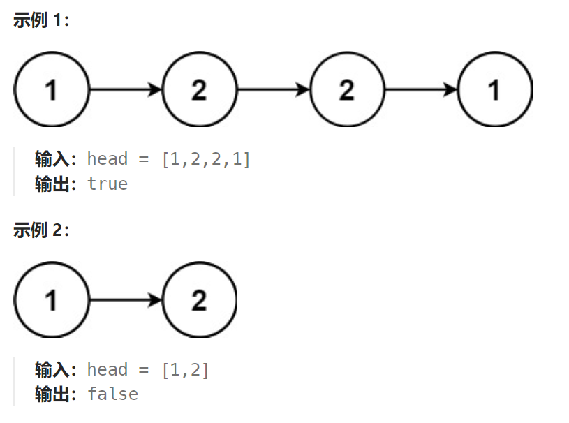

## 题目：

给你一个单链表的头节点 `head` ，请你判断该链表是否为回文链表。如果是，返回 `true` ；否则，返回 `false` 。



## 题解：

### 方法一：栈

```go
func isPalindrome(head *ListNode) bool {
    // 1.将整个链表入栈
    stack := make([]*ListNode, 0)
    cur := head
    for cur != nil {
        stack = append(stack, cur)
        cur = cur.Next
    }
    // 2.双指针扫描栈
    left, right := 0, len(stack)-1
    for left <= right {
        if stack[left].Val != stack[right].Val {
            return false
        }
        left++
        right--
    }
    return true
}
```

### 方法二：快慢指针 

如果要求额外的空间复杂度为O(1)，就必须使用此方法：

使用快慢指针来辅助，快指针一次移动递增两次，慢指针一次移动只递增一次。当**快指针指向链表尾部时，慢指针刚好指向链表中间节点**。

现在我们可以获得：**头节点指针、尾节点指针、中间节点指针**。我们**从尾部节点开始到中间节点，反转链表的指向**，然后**分别从头、尾指针开始，分别向后(前)遍历**，如果直到双方遍历到中间节点也没有出现节点数值不相等的情况，说明这是一个回文结构。

这样的新思路中，我们没有使用任何额外的辅助空间。但是时间复杂度却没有增长。