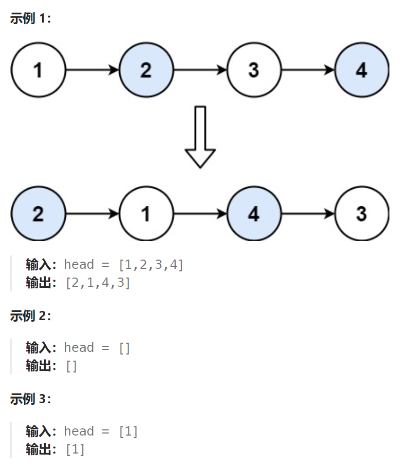

## 题目：

给你一个链表，两两交换其中相邻的节点，并返回交换后链表的头节点。你必须在不修改节点内部的值的情况下完成本题（即，只能进行节点交换）。



## 题解：

### 方法一：迭代法（必须引入哑结点）

```go
func swapPairs(head *ListNode) *ListNode {
    dummyHead := &ListNode{0, head}
    temp := dummyHead  // temp 用来表示前一组交换的两节点的后者
    for temp.Next != nil && temp.Next.Next != nil {
        node1 := temp.Next  // 要交换的第一个节点
        node2 := temp.Next.Next  // 要交换的第二个节点
        temp.Next = node2   // temp 指向新一组交换节点的后者
        node1.Next = node2.Next  // 一号节点指向二号节点的后继节点（先将二号节点取出）
        node2.Next = node1  // 二号节点指向一号节点
        temp = node1   // 交换后的第二个节点作为新的 temp 
    }
    return dummyHead.Next
}
```

```java
class Solution {
    public ListNode swapPairs(ListNode head) {
        ListNode dummy = new ListNode(0, head);
        // 每次交换，都涉及：上一组的后一个节点(初始是虚拟头结点) + 待交换的两个节点
        ListNode cur = dummy;
        while (cur.next != null && cur.next.next != null) {
            ListNode node1 = cur.next;
            ListNode node2 = cur.next.next;

            node1.next = node2.next;
            node2.next = node1;
            cur.next = node2;
            cur = node1;
        }
        return dummy.next;
    }
}
```


### 方法二：递归法

```go
func swapPairs(head *ListNode) *ListNode {
    if head == nil || head.Next == nil {  // 只有一个节点的时候不需要操作
        return head
    }
    fir, sec := head, head.Next // 分别指向两个需要交换的节点

    return helper(fir, sec)
}

// 递归函数, 将两个节点交换, 然后返回交换后的第一个节点
func helper(fir *ListNode, sec *ListNode) *ListNode {
    if fir == nil || sec == nil{   // 至少两个要交换的节点都存在
        return fir
    }
    var subRes *ListNode =nil  // 保存后面已交换节点的新头结点
    if sec.Next != nil && sec.Next.Next != nil {
        subRes = helper(sec.Next, sec.Next.Next)
    } else {
        subRes = sec.Next
    }

    fir.Next = subRes   // 一号节点指向二号节点的后继节点（先将二号节点取出）
    sec.Next = fir  // 二号节点指向一号节点  

    return sec
}
```

