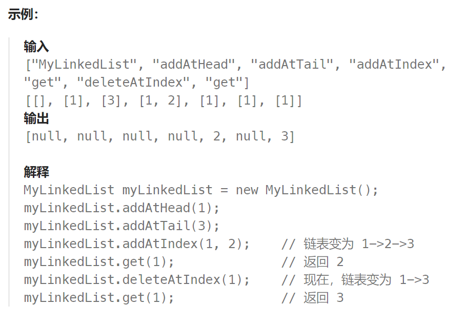

## 题目：

你可以选择使用单链表或者双链表，设计并实现自己的链表。

单链表中的节点应该具备两个属性：`val` 和 `next` 。`val` 是当前节点的值，`next` 是指向下一个节点的指针/引用。

如果是双向链表，则还需要属性 `prev` 以指示链表中的上一个节点。假设链表中的所有节点下标从 **0** 开始。

实现 `MyLinkedList` 类：

- `MyLinkedList()` 初始化 `MyLinkedList` 对象。
- `int get(int index)` 获取链表中下标为 `index` 的节点的值。如果下标无效，则返回 `-1` 。
- `void addAtHead(int val)` 将一个值为 `val` 的节点插入到链表中第一个元素之前。在插入完成后，新节点会成为链表的第一个节点。
- `void addAtTail(int val)` 将一个值为 `val` 的节点追加到链表中作为链表的最后一个元素。
- `void addAtIndex(int index, int val)` 将一个值为 `val` 的节点插入到链表中下标为 `index` 的节点之前。如果 `index` 等于链表的长度，那么该节点会被追加到链表的末尾。如果 `index` 比长度更大，该节点将 **不会插入** 到链表中。
- `void deleteAtIndex(int index)` 如果下标有效，则删除链表中下标为 `index` 的节点。



### 题解：

最不易出错的方式是引入"虚假头结点"，之后在链表头结点位置上插入、删除节点将变得和普通节点一样，而无需多考虑。

```go
type Node struct{
    Val int
    Next *Node
}
type MyLinkedList struct {
    Head *Node
    Len int
}
func Constructor() MyLinkedList {
    return MyLinkedList{&Node{},0}   // 链表头部引入一个虚假头结点，这样在插入和删除头结点的时候会方便很多
}
func (this *MyLinkedList) Get(index int) int {
    if index < 0 || index >= this.Len {   // index 最大到 this.Len-1
        return -1
    }
    cur := this.Head
    // 移动到第 index 个节点, 因为从虚假头结点开始, 因此实际需要移动 index + 1 次
    for i := 0; i <= index; i++ {
        cur = cur.Next
    }
    return cur.Val
}
func (this *MyLinkedList) AddAtHead(val int)  {
    this.AddAtIndex(0, val)
}
func (this *MyLinkedList) AddAtTail(val int)  {
    this.AddAtIndex(this.Len, val)
}
func (this *MyLinkedList) AddAtIndex(index int, val int)  {
    if index < 0 || index > this.Len {  // 插入的位置最大到 this.Len
        return
    }
    cur := this.Head
    // 移动到第 index - 1 个元素位置，需要移动 index 次
    // 因为使用了虚假头结点，因此头结点的插入方式和其他节点是一样的
    for i := 0; i < index; i++ {
        cur = cur.Next
    }
    // cur 指向的是第 index - 1 个节点
    newNode := &Node{Val: val, Next: cur.Next}
    cur.Next = newNode

    this.Len++
}
func (this *MyLinkedList) DeleteAtIndex(index int)  {
    if index < 0 || index >= this.Len {  // this.Len 实际是不存在的位置
        return
    }
    cur := this.Head
    // 移动到第 index - 1 个节点上
    for i := 0; i < index; i++ {
        cur = cur.Next
    }
    cur.Next = cur.Next.Next

    this.Len--
}
```

