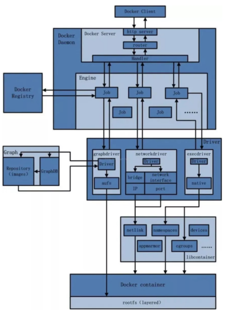

## 一、docker官网与仓库

- docker官网：http://www.docker.com
- Docker Hub仓库: https://hub.docker.com/

## 二、docker部署环境

**Docker并非是一个通用的容器工具，它依赖于已存在并运行的Linux内核环境。**

Docker实质上是在已经运行的Linux下制造一个隔离的文件系统，因此它**执行的效率几乎等同于所部署的Linux主机**。

因此，**Docker必须部署在Linux内核的系统上，如果其他系统（如Windows）想要部署Docker就必须安装一个虚拟Linux环境**。

在Windows上部署Docker的方法就是先安装一个虚拟机，然后再安装的Linux虚拟机上运行Docker。

## 三、docker三要素

### 3.1 镜像(image)

​	**Docker 镜像（Image）就是一个只读的模板。镜像可以用来创建(实例化) Docker 容器，一个镜像可以创建很多容器。**它也相当于是一个root文件系统。比如官方镜像 centos:7 就包含了完整的一套 centos:7 最小系统的 root 文件系统。相当于容器的“源代码”，**docker镜像文件类似于Java的类模板，而docker容器实例类似于java中new出来的实例对象。**

### 3.2 容器(container)

**从面向对象角度**：

​	Docker 利用容器（Container）独立运行的一个或一组应用，应用程序或服务运行在容器里面，容器就类似于一个虚拟化的运行环境，**容器是用镜像创建的运行实例**。就像是Java中的类和实例对象一样，**镜像是静态的定义，容器是镜像运行时的实体**。**容器为镜像提供了一个标准的和隔离的运行环境，它可以被启动、开始、停止、删除**。每个容器都是相互隔离的、保证安全的平台

**从镜像容器角度：**

​	可以把容器看做是**一个简易版的环境**（包括root用户权限、进程空间、用户空间和网络空间等）和运行在其中的应用程序。

### 3.3 仓库(repository)

仓库（Repository）是集中存放镜像文件的场所。类似于：

Maven仓库，存放各种jar包的地方；

github仓库，存放各种git项目的地方；

Docker公司提供的官方registry被称为Docker Hub，存放各种镜像模板的地方。

 

仓库分为公开仓库（Public）和私有仓库（Private）（公司私有） 两种形式。

最大的公开仓库是 Docker Hub(https://hub.docker.com/)，

存放了数量庞大的镜像供用户下载。国内的公开仓库包括阿里云 、网易云等

### 3.4 总结

​	**Docker 本身是一个容器运行载体或称之为管理引擎**。我们把应用程序和配置依赖打包好形成一个可交付的运行环境，这个打包好的运行环境就是image镜像文件。只有通过这个镜像文件才能生成Docker容器实例(类似Java中new出来一个对象)。

​	**image文件可以看作是容器的模板。Docker 根据 image 文件生成容器的实例（简称容器）**。同一个 image 文件，可以生成多个同时运行的容器实例。

**镜像文件**

\*  image 文件生成的容器实例，本身也是一个文件，称为镜像文件。

**容器实例**

\*  一个容器运行一种服务，当我们需要的时候，就可以通过docker客户端创建一个对应的运行实例，也就是我们的容器

**仓库**

\* 就是放一堆镜像的地方，我们可以把镜像发布到仓库中，需要的时候再从仓库中拉下来就可以了。

## 四、Docker平台架构图解

Docker 是一个 C/S 模式的架构，后端是一个松耦合架构，众多模块各司其职。 

Docker运行的基本流程为：

- 用户使用Docker Client与Docker Daemon(后台守护进程)建立通信，并发送请求给后者。
- Docker Daemon 作为 Docker架构中的主题部分，首先提供 Docker Server的功能使其可以接收来自于Docker Client的请求
- Docker Engine 执行 Docker 内部的一系列工作，每一项工作都是以一个Job的形式存在
- Job的执行过程中，当需要镜像容器时，会通过网络管理驱动Network driver创建并配置Docker容器网络环境
- 当需要限制Docker容器运行资源或者执行用户指令等操作时，则通过Exec driver来完成
- Libcontainer是一项独立运行的容器管理包，Network driver以及Exec driver都是通过Libcontainer来实现具体的对容器的操作

