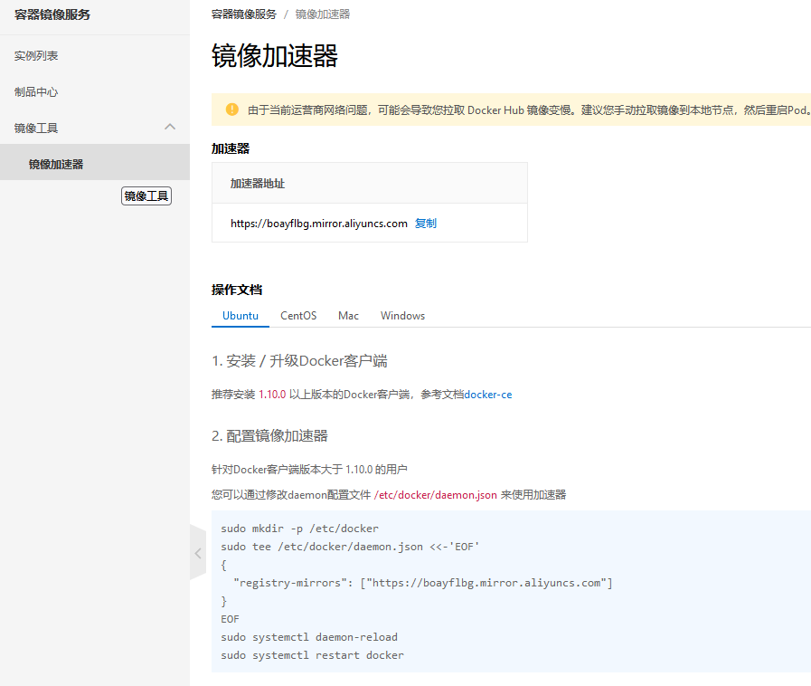

## 一、docker安装

### 1.1 卸载旧版本

先卸载旧版，如果没有的话，就不用执行了，直接第二步。

```shell
sudo apt-get remove docker docker-engine docker.io containerd runc
```

### 1.2 在终端输入

```shell
sudo apt update
sudo apt-get install ca-certificates curl gnupg lsb-release
```

### 1.3 安装证书

```shell
curl -fsSL http://mirrors.aliyun.com/docker-ce/linux/ubuntu/gpg | sudo apt-key add -
```

### 1.4 写入软件源信息

```shell
sudo add-apt-repository "deb [arch=amd64] http://mirrors.aliyun.com/docker-ce/linux/ubuntu $(lsb_release -cs) stable"
```

### 1.5 安装docker

```shell
sudo apt-get install docker-ce docker-ce-cli containerd.io
```

### 1.6 安装工具

```shell
sudo apt-get -y install apt-transport-https ca-certificates curl software-properties-common
```

### 1.7 启动和重启docker

```shell
启动
systemctl start docker
重启
service docker restart
```

### 1.8 检查是否安装成功

```shell
查看版本
sudo docker version

运行hello-world
sudo docker run hello-world 
```


## 二、使用阿里云镜像加速仓库

docker默认使用的仓库是docker hub，但这是一个国外的网站，国内访问会比较慢，为了提高访问下载速度，可以使用阿里云的镜像仓库。

### 2.1 登陆阿里云开发者平台

```
https://promotion.aliyun.com/ntms/act/kubernetes.html
```


### 2.2 点击控制台


### 2.3 选择容器镜像服务


### 2.4 获取加速器地址



### 2.5 粘贴操作文档中的脚本直接执行


### 2.6 测试

