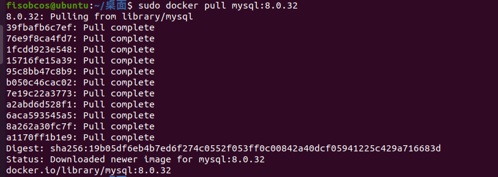

## 一、帮助启动类命令

- 启动docker： `systemctl start docker`
- 停止docker： `systemctl stop docker`
- 重启docker：` systemctl restart docker`
- 查看docker状态：` systemctl status docker`
- 开机启动： `systemctl enable docker`
- 查看docker概要信息：` docker info`
- 查看docker总体帮助文档： `docker --help`
- 查看docker命令帮助文档： `docker 具体命令 --help`

## 二、镜像命令

### 2.1 `docker images`

作用：列出本地主机上的镜像


OPTIONS说明：

- -a :列出本地所有的镜像（含历史映像层）
- -q :只显示镜像ID。


显示结果各个标签的说明：

- REPOSITORY：表示镜像的仓库源
- TAG：镜像的标签版本号
- IMAGE ID：镜像ID
- CREATED：镜像创建时间
- SIZE：镜像大小

**同一仓库源可以有多个 TAG版本**，代表这个仓库源的不同个版本，我们**使用 REPOSITORY:TAG 来定义不同的镜像**。

如果你**不指定一个镜像的版本标签**，例如你只使用 ubuntu，**docker 将默认使用 ubuntu:latest 镜像**


### 2.2 `docker search [OPTIONS] 镜像名字` 

作用：

​	在远程仓库中查询是否存在某一镜像。

OPTIONS说明：

​	--limit : 只列出N个镜像，默认25个。如：docker search --limit 5 redis


显示结果中的参数说明：


### 2.3 `docker pull 镜像名字`

作用：下载镜像

使用：docker pull 镜像名字[:TAG]  或者  docker pull 镜像名字（没有TAG就是最新版，等价于docker pull 镜像名字:latest）



### 2.4 `docker system df `

作用：查看镜像/容器/数据卷所占的空间


### 2.5 `docker rmi 镜像名字或ID`

作用：删除指定镜像

使用：

- 删除单个：`docker rmi  -f 镜像ID`
- 删除多个：`docker rmi -f 镜像名1:TAG 镜像名2:TAG`
- 删除全部：`docker rmi -f $(docker images -qa)`

### 2.6 docker虚悬镜像

仓库名、标签都是< none >的镜像，俗称虚悬镜像dangling image


## 三、容器命令

### 3.1 新建+启动容器

`docker run [OPTIONS] IMAGEName [COMMAND] [ARG...]`


**OPTIONS说明**：（有些是一个减号，有些是两个减号）

--name="容器新名字"    为容器指定一个名称；

-d: 后台运行容器并返回容器ID，也即启动守护式容器(后台运行)；


**-i：以交互模式运行容器，通常与 -t 同时使用；**

**-t：为容器重新分配一个伪输入终端，通常与 -i 同时使用；**

**也即启动交互式容器(前台有伪终端，等待交互)；**


-P: 随机端口映射，大写P

-p: 指定端口映射，小写p


**启动交互式容器(前台命令行)：**


使用镜像`centos:latest`以交互模式启动一个容器,在容器内执行`/bin/bash`命令。

`docker run -it --name=centos centos /bin/bash`

```
参数说明：
-i: 交互式操作。
-t: 终端。
centos : centos 镜像。
/bin/bash：放在镜像名后的是命令，我们希望有个交互式 Shell，因此用的是 /bin/bash。
要退出终端，直接输入 exit  --> 直接退出centos容器
```

### 3.2 列出当前所有正在运行的容器

`docker ps [OPTIONS]`

**OPTIONS说明：**

- -a :列出当前所有正在运行的容器+历史上运行过的
- -l :显示最近创建的容器。
- -n：显示最近n个创建的容器。
- -q :静默模式，只显示容器编号。

### 3.3 退出容器

两种退出方式：

- `exit`

run进去容器，exit退出，**容器停止**

- `ctrl+p+q`

run进去容器，ctrl+p+q退出，**容器不停止**

### 3.4 启动已停止运行的容器

`docker start 容器ID或者容器名`

### 3.5 重启容器

`docker restart 容器ID或者容器名`

### 3.6 停止容器

`docker stop 容器ID或者容器名`

### 3.7 强制停止容器

`docker kill 容器ID或容器名`

### 3.8 删除已停止的容器

`docker rm 容器ID`

- 如果要删除尚在运行的容器：需要使用``docker rm -f 容器ID``
- 一次性删除多个容器：`docker rm -f $(docker ps -a -q)`  或者  `docker ps -a -q | xargs docker rm`

