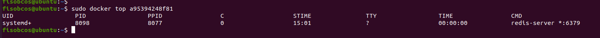

## 一、启动守护式容器

在大部分的场景下，我们希望 docker 的服务是在后台运行的， 我们可以过 -d 指定容器的后台运行模式。

`docker run -d 容器名`


使用镜像`centos:latest`以后台模式启动一个容器：`docker run -d centos`

问题：然后`docker ps -a` 进行查看, 会发现容器已经退出

很重要的要说明的一点: **Docker容器后台运行,就必须有一个前台进程.**

**容器运行的命令如果不是那些一直挂起的命令（比如运行top，tail），就是会自动退出的。**

 

这个是`docker`的机制问题，比如你的`web`容器，我们以`nginx`为例，正常情况下，我们配置启动服务只需要启动响应的`service`即可。例如`service nginx start`。但是这样做，**`nginx`为后台进程模式运行，就导致`docker`前台没有运行的应用，这样的容器后台启动后，会立即自杀因为他觉得他没事可做了**。所以，最佳的解决方案是，**将你要运行的程序以前台进程的形式运行，常见就是命令行模式，表示我还有交互操作，别中断。**


`redis`可以以后台模式运行：

```
·前台交互式启动
  docker run -it redis:6.0.8
·后台守护式启动
  docker run -d redis:6.0.8
```

## 二、查看容器内信息

### 2.1 查看容器日志

`docker logs 容器ID`


将指定容器中所有产生的日志进行显示


### 2.2 查看容器内运行的进程

`docker top 容器ID`



一个容器本身就是一个微型的`linux`系统，因此可以查看`docker`内部的进程运行情况

### 2.3 查看容器内部细节

`docker inspect 容器ID`


此命令将会以`json`字符串的格式，详细的给出整个`docker`容器的内部信息


## 三、重新以命令行交互模式进入正在运行的容器

要想重新以命令行交互模式运行处于后台运行的容器，一共有以下两种方式：

### 3.1 `docker exec -it 容器ID bashShell`


### 3.2 `docker attach 容器ID`


### 3.3 两种方式的区别

-  attach 直接进入容器启动命令的终端，不会启动新的进程。当用exit退出时，会导致整个容器的停止。


-  exec 是在容器中打开新的终端，并且可以启动新的进程。当用exit退出时，不会导致整个容器的停止。


**因此推荐使用 `docker exec` 命令，因为退出容器终端，不会导致容器的停止。**

**对于`redis` 、 `mysql` 一类的容器，一般用`-d`后台启动的程序，再用`exec`进入对应容器实例**.


## 四、从容器内拷贝文件到主机上

`docker cp  容器ID:容器内路径 目的主机路径`


### 五、导入和导出容器

### 5.1 export 导出容器的内容留作为一个tar归档文件

`docker export 容器ID > 文件名.tar`

将整个容器打包成一个tar包（可以指定路径）


### 5.2 import 从tar包中的内容创建一个新的文件系统再导入为镜像

`cat 文件名.tar | docker import - 镜像用户/镜像名:镜像版本号`

可以将一个打包的容器重新生成为一个镜像文件

