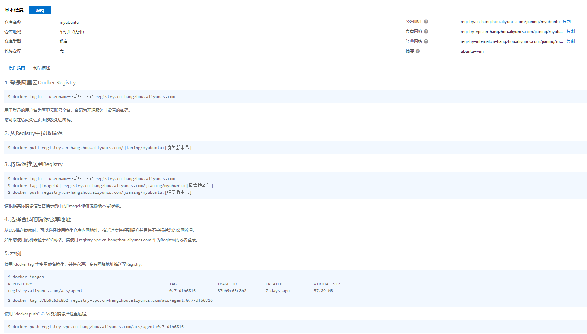

## 一、在阿里云创建镜像仓库

### 1.1 阿里云开发者平台

`https://promotion.aliyun.com/ntms/act/kubernetes.html`

进入控制台，选择容器镜像服务

### 1.2 选择个人实例

### 1.3 创建命名空间

### 1.4 创建镜像仓库

### 1.5 获取镜像仓库脚本

## 二、将本地镜像推送到阿里云

首次登录需要用户设置登录密码

## 三、将阿里云上的镜像下载到本地

