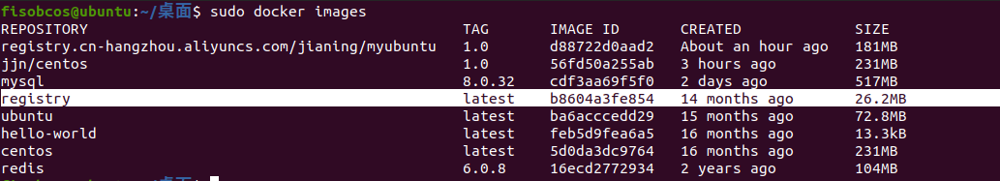
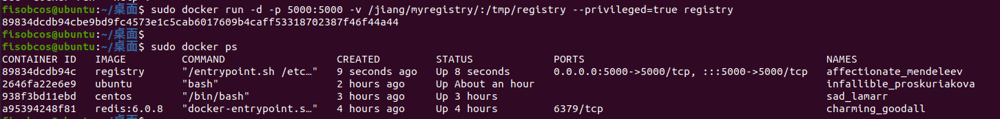

## 一、配置Docker Registry

### 1.1 下载

`Docker Registry`是Docker官方为了支持用户实现私有仓库而给出的镜像。

```
docker pull registry 
```



### 1.2 运行私有库Registry

```
docker run -d -p 5000:5000 -v /jiang/myregistry/:/tmp/registry --privileged=true registry
```

将私有库Registry镜像绑定在本地IP的5000端口，且docker内部映射也是5000



## 二、将本地镜像推送到私有库Registry

案例演示创建一个新镜像，ubuntu安装ifconfig命令

### 2.1 从Hub上下载ubuntu镜像到本地并成功运行

### 2.2 下载ifconfig

​	在容器内运行  `apt-get update`  和  `apt-get install net-tools`


### 2.3 安装完成后，commit我们自己的新镜像

`sudo docker commit -m="ifconfig cmd add" -a="jjn" 1df37d7b3f19 myubuntu:1.2`


### 2.4 curl验证私服库上有什么镜像

首先需要使用ifconfig查看宿主机上docker的本地ip，因为私有库Registry容器运行在宿主机docker的5000端口上：


```
curl -XGET http://172.17.0.1:5000/v2/_catalog
```

### 2.5 将新镜像名称修改符合私服规范的Tag

```
sudo docker tag myubuntu:1.2 172.17.0.1:5000/myubuntu:1.2
```

- 修改前：


- 使用修改命令：


- 修改后：


### 2.6 修改docker配置文件使之支持http

```
vim /etc/docker/daemon.json
```

```
{
  "registry-mirrors": ["https://boayflbg.mirror.aliyuncs.com"],
  "insecure-registries": ["172.17.0.1:5000"]
}
```

上述理由：docker默认不允许http方式推送镜像，通过配置选项来取消这个限制。


注：如果修改完后如果不生效，建议重启docker


```
systemctl restart docker
sudo docker run -d -p 5000:5000 -v /jiang/myregistry/:/tmp/registry --privileged=true registry
```

### 2.7 push推送到私服库

```
docker push 172.17.0.1:5000/myubuntu:1.2
```


### 2.8 curl再次验证私服库上有什么镜像

```
curl -XGET http://172.17.0.1:5000/v2/_catalog
```


### 2.9 pull到本地并运行

```
docker pull 172.17.0.1:5000/myubuntu:1.2
```

