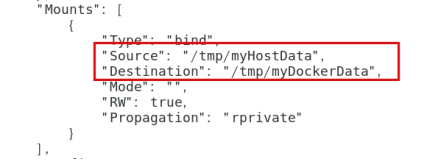

## 一、数据卷是什么

卷就是目录或文件，存在于一个或多个容器中，由docker挂载到容器，但不属于联合文件系统，因此能够绕过Union File System提供一些用于持续存储或共享数据的特性：

卷的设计目的就是数据的持久化，完全独立于容器的生存周期，因此Docker不会在容器删除时删除其挂载的数据卷。

将运用与运行的环境打包成镜像，通过 docker run后形成容器实例运行 ，但是我们对数据的要求希望是持久化的。

Docker容器产生的数据，如果不备份，那么当容器实例删除后，容器内的数据自然也就没有了。为了能保存数据在docker中我们使用卷。

**数据卷的特点**：

1：数据卷可在容器之间共享或重用数据

2：卷中的更改可以直接实时生效，爽

3：数据卷中的更改不会包含在镜像的更新中

4：数据卷的生命周期一直持续到没有容器使用它为止

## 二、数据卷的使用

指令：`docker run -it --privileged=true -v /宿主机绝对路径目录:/容器内目录   镜像名`

通过此命令就可以在宿主机和容器实现文件的映射和共享。

### 2.1 `--privileged=true`

使用数据卷时，Docker挂载主机目录访问如果出现`cannot open directory .: Permission denied`，那么在挂载目录后多加一个

`--privileged=true`参数即可

 如果是CentOS7安全模块会比之前系统版本加强，不安全的会先禁止，所以目录挂载的情况被默认为不安全的行为，

在SELinux里面挂载目录被禁止掉了额，如果要开启，我们一般使用--privileged=true命令，扩大容器的权限解决挂载目录没有权限的问题，也即：使用该参数，container内的root拥有真正的root权限，否则，container内的root只是外部的一个普通用户权限。

## 三、使用案例

### 3.1 宿主vs容器之间映射添加容器卷

命令：`docker run -it --name myu3 --privileged=true -v /tmp/myHostData:/tmp/myDockerData ubuntu /bin/bash`

将宿主机的`/tmp/HostData`目录和docker容器`myu3`的`/tmp/DockerData`目录建立映射关系

### 3.2 查看容器卷是否添加成功

使用`docker inspect 容器ID` 查看被映射的容器，是否有以下`json`字符串：

如果有，则说明容器卷建立成功。

### 3.3 容器卷的效果

建立容器卷后，可以达到下述的效果：

- docker容器在`/tmp/myDockerData`目录下的任何修改操作，宿主机的`/tmp/myHostData`目录都会同步获得 
- 宿主机在`/tmp/myHostData`目录下的任何修改操作，docker容器的`/tmp/myDockerData`目录都会同步获得
- 当docker容器被stop，宿主机在`/tmp/myHostData`目录下的任何修改操作，当此docker容器重启后也将同步到所有的修改操作

### 3.4 读写规则映射添加说明

使用数据卷进行映射时，默认使用的是读写映射(`rw`)，意味着宿主机和容器的“读”与“写”都是相互映射的。`docker`还提供了另一种映射规则：**只读映射(`ro`)，在这种映射规则下，`docker`容易只能进行读取的同步，`docker`容器本身没有在`/tmp/myDockerData`目录下写入的权限。（容器实例内部被限制，只能读取不能写）**

读写映射(默认)：

`docker run -it --name myu3 --privileged=true -v /tmp/myHostData:/tmp/myDockerData ubuntu /bin/bash `或者

`docker run -it --name myu3 --privileged=true -v /tmp/myHostData:/tmp/myDockerData:rw ubuntu /bin/bash`

即`rw`可加可不加

只读映射：

`docker run -it --name myu3 --privileged=true -v /tmp/myHostData:/tmp/myDockerData:ro ubuntu /bin/bash`

### 3.5 数据卷的继承和共享

- 容器1完成和宿主机的映射

`docker run -it --privileged=true -v /tmp/myHostData:/tmp/myDockerData --name u1 ubuntu`

宿主机和容器1之间指定目录实现数据的同步

- 容器2继承容器1的卷规则

`docker run -it  --privileged=true --volumes-from 父类  --name u2 ubuntu`

本例子中的父类就是容器1 `u1`：

`docker run -it  --privileged=true --volumes-from u1  --name u2 ubuntu`

通过这种继承，**容器2(`/tmp/myDockerData`)、容器1(`/tmp/myDockerData`)、宿主机(`/tmp/myHostData`)之间实现数据的同步**，值得注意的是，**尽管容器2继承自容器1，但如果容器1被stop，容器2和宿主机也是保持同步的。也即是说：这种继承方式实际上形成了`一主二从`的数据共享关系。**

