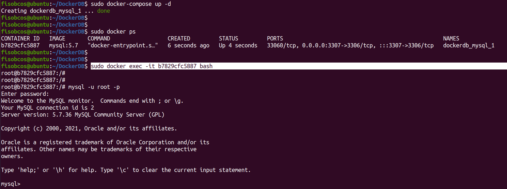
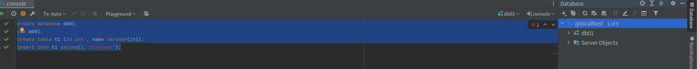
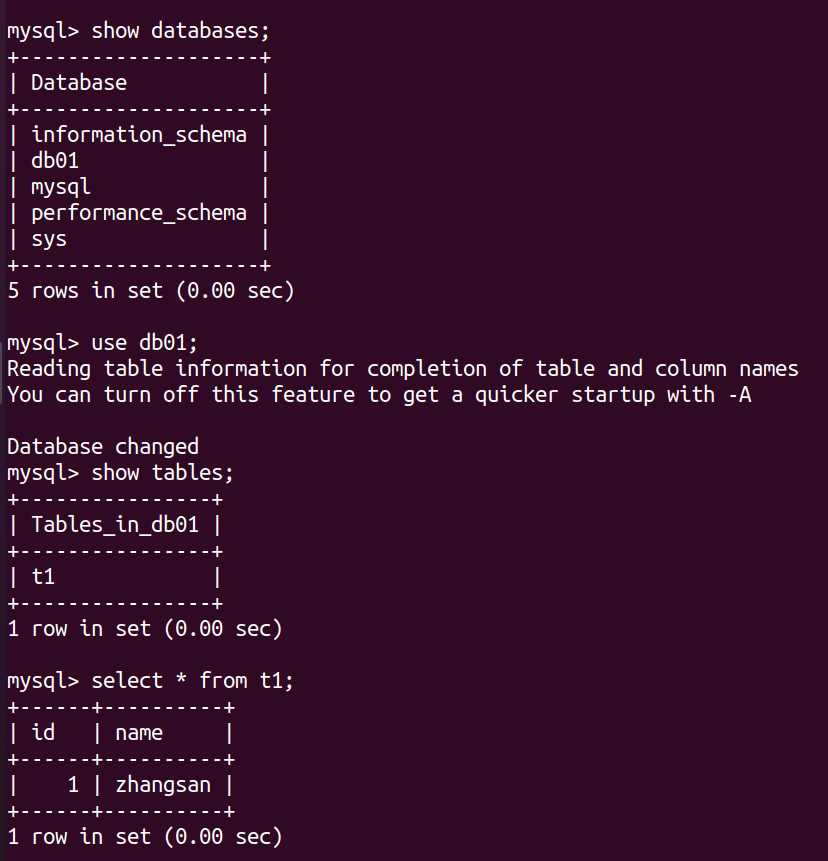
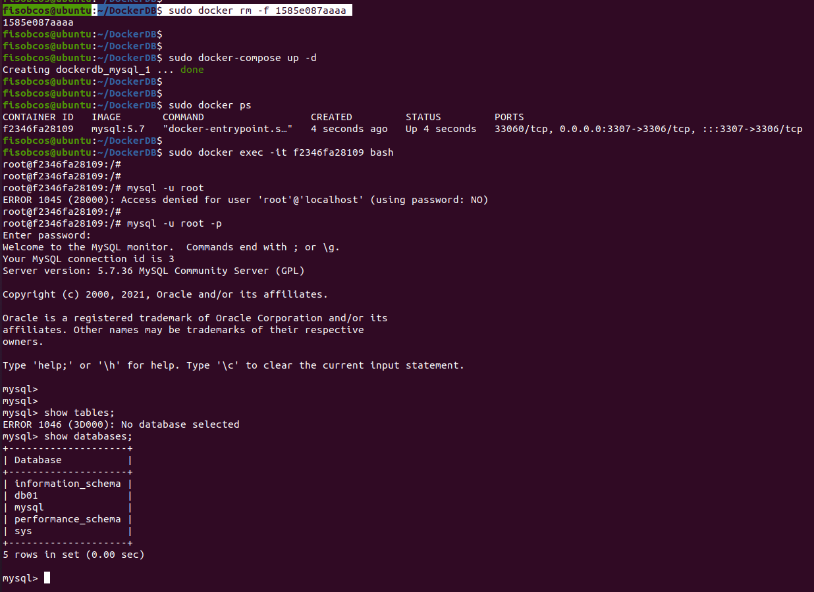

## 一、下载`mysql`镜像

下载最新版：`docker pull mysql`

下载指定版本（如5.7）：`docker pull mysql:5.7`

## 二、`mysql`镜像基础使用

### 2.1 创建`mysql`容器

```
docker run -p 3306:3306 -e MYSQL_ROOT_PASSWORD=123456 -d mysql
```

**注意：如果宿主机本身已经安装了`mysql`，那么意味着3306端口已经被占用，此时需要重新设置宿主机映射端口。**

```
docker run -p 5000:3306 -e MYSQL_ROOT_PASSWORD=123456 -d mysql
```

也可以通过如下命令先关闭宿主机的mysql服务。

```shell
sudo netstat -tanlp | grep 3306  ## 查看使用3306的进程

sudo kill xxx   ##杀死对应进程
```

检查容器是否启动：

```
docker ps
```

创建伪终端：

```
docker exec -it 容器ID /bin/bash
```

登录`mysql`客户端

```
mysql -uroot -p
```


### 2.2 建库建表插入数据

```sql
create database db01;
use db01;
create table t1 (id int , name varchar(20));
insert into t1 values(1,"zhangsan");
```

从外部连接docker容器`mysql`: (访问5000端口)


### 2.3 存在问题

#### 2.3.1 插入中文字符

如果在docker容器的`mysql`中插入中文字符，则会出现以下情况：


可见，容器内部的`mysql`无法正确识别插入的中文字符。

**原因在于：docker上默认字符集编码默认不是`utf-8`**

我们可以在docker容器内部的`mysql`客户端中输入以下命令来查看默认字符集编码：

```sql
 SHOW VARIABLES LIKE 'character%';
```


如上所示，**容器内`mysql client`使用的字符集编码是`latin1`**

#### 2.3.2 删除容器后数据丢失

容器内`mysql`保存的数据不具备持久性，一旦容器被删除，数据也会被一并删除


## 三、`mysql`镜像高级使用--解决存在问题

为了解决上述两个存在的问题，下面给出`mysql`镜像的实战使用方式：

```
docker run -d -p 3307:3306 --privileged=true -v /home/fisobcos/DockerDB/dockerdata/dockerMysql/log:/var/log/mysql -v /home/fisobcos/DockerDB/dockerdata/dockerMysql/data:/var/lib/mysql -v /home/fisobcos/DockerDB/dockerdata/dockerMysql/conf:/etc/mysql/conf.d -e MYSQL_ROOT_PASSWORD=root  --name mysql mysql:5.7  --default-authentication-plugin=mysql_native_password
```

上述的方式使用了容器卷，对`mysql`容器的数据在宿主机进行了备份。

```
docker run -d -p 3306:3306 --privileged=true 
-v /dockerdata/dockerMysql/log:/var/log/mysql 
-v /dockerdata/dockerMysql/data:/var/lib/mysql 
-v /dockerdata/dockerMysql/conf:/etc/mysql/conf.d
-e MYSQL_ROOT_PASSWORD=123456  
--name mysql mysql:8.0.32
```

### 3.1 配置`my.cnf`设置字符集编码

```shell
cd /dockerdata/dockerMysql/conf
vim my.cnf
```

配置文件内容如下：

```
[client]
	default-character-set=utf8
[mysql]
	default-character-set=utf8
[mysqld]
	init_connect=' SET collation_connection = utf8_unicode_ci '
	init_connect=' SET NAMES utf8 '
	character-set-server=utf8
	collation-server=utf8_unicode_ci 
	skip-character-set-client-handshake 
	skip-name-resolve
```

重新启动`mysql`容器实例再重新进入并查看字符编码。此时可以向`mysql`容器中插入中文字符。

### 3.2 数据持久性问题

由于使用了数据卷，`mysql`容器中的数据在宿主机上进行了同步，因此及时容器退出或被删除，数据也会被保存在宿主机上，当下一次再次启动新容器时也可以重新使用这些保存在宿主机上的数据。


### 3.3 问题

出现以下问题：

```
docker中mysql登录时： Can't connect to local MySQL server through socket '/var/run/mysqld/mysqld.sock'
```

**建议直接通过`docker-compose.yaml`完成数据库的docker部署，不然会出现各种各样的问题**

下面给出`docker-compose.yaml`的内容： (**一定注意缩进，不同等级的需要多出一个空格来缩进区别**)

```yaml
version: "3.7"

services:
 mysql: 
  image: mysql:5.7
  environment:
   MYSQL_ROOT_PASSWORD: "123456"
  ports:
  - "3307:3306"
  volumes:
  - "/home/fisobcos/DockerDB/dockerdata/dockerMysql/log:/var/log/mysql"
  - "/home/fisobcos/DockerDB/dockerdata/dockerMysql/data:/var/lib/mysql"
  - "/home/fisobcos/DockerDB/dockerdata/dockerMysql/conf:/etc/mysql/conf.d"
  command: --default-authentication-plugin=mysql_native_password 
```

然后执行命令：

```
sudo docker-compose up -d

sudo docker exec -it xxx(容器ID) bash
```




外部软件连接3307数据库并插入数据：




容器内部查看数据（**此时编码正确**）：




退出并删除该容器后，重新以容器数据卷生成新的容器，再次检查数据库数据：


