## 一、DockerFile是什么

Dockerfile是用来构建Docker镜像的文本文件，是由一条条构建镜像所需的指令和参数构成的脚本。

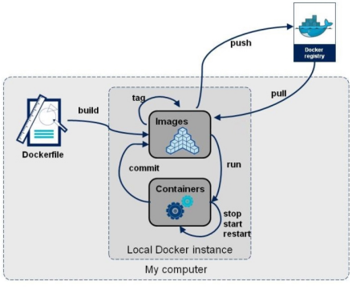

官方文档：https://docs.docker.com/engine/reference/builder/

### 1.1 DockerFile构建容器三步骤

- 编写Dockerfile文件
- docker build命令构建镜像
- docker run依镜像运行容器实例


### 1.2 DockerFile构建过程解析

- 每条**保留字指令都必须为大写字母**且后面要跟随至少一个参数
- 指令按照从上到下，顺序执行
- #表示注释
- **每条指令都会创建一个新的镜像层并对镜像进行提交**


### 1.3 Docker执行Dockerfile的大致流程

- docker从**基础镜像**运行一个容器
- 执行一条指令并对容器作出修改
- 执行类似docker commit的操作提交一个**新的镜像层**
- docker再**基于刚提交的镜像运行一个新容器**
- 执行dockerfile中的下一条指令直到所有指令都执行完成


### 1.4 总结

从应用软件的角度来看，Dockerfile、Docker镜像与Docker容器分别代表软件的三个不同阶段，

- Dockerfile是软件的原材料
- Docker镜像是软件的交付品
- Docker容器则可以认为是软件镜像的运行态，也即依照镜像运行的容器实例

Dockerfile面向开发，Docker镜像成为交付标准，Docker容器则涉及部署与运维，三者缺一不可，合力充当Docker体系的基石。

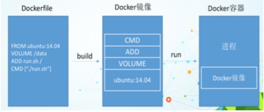

**Dockerfile**：

定义了进程需要的一切东西。Dockerfile涉及的内容包括执行代码或者是文件、环境变量、依赖包、运行时环境、动态链接库、操作系统的发行版、服务进程和内核进程(当应用进程需要和系统服务和内核进程打交道，这时需要考虑如何设计namespace的权限控制)等等;

**Docker镜像：**

在用Dockerfile定义一个文件之后，docker build时会产生一个Docker镜像，当运行 Docker镜像时会真正开始提供服务。

**Docker容器：**

容器是直接提供服务的。


## 二、DockerFile常用保留字指令

### 2.1 `FROM`

指明基础镜像，当前新镜像是基于哪个镜像的，指定一个已经存在的镜像作为模板，因此DockerFile的第一条必须是from

### 2.2 `MAINTAINER`

镜像维护者的姓名和邮箱地址

### 2.3 `RUN`

**容器构建build（由DockerFile构建Docker镜像）**时需要运行的命令。

`RUN`的使用由两种格式：

- shell格式

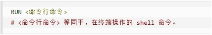

例如：

```
RUN yum -y install vim   //RUN后直接接shell指令
```

- exec格式

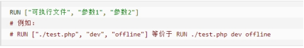

### 2.4 `EXPOSE`

当前容器对外暴露出的端口

### 2.5 `WORKDIR`

指定在创建容器后，伪终端默认登陆的进来的工作目录，一个落脚点

### 2.6 `USER`

指定该镜像以什么样的用户去执行，如果都不指定，默认是root

### 2.7 `ENV`

用来在构建镜像过程中**设置环境变量**

```
ENV MY_PATH /usr/mytest

这个环境变量可以在后续的任何RUN指令中使用，这就如同在命令前面指定了环境变量前缀一样；也可以在其它指令中直接使用这些环境变量

比如：WORKDIR $MY_PATH  , 指定伪终端登录后默认的落脚点工作目录
```

### 2.8 `ADD`

将**宿主机目录下的文件**拷贝进**镜像**且会自动处理URL和**解压tar压缩包**

### 2.9 `COPY`

类似ADD，**拷贝文件和目录到镜像中**。 将从构建上下文目录中 <源路径> 的文件/目录复制到新的一层的镜像内的 <目标路径> 位置

```
·COPY src dest
·COPY ["src", "dest"]
·<src源路径>：源文件或者源目录
·<dest目标路径>：容器内的指定路径，该路径不用事先建好，路径不存在的话，会自动创建。
```

### 2.10 `VOLUME`

用于指定容器数据卷，用于数据保存和持久化工作

需要注意：**通过 VOLUME 指令创建的挂载点，无法指定宿主机上对应的目录，是自动生成的。**一般是在宿主机的`/var/lib/docker`目录下自动创建一个临时文件。但是**可以指定容器上映射的目录。**

### 2.11 `CMD`

指定**容器启动RUN（由Docker镜像到Docker容器）**后的要干的事情

指定的使用格式与`RUN`类似，也分为两种格式：

- `shell`格式 ： CMD <shell命令>

- `exec`格式： CMD ["可执行文件"，"参数1","参数2"，……]

注意：Dockerfile 中可以有多个 CMD 指令，但**只有最后一个生效**。如果在实例化镜像时在`docker run`之后添加了其他shell命令，则CMD 会被 docker run 之后的shell命令替换

### 2.12 `ENTRYPOINT`

也是用来指定一个容器启动时**（由Docker镜像到Docker容器）**要运行的命令

类似于 CMD 指令，但是**ENTRYPOINT不会被docker run后面的命令覆盖**， 而且这些命令行参数会被当作参数送给 ENTRYPOINT 指令指定的程序。

**命令格式和案例说明：**

- 命令格式：

```
ENTRYPOINT ["可执行文件","参数1","参数2"，……]
```

**ENTRYPOINT可以和CMD一起用**，一般是**变参才会使用 CMD** ，这里的 **CMD 等于是在给 ENTRYPOINT 传参**。

当指定了ENTRYPOINT后，CMD的含义就发生了变化，**不再是直接运行其命令而是将CMD的内容作为参数传递给ENTRYPOINT指令**，他两个组合会变成`ENTRYPOINT "CMD"`

- 案例说明：

假设已通过 Dockerfile 构建了 nginx:test 镜像：

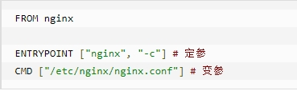

```dockerfile
FROM nginx

ENTRYPOINT ["nginx","-c"]  #定参
CMD ["/etc/nginx/nginx.conf"] #变参
```

以上dockerfile的实际执行效果为：

```
nginx -c /etc/nginx/nginx.conf  //在镜像生成容器时使用的是  docker run  nginx:test
```

**如果生成实例化容器时使用的命令不是`docker run  nginx:test`，而是带有参数的，比如：`docker run nginx:test -c /etc/nginx/new.conf`**

那么此时的dockerFile的实际执行效果应为：

```
nginx -c /etc/nginx/new.conf
```

即是说：**CMD中的参数被命令行中的参数替换了**。


**`ENTRYPOINT`的优点**：在执行docker run的时候**可以指定 ENTRYPOINT 运行所需的参数**。


**`ENTRYPOINT`注意事项：**如果 Dockerfile 中如果**存在多个** ENTRYPOINT 指令，**仅最后一个生效**。


## 三、`DockerFile`使用案例

### 3.1 自定义镜像mycentosjava8

要求：Centos7镜像具备vim+ifconfig+jdk8

JDK的下载镜像地址：（下载jdk8 171）

```
官方： https://www.oracle.com/java/technologies/downloads/#java8

第三方：https://mirrors.yangxingzhen.com/jdk/
```

1. **编写Dockerfile文件** 

​        **Dockerfile文件的首字母必须是 `D`，一般都命名为`Dockerfile`**

```dockerfile
FROM centos:7    # 需要添加tag标签，下载centos7，因为最新版的centos8已经停止更新
MAINTAINER jjn<1556174776@qq.com>
 
ENV MYPATH /usr/local
WORKDIR $MYPATH
 
#安装vim编辑器
RUN yum -y install vim
#安装ifconfig命令查看网络IP
RUN yum -y install net-tools
#安装java8及lib库
RUN yum -y install glibc.i686
RUN mkdir /usr/local/java
#ADD 是相对路径jar,把jdk-8u171-linux-x64.tar.gz添加到容器中,安装包必须要和Dockerfile文件在同一位置
ADD jdk-8u171-linux-x64.tar.gz /usr/local/java/
#配置java环境变量
ENV JAVA_HOME /usr/local/java/jdk1.8.0_171
ENV JRE_HOME $JAVA_HOME/jre
ENV CLASSPATH $JAVA_HOME/lib/dt.jar:$JAVA_HOME/lib/tools.jar:$JRE_HOME/lib:$CLASSPATH
ENV PATH $JAVA_HOME/bin:$PATH
 
EXPOSE 80
 
CMD echo $MYPATH
CMD echo "success--------------ok"
CMD /bin/bash
```

2. **通过Dockerfile文件生成镜像**

```
docker build -t 新镜像名字:TAG .    //指令格式 -->  注意最后有一个 .
```

这里案例中的应该是：

```
docker build -t centosjava8:1.0 .
```

3. **通过镜像生成容器**

```
docker run -it 新镜像名字:TAG   //指令格式
```

此案例中的应该是：

```
docker run -it centosjava8:1.0 /bin/bash
```

效果：

- 使用`vim`

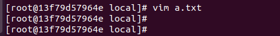

- 使用`ifconfig`

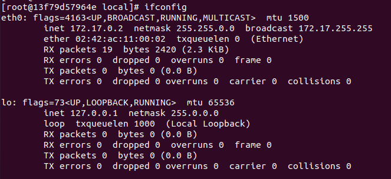

- 使用`java`

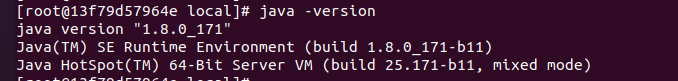


## 四、虚悬镜像

### 4.1 虚悬镜像是什么

```
仓库名、标签都是<none>的镜像，俗称dangling image
```

### 4.2 生成一个虚悬镜像

- vim 生成 Dockerfile

```
from ubuntu
CMD echo 'action is success'
```

- docker build .  

​	由于没有指定容器实例名称跟TAG，因此会生成一个虚悬镜像

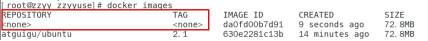

### 4.3 查看所有的虚悬镜像

```
docker image ls -f dangling=true
```

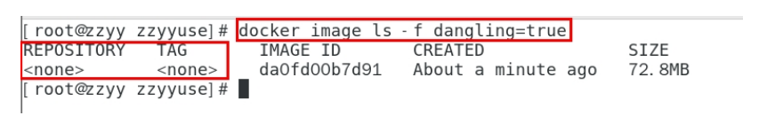

### 4.4 删除所有虚悬镜像

```
docker image prune
```

虚悬镜像已经失去存在价值，可以删除

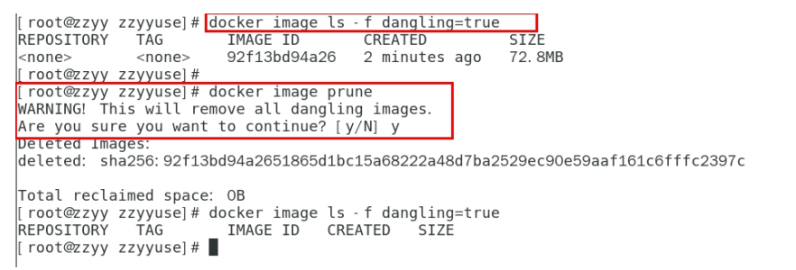
