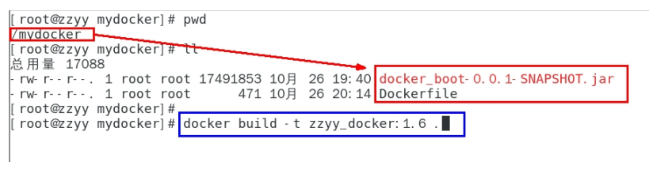
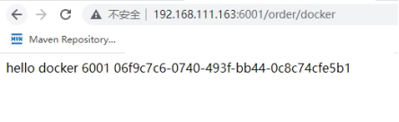

## 一、通过dockerfile发布微服务部署到docker容器

### 1.1 使用IDEA工具里面生成微服务jar包：

```
docker_boot-0.0.1-SNAPSHOT.jar
```

### 1.2 编写Dockerfile

```dockerfile
# 基础镜像使用java
FROM java:8
# 作者
MAINTAINER jjn
# VOLUME 指定临时文件目录为/tmp，在宿主机/var/lib/docker目录下创建了一个临时文件并链接到容器的/tmp
VOLUME /tmp
# 将jar包添加到容器中并更名为zzyy_docker.jar
ADD docker_boot-0.0.1-SNAPSHOT.jar zzyy_docker.jar
# 运行jar包
RUN bash -c 'touch /zzyy_docker.jar'
ENTRYPOINT ["java","-jar","/zzyy_docker.jar"]
#暴露6001端口作为微服务
EXPOSE 6001
```

### 1.3 将微服务jar包和Dockerfile文件上传到同一个目录下/mydocker

需要注意：**需要将微服务与`Dockerfile`文件放在一个目录下**



### 1.4 根据`Dockerfile`构建镜像

```
docker build -t zzyy_docker:1.6 .
```

### 1.5 后台运行微服务容器

```
docker run -d -p 6001:6001 zzyy_docker:1.6   //监听6001端口
```

### 1.6 访问测试

