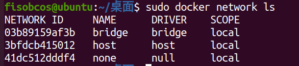
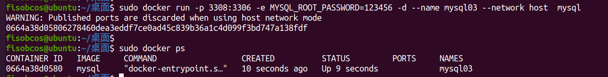

## 一、`Docker`网络是什么

### 1.1 docker不启动时的默认网络情况


### 1.2 docker启动后的网络情况


**会产生一个名为docker0的虚拟网桥，而且默认网络IP为：172.17.0.1/255.255.0.0**

### 1.3 查看docker已有网络模式

命令：

```
docker network ls
```




**默认存在3种网络模式：bridge、host、none。**

## 二、`Docker`网络常用命令

### 2.1 使用帮助手册

```
docker network --help
```


**help 给出了docker network 的全部使用方法**


### 2.2 查看网络源数据

```
docker network inspect xxx(网络名称)
```

**查看已有网络模式的详细信息**


### 2.3 创建自定义网络

```
docker network create xxx(网络名)
```

**创建的自定义网络如果不指定模式，那么默认为bridge模式**


### 2.4 删除指定网络

```
docker network rm xxx(网络名)
```


## 三、`Docker `网络的用途和网络模式介绍

### 3.1 用途

- 实现容器间的互联和通信以及端口映射
- 容器IP变动时候可以通过服务名直接网络通信而不受到影响

### 3.2 网络模式介绍

#### 3.2.1 总体介绍


#### 3.2.2  bridge模式

​	**使用--network  bridge指定，默认使用docker0**

​	Docker 服务默认会创建一个 docker0 网桥（其上有一个 docker0 内部接口），该**桥接网络的名称为docker0**，它在内核层连通了其他的物理或虚拟网卡，这就**将所有容器和本地主机都放到同一个物理网络**。Docker 默认**指定了 docker0 接口 的 IP 地址和子网掩码**，让**主机和容器之间可以通过网桥相互通信**。

​	Docker使用Linux桥接，在宿主机虚拟一个Docker容器网桥(docker0)，**Docker启动一个容器时会根据Docker网桥的网段分配给容器一个IP地址，称为Container-IP**，同时**Docker网桥是每个容器的默认网关**。因为在**同一宿主机内的容器都接入同一个网桥，这样容器之间就能够通过容器的Container-IP直接通信**。

​	**docker run** 的时候，没有指定network的话**默认使用的网桥模式就是bridge，使用的就是docker0**。在宿主机ifconfig,就可以看到docker0和自己create的network(后面讲)eth0，eth1，eth2……代表网卡一，网卡二，网卡三……，lo代表127.0.0.1，即localhost，inet addr用来表示网卡的IP地址

​	**网桥docker0创建一对对等虚拟设备接口一个叫veth，另一个叫eth0，成对匹配。**

​	整个宿主机的网桥模式都是docker0，类似一个交换机有一堆接口，每个接口叫veth，在本地主机和容器内分别创建一个虚拟接口，并让他们彼此联通（这样一对接口叫veth pair）；每个容器实例内部也有一块网卡，每个接口叫eth0。

​	通过上述，将**宿主机上的所有容器都连接到这个内部网络上**，两个容器在同一个网络下,会从这个网关下各自拿到分配的ip，此时**两个容器的网络是互通的**。


**实践验证：**

```
sudo docker run -p 3307:3306 -e MYSQL_ROOT_PASSWORD=123456 -d --name mysql01 mysql
sudo docker run -p 3308:3306 -e MYSQL_ROOT_PASSWORD=123456 -d --name mysql02 mysql
```

在宿主机查看ip情况： `ip addr`

可以看到多了两个网络映射：


如果进入两个容器内部在进行查看，也是可以看到对应的网络映射的（必须要实现安装ip addr 或 ifconfig 工具）

#### 3.2.3 host模式

使用--network host指定

**直接使用宿主机的 IP 地址与外界进行通信**，不再需要额外进行NAT 转换。

​	容器将不会获得一个独立的Network Namespace， 而是**和宿主机共用一个Network Namespace**。容器将不会虚拟出自己的网卡而是**使用宿主机的IP和端口**。


实践验证：

```
sudo docker run -p 3308:3306 -e MYSQL_ROOT_PASSWORD=123456 -d --name mysql03 --network host  mysql
```



docke启动时总是遇见上述中的警告：`WARNING: Published ports are discarded when using host network mode`

原因：

**docker启动时指定--network=host或-net=host**，**如果还指定了-p映射端口，那这个时候就会有此警告**。

警告是通知用户：**通过-p设置的参数将不会起到任何作用，端口号会以主机端口号为主，重复时则递增。**

因此我们可以选择无视这个警告，或者采用以下的做法（去掉端口的映射）：

```
sudo docker run -e MYSQL_ROOT_PASSWORD=123456 -d --name mysql03 --network host  mysql
```

下面是查看容器实例内部：

可以看到**容器是`host`模式，且没有网关和IP地址。**


此时我们**只需访问宿主机的3306端口，就可以直接访问容器内的mysql了。**

#### 3.2.4 none模式

使用--network none指定

​	在none模式下，并**不为Docker容器进行任何网络配置**。 也就是说，**这个Docker容器没有网卡、IP、路由等信息**，**只有一个lo**。需要我们自己为Docker容器添加网卡、配置IP等。

​	禁用网络功能，只有lo标识(就是127.0.0.1表示本地回环)


**实践验证：**

```
docker run -d -p 8084:8080 --network none --name tomcat84 billygoo/tomcat8-jdk8
```

进入容器内部查看:


在容器外部查看:


#### 3.2.5 container模式

使用--network container:NAME或者容器ID指定

​	新建的容器和**已经存在的一个容器共享一个网络ip配置**而不是和宿主机共享。新创建的容器不会创建自己的网卡，配置自己的IP，而是和一个指定的容器共享IP、端口范围等。同样，**两个容器除了网络方面，其他的如文件系统、进程列表等还是隔离的。**


**实践验证：**

案例一：

```
docker run -d -p 8085:8080        --name tomcat85 billygoo/tomcat8-jdk8
docker run -d -p 8086:8080 --network container:tomcat85 --name tomcat86 billygoo/tomcat8-jdk8
```

运行结果:


相当于**tomcat86和tomcat85公用同一个ip同一个端口，导致端口冲突**


案例二：

使用Alpine Linux：

​	Alpine Linux 是一款独立的、非商业的通用 Linux 发行版，专为追求安全性、简单性和资源效率的用户而设计。 可能很多人没听说过这个 Linux 发行版本，但是经常用 Docker 的朋友可能都用过，因为他小，简单，安全而著称，所以作为基础镜像是非常好的一个选择，可谓是麻雀虽小但五脏俱全，镜像非常小巧，不到 6M的大小，所以特别适合容器打包。

```
docker run -it    --name alpine1  alpine /bin/sh
docker run -it --network container:alpine1 --name alpine2  alpine /bin/sh
```

运行结果，验证共用搭桥:

**网络映射是相同的。**


假如此时关闭alpine1，再看看alpine2


再看alpine2，发现网络映射eth0@if16已经消失。


## 四、`Docker`自定义网络

过时的link：通过`--link`实现多容器之间的网络互通可能在未来被docker所移除，因此不推荐使用这种方式。


### 4.1 没有使用自定义网络之前

使用以下命令分别启动两个容器：

```
docker run -d -p 8081:8080   --name tomcat81 billygoo/tomcat8-jdk8
docker run -d -p 8082:8080   --name tomcat82 billygoo/tomcat8-jdk8
```

上述成功启动后，使用docker exec进入各自容器实例内部，通过使用命令`ip addr`查看容器各自的IP地址，然后相互使用`ping`命令进行通信测试：


可以看到，**两个容器可以通过IP地址直接进行网络通信**


但如果**使用容器名，就无法通过`ping`测试（即无法通过容器名进行网络通信）**


### 4.2 使用自定义网络之后

自定义桥接网络,自定义网络默认使用的是桥接网络bridge

- 新建自定义网络（zzyy_network）


- 新建容器加入上一步新建的自定义网络（通过使用  **-- network zzyy_network** 命令行来实现）

```
docker run -d -p 8081:8080 --network zzyy_network  --name tomcat81 billygoo/tomcat8-jdk8
docker run -d -p 8082:8080 --network zzyy_network  --name tomcat82 billygoo/tomcat8-jdk8
```

- 使用容器名互相ping测试（**使用容器名可以实现网络通信**）


结论：**自定义网络本身就维护好了主机名和ip的对应关系（ip和域名都能通）**