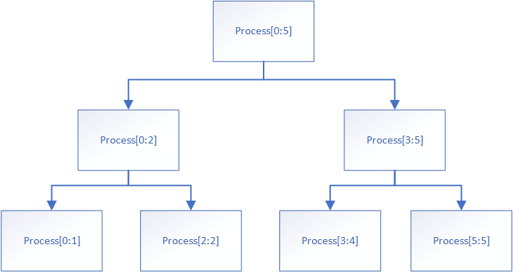

### 递归的运作过程其实可以看作是对一颗树的后序遍历

例一：用递归方法求某一数组的最大值
```go
    func getMax(arr []int) int {
        return process(arr,0,len(arr)-1)
    }

    func process(arr []int,left,right int) int {
        if (left == right) {
            return arr[left]
        }
        mid := left + ((right-left)>>1)   // mid = left + (right - left)/2 (右移一位相当于除以二)
        leftMax := process(arr,left,mid)
        rightMax := process(arr,mid+1,right)
        return Max(leftMax,rightMax)
    }

    func Max(a,b int) int {
        if a>b {
            return a
        }else {
            return b
        }
    }
```

如果我们要求解的数组为 arr= [3,2,5,6,7,4],运行流程如下：



如上图所示，算法运行的流程与二叉树的后序遍历算法一致，先运算最左子树的左叶子节点(process[0:1])，然后是右叶子节点(process[2:2])，然后是根节点(process[0:2])。接着返回上一层.....


### master公式求复杂度(针对递归问题)

要求递归问题每次进行递归问题都是等规模的

T(N) = a * T(N/b) + O(N^d)  ----> O(N^d) 是指除了递归运算之外的计算复杂度。

1. log(b,a) > d ,则复杂度为O(N^log(b,a))
2. log(b,a) = d ,则复杂度为O(N^d * logN)
3. log(b,a) < d ,则复杂度为O(N^d)

对于上述的递归求法，其复杂度计算如下：

a = b =2 , d = 0

log(2,2) = 1 > 0  , 所以复杂度为 O(N)