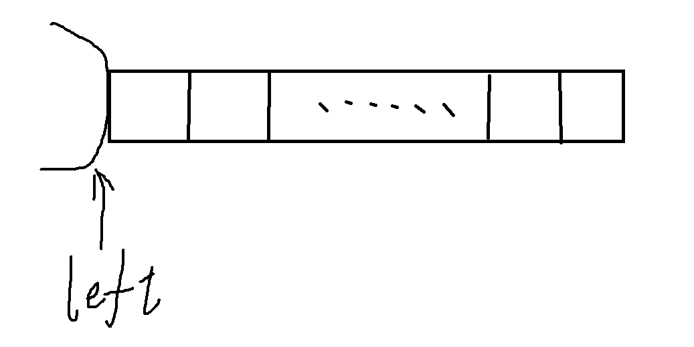
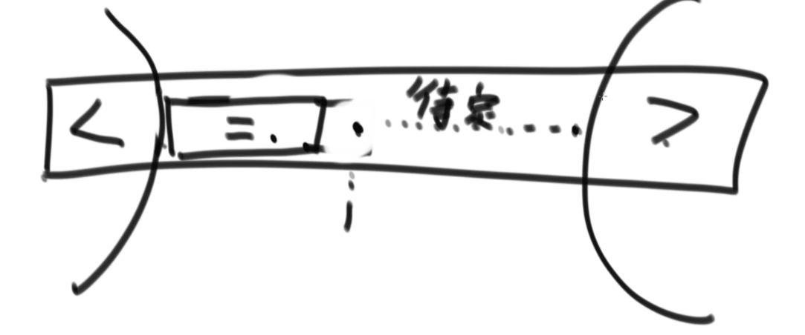

### 一、问题一

给定一个数组arr，和一个数num，请把小于等于num的数放在数组的左边，大于num的数放在数组的右边。要求额外空间复杂度为O(1),时间复杂度O(N)

思路：设定一个指针left，其用来指向 <=num部分数组的下一个位置。从0开始遍历整个数组，一旦当前数 <=num，将其(arr[i])与arr[left]进行交换 ,接着 i++ ，left++；如果当前数 > num，则只有 i++

如下图：left区域在逐渐”吞噬“数组

举例：数组[3,5,6,7,4,3,5,8],num = 5

1. i = left =0 , arr[0] <= 5。swap(arr[0],arr[0])   arr= [3,5,6,7,4,3,5,8]
2. i = left= 1,arr[1] <= 5。 swap(arr[1],arr [1])   arr= [3,5,6,7,4,3,5,8]
3. i = left= 2, arr[2] > 5。 arr= [3,5,6,7,4,3,5,8]
4. i = 3 , left= 2， arr[3] > 5     arr= [3,5,6,7,4,3,5,8]
5. i = 4， left= 2 ，arr[4]<=5。 swap(arr[4],arr[2])    arr= [3,5,4,7,6,3,5,8]
6. i = 5 , left= 3，arr[5]<=5。swap(arr[5],arr[3])     arr= [3,5,4,3,6,7,5,8]
7. i = 6，left= 4，arr[6]<=5。swap(arr[6],arr[4])   arr = [3,5,4,3,5,7,6,8]

### 二、问题二(荷兰国旗)

给定一个数组arr，和一个数num，请把小于num的数放在数组的左边，等于num的放在中间，大于num的数放在数组的右边。要求额外空间复杂度为O(1),时间复杂度O(N)

思路：需要有左右两个区域， < num区域（left）和 > num区域(right)。left指向左区域的下一个，right指向右区域的上一个。

1. 如果arr[i]<num，则swap(arr[i],arr[left]) ,i++  left++
2. 如果arr[i]=num，则i++
3. 如果arr[i]>num，则swap(arr[i],arr[right]),right--

如图：如果是情况2，则只是=区域在右扩；如果是情况3，则只是<区域在左扩；如果是情况1，则可以看作是<区域在推动=区域在前进(=区域的首元素被换到尾部，原来的尾元素被<区域"吞噬")

### 三、快速排序法1.0

加入待排序的数组为arr = [3,5,6,7,4,3,8,5]，那么将此数组的最后一个元素arr[n-1] = 5作为num，对arr[0:n-2]采用问题一同样的方法进行分区，<= num的排到前面，> num的排到后面。完成此次排序之和，将>num区域的第一个元素与arr[n-1]进行交换，效果如下：

完成本次移动之后，采用递归的方法分别对<=5区域和>5区域采用相同的方法进行移动(采用个分区的**最后一个元素作为num**)

递归完成后，可以得到一个有序数组

### 四、快速排序法2.0

思路基本与1.0相同，只不过采用了问题二(荷兰国旗)的分区思想，新增了=5的区域，最后一个作为num的数在完成本次区域划分、元素交换之和，依旧与>num区域的第一个元素进行交换。

接着分别对<num区域和>num区域进行递归划分。。。

相比于1.0版本，因为不需要对=num区域进行递归，因此计算量有所下降。

### 五、快速排序法的时间复杂度

如果每次num都能刚好落在区域的中间，那么时间复杂度将是O(N*logN)，随着num的逐渐向两侧偏移，复杂度将会从O(N *logN)想着O(N^2)的方向恶化。

### 六、针对`num`优化的快排3.0

由于快排算法时间复杂度高低取决于num选择的好坏，因此快排3.0的做法是每次进行分区前先从整个arr数组中随机选择一个数，将其与arr[n-1]（或者是当前分区的最后一个元素）进行交换，然后采用快排2.0进行排序。

**由于num的选择引入了随机，变相的优化了快排算法，最后根据数学期望，可以让快排3.0的时间复杂度变为O(N*logN)**