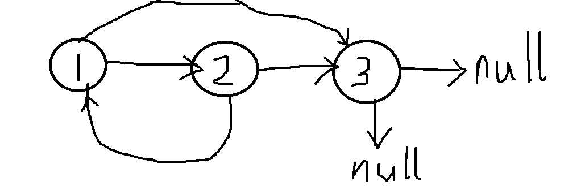
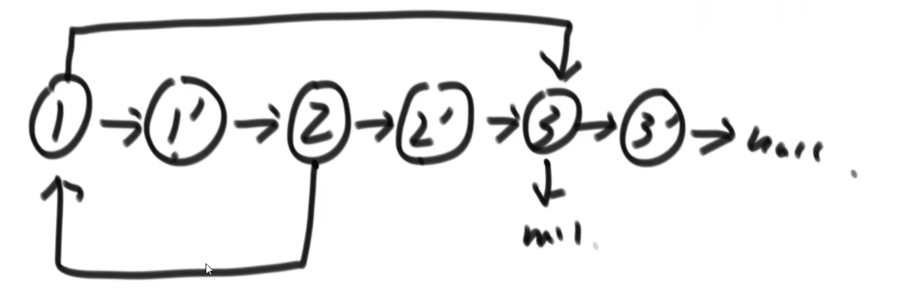

### 一、反转单向和双向链表

题目：分别实现反转单向链表和反转双向链表的函数

要求：如果链表长度为N，时间复杂度要求为O(N)，额外空间复杂度要求为O(1)

### 二、打印两个有序链表的公共部分

题目：给定两个有序链表的头指针`head1`和`head2`，打印两个链表的公共部分

要求：如果两个链表的长度之和为N，时间复杂度要求为O(N)，额外空间复杂度要求为O(1)

> 思路：分别从`head1`和`head2`出发，如果指针指向的节点数值相等则打印；如果`head1`指向元素大于`head2`，那么`head2++`，`head1`不变，也就是说两链指针指向数相比，小数值的链指针++

### 三、判断一个链表是否为回文结构

题目：给定一个单链表的头节点head，请判断该链表是否为回文结构

例子：1->2->1，返回true；1->2->2->1，返回true；15->6->15，返回true；1->2->3，返回false

要求：如果链表长度为N，则时间复杂度需要达到O(N)

> 思路：准备一个额外的长度为N的栈，将整个单链表的元素从前往后压入栈中。接着再进行出栈，第i次出栈的元素分别和原始链表的第i个节点的数值进行比较。如果直到所有元素出栈也没有出现数值不相等的情况，则说明这是一个回文结构

新要求：要求额外的空间复杂度为O(1)

> 新思路：使用快慢指针来辅助，快指针一次移动递增两次，慢指针一次移动只递增一次。当快指针指向链表尾部时，慢指针刚好指向链表中间节点。
>
> 现在我们可以获得：头节点指针、尾节点指针、中间节点指针。我们从尾部节点开始到中间节点，反转链表的指向，然后分别从头、尾指针开始，分别向后(前)遍历，如果直到双方遍历到中间节点也没有出现节点数值不相等的情况，说明这是一个回文结构。
>
> 这样的新思路中，我们没有使用任何额外的辅助空间。但是时间复杂度却没有增长。

### 四、将单向链表按某值划分为左边小、中间相等、右边大的形式

题目：给定一个单链表的头节点head，节点的值类型是整数，再给定一个整数pivot。实现一个调整链表的函数，将链表调整为左部分都是小于pivot的节点，中间部分都是等于pivot的节点，右部分都是值大于pivot的节点。

> 思路：将链表从头到尾存储的数值按相同顺序存储到一个临时数组中，对数组采用归并排序的方法完成分区，然后将排完序的数组恢复为链表的形式

进阶：再实现原问题功能的基础上增加如下的要求：

1. 调整后所有小于pivot的节点之间的相对顺序和调整前一样
2. 调整后所有等于pivot的节点之间的相对顺序和调整前一样
3. 调整后所有大于pivot的节点之间的相对顺序和调整前一样
4. 时间复杂度为O(N)，额外的空间复杂度为O(1)

> 思路：准备六个额外的指针，分别是：
>
> 1. 小于区域的头指针 LH 
> 2. 小于区域的尾指针 LT
> 3. 等于区域的头指针 EH
> 4. 等于区域的尾指针 ET
> 5. 大于区域的头指针 GH
> 6. 大于区域的尾指针 GT
>
> 开始，所有的指针都指向`nil`。接着从头开始遍历原始链表：如果节点数值小于pivot，则插入到用LH、LT记录的小于链上；如果节点数值等于pivot，则插入到用EH、ET记录的等于链上；如果节点数值大于pivot，则插入到GH、GT记录的大于链上。
>
> 最后，将这三条链再串联起来。
>
> 一个小问题，有时候可能某一区域不存在，在进行连接的时候需要考虑这一问题。

### 五、复制含有随机指针节点的链表

题目：一种特殊的单链表节点类描述如下：

```go
type Node struct{
    value int
    next *Node
	rand *Node
}
```

`rand`指针时单链表节点结构中新增的指针，`rand`可能指向链表中的任意一个节点，也可能指向null。给定一个由Node节点类型组成的无环单链表的头节点指针，请实现一个函数完成这个链表的复制，并返回复制链表的头节点

要求：时间复杂度为O(n)，额外空间复杂度为O(1)

如果整个链表的结构如下：



如果不考虑空间复杂度，可以用哈希表的方式来实现：

> 1.首先新建三个克隆节点，分别克隆节点1、2、3的值
>
> 2.新建一个容量为3的哈希表，key值为原始链表中每个节点的指针，value值为对应克隆节点的指针
>
> 3.遍历原始链表：对于原始节点1，其下一节点为节点2，随机节点为节点3。因此对于克隆节点1来说，下一节点就是克隆节点2（hashMap[2号节点]），随机节点就是克隆节点3（hashMap[3号节点]）。通过这样的方式，我们可以让每一个克隆节点克隆到原始节点的next和rand指针指向哪一个节点。
>
> 4.返回指向克隆节点1的指针。

如果考虑空间复杂度为O(1)，则需要用下面的方法：

> 1.首先新建三个克隆节点，分别克隆节点1、2、3的值
>
> 2.在原节点1、2之间插入克隆节点1；原节点2、3之间插入克隆节点2；原节点3、nil之间插入克隆节点3，如下：



> 3.接着每两个节点为一组，从头开始遍历链表。因为节点1的rand指向节点3，因此`节点1.next`（就是克隆节点1）的rand指向`节点3.next`（就是克隆节点3）；因为节点2的rand指向节点1，因此`节点2.next`（就是克隆节点2）的rand指向`节点1.next`（就是克隆节点1）…………
>
> 4.经过上述步骤就可以完成下面的链表结构：


> 5.最后将3个原节点删除，就可以得到复制的克隆链表

### 六、两个单链表相交的一系列问题

题目：给定两个可能有环也可能无环的单链表，头结点`head1`和`head2`。请实现一个函数，如果两个链表相交，请返回相交的第一个节点。如果不相交，返回nil

要求：如果两个链表长度之和为N，时间复杂度请到达O(N)，额外的空间复杂度为O(1)