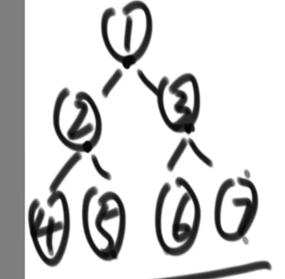
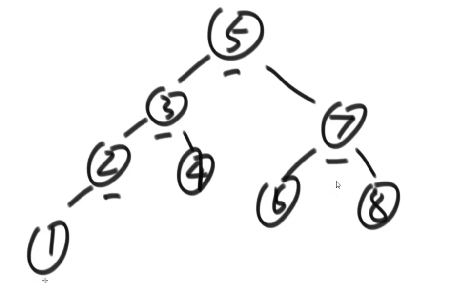
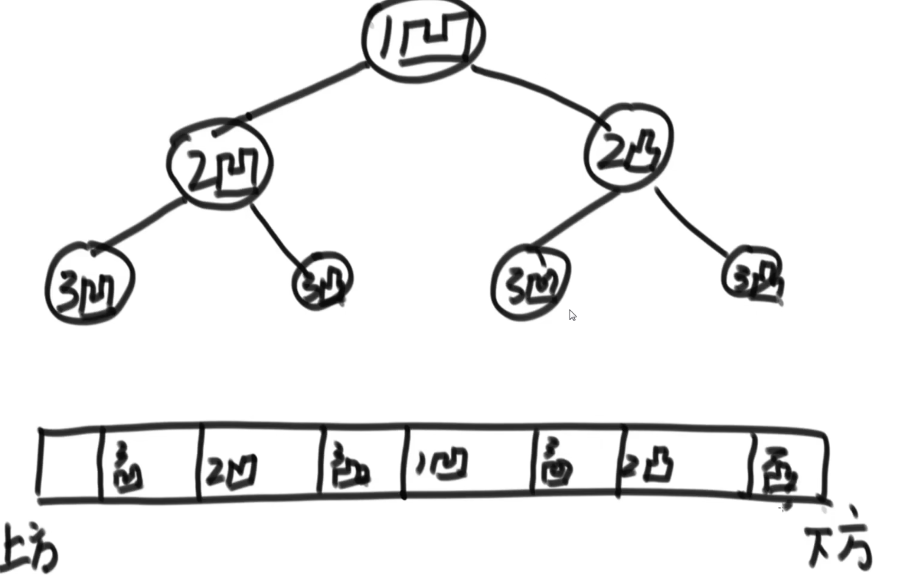

### 一、二叉树的三种递归遍历

二叉树的递归遍历中，每一个节点都会被访问3次，以下面例子说明：



上述的二叉树，如果采用递归遍历的方式，那么节点访问的顺序将为：

1,2,4,4,4,2,5,5,5,2,1,3,6,6,6,3,7,7,7,3,1

所谓的三种递归遍历方式是指：打印节点数值的时机不同。

1. 如果在节点第一次被访问时进行打印，那么成为先序遍历(根、左、右)。上述例子最后输出的结果就为：1,2,4,5,3,6,7
2. 如果在节点第二次被访问时进行打印，那么成为中序遍历（左、根、右）。上述例子最后输出的结果就为：4,2,5,1,6,3,7
3. 如果在节点第三次被访问时进行打印，那么成为后序遍历（左、右、根）。上述例子最后输出的结果就为：4,5,2,6,7,3,1

### 二、二叉树的三种非递归遍历

#### 2.1 先序遍历

1. 准备一个栈，栈大小为2即可（容得下左右孩子两个节点）
2. 先将二叉树的根节点入栈
3. 从栈中弹出一个节点
4. 打印该节点元素
5. 针对该弹出节点，先压入右孩子节点，再压入左孩子结点
6. 从第三步开始重复，直到栈无数可放。

#### 2.2 中序遍历

1. 准备一个栈，栈大小为二叉树深度
2. 根节点入栈
3. 不断让当前节点的左孩子结点入栈。直到没有左孩子，弹出最新的节点
4. 打印弹出节点的数值
5. 将该弹出节点的右子树采取从步骤2开始的相同策略...

#### 2.3 后序遍历

1. 准备两个栈，栈1和栈2，栈1大小为2即可，栈2大小必须等于二叉树节点个数
2. 先将二叉树根节点入栈1
3. 从栈1中弹出一个节点，将其存入栈2
4. 针对上述弹出节点，先压入左孩子结点，再压入右孩子节点
5. 从第三步开始重复，直到栈1无数可放。
6. 将栈2收集到的所有节点依次出栈，可以得到后序遍历的二叉树

### 三、二叉树的深度、广度优先遍历算法

#### 2.1 深度优先遍历

​	二叉树的深度优先遍历 其实就是 先序遍历

#### 2.2 广度优先遍历

​	二叉树的广度优先遍历算法，通过队列来实现：

1. 从根节点开始，将根节点入队列
2. 从队列中取出一个节点，打印其数值。接着先后将该节点的左孩子、右孩子节点入队列。
3. 不断重复步骤2，直到出队列的节点没有孩子节点。

### 四、获取二叉树的最大宽度

​	需要对二叉树的广度优先遍历算法进行修改：

1. 需要一个`hashMap`来记录每个节点所在的层数，对于根节点可以在算法之初进行添加，对于其他节点需要在将其放入队列之前进行记录
2. 需要一个变量`curLevel`来记录当前正在遍历的层数（初始值为1），另一个变量`curLevelNodes`来记录当前层数的节点数（初始值为0），最后一个变量`max`来存储最大宽度
3. 每次从队列中取出一个节点时：根据`hashMap`记录的出队列节点的层数，将其与`curLevel`进行比较，若相等则`curLevelNodes`++；若不相等意味着当前层数所有节点已经遍历完毕，刚才出队列的是下一层的节点，因此更新`max`，同时`curLevel++`，`curLevelNodes = 1`

不借助`hashMap`的求解法：

1. 需要准备以下额外空间：一个队列、一个`Node`类型指针`CurEnd`、一个`Node`类型指针`NextEnd`、一个`int`型变量`curLevelNode`、一个`int`型变量`max`
2. 从根节点开始，将根节点添加到队列中。`CurEnd`初始化为根节点，`NextEnd`初始化为根节点
3. 根节点出队列，先左孩子入队列，再右孩子入队列。`NextEnd`总是指向刚进入队列的节点（最后指向右孩子），因为根节点出队列，因此其所在层数节点数目统计量`curLevelNode++`。同时因为根节点已经是其所在层数的最后一个节点（这一点由`CurEnd`记录着），因此（更新max）让 `max = max(max,curLevelNode)`。同时（更新`CurEnd`）让`CurEnd` = `NextEnd`
4. 每一次都出队列一个元素，直到队列为空之前不断重复步骤3

### 五、如何判断一颗二叉树是否为搜索二叉树

搜索二叉树是指：对于任何一颗子树来说，都满足 左子树所有节点的数值 < 根节点数值 < 右子树所有节点的数值。如下：



思路：

>  采用中序遍历打印整颗二叉树，如果在打印过程中一直是升序那么肯定是搜索二叉树，一旦出现降序那必然不是搜索二叉树。
>
> 上述例子二叉树，打印结果是：1、2、3、4、5、6、7、8

#### 5.1 算法实现一：

```go
var preValue int = MIN_VAlue   // 记录上次应打印的节点数值

func checkBST(head Node) bool {
    if head == nil {
        return true
    }
    isLeftBST := checkBST(head.Left)  // 判断左子树是否为搜索二叉树
    if !isLeftBST {
        return false
    }
    // 中间(第二次访问节点时)进行数据判断
    if head.value <= preValue {   // 必须是升序
        return false
    } else {
        preValue = head.Value
    }
    return checkBST(head.right)  // 判断右子树是否为搜索二叉树
}
```

比较过程可以分为两步：

- 第一步：判断`左子树所有节点的数值 < 根节点数值`

```go
isLeftBST := checkBST(head.Left)  // 判断左子树是否为搜索二叉树
if !isLeftBST {
    return false
}

if head.value <= preValue {   
    return false
} else {
    preValue = head.Value
}
```

第一步判断中，`preValue`存储的是其左子树根节点右孩子节点的数值，因此需要保证 当前节点 `head.Value > preValue`才能保证 `左子树所有节点的数值 < 根节点数值`。


- 第二步：判断`根节点数值 < 右子树所有节点的数值`

```go
return checkBST(head.right)
```

这一步其实包含两次判断:

​			第一次判断：`preValue`保存的是当前子树根节点的数值，因此下述的代码完成`根节点数值 < 右子树的左子树所有节点数值` :

```go
isLeftBST := checkBST(head.Left)  // 判断左子树是否为搜索二叉树
if !isLeftBST {
    return false
}

if head.value <= preValue {   
    return false
} else {
    preValue = head.Value
}
```

​			第二次判断：完成当前右子树内部的 ： `根节点数值 < 右子树所有节点的数值`

```go
return checkBST(head.right)
```

#### 5.2 算法实现二

​	更简单的方式：

​	准备一个额外的数组，采用中序遍历的方式输出二叉树，输出的结构存入数组中。对数组进行遍历，确保数组是升序结构。

### 六、判断一个二叉树是否是完全二叉树

完全二叉树是指，对于任意一个节点：

1. 如果有右孩子节点就必须有左孩子结点。
2. 如果在遍历过程中，出现了一个只有左孩子但没有右孩子的节点，那么这个节点往后的所有节点都必须是叶子结点。

因此对于此问题的思路也比较明确：

> 采用层序遍历算法(广度优先遍历)来遍历整颗二叉树。
>
> 1.如果发现一个节点只有右孩子节点但没有左孩子节点，直接返回false。
>
> 2.设置一个开关变量，在遇到第一个只有左孩子但没有右孩子的节点之前一直是false，遇到之后变为true。在开关变量等于true的情况下，如果访问的节点不是叶子结点（左右孩子皆为nil）则返回false。

### 七、判断一棵树是否是满二叉树

一颗二叉树的最大深度为L，节点数为N，如果满足以下条件则为满二叉树：

```
N = 2^L - 1
```

因此解决的思路就是：进行依次完整的遍历，统计出N和L，看两者是否满足上述公式即可。

```go
type Info struct {
    height int
    nodes int
}

func IsFull(node Node) bool {
    Info := InfoFind(node)
    
    if Info.nodes == math.Exp(2,Info.height) - 1{
        return true
    } else {
        return false
    }
}


fun InfoFind(node Node) Info{
    if node == nil {
        return Info{0,0}
    }
    leftInfo := InfoFind(node.left)
    rightInfo := InfoFind(node.right)
    
    height := math.Max(leftInfo.height,rightInfo.height) + 1
    nodes := leftInfo.nodes + rightInfo.nodes + 1
    
    return Info{height,nodes}
}

```


### 八、判断一颗树是否为平衡二叉树

平衡二叉树是指，对于一颗二叉树的任意一颗子树都满足：       左子树高度与右子树高度之差不得超过1

> 思路：
>
> 采用递归的方式：如果一个二叉树为平衡二叉树，那么他的左子树和右子树都必须是平衡二叉树。同时左右子树高度之差不能超过1。

代码如下：

```go
func process(node Node) (bool,int){
    if (node == nil){
        return true,0  // 返回值分别表示当前子树是否为平衡二叉树和当前子树高度
    }
    leftIsBalanced,leftHeight := process(node.left)
    rightIsBalanced,rightHeight := process(node.right)
    
    height := math.Max(leftHeight,rightHeight) + 1
    isBalanced :=  leftIsBalanced && rightIsBalanced && math.Abs(leftHeight - rightHeight) < 2
    
    return isBalanced,height
}
```

#### 8.1 采用同样的递归思想解决搜索二叉树问题

如果采用递归的方法，要解决的问题如下：

1. 当前节点的左子树是搜索二叉树
2. 当前节点的右子树是搜索二叉树
3. 左子树的最大值 < 当前节点的值 
4. 当前节点的值 < 右子树的最小值

因为递归问题返回值都必须是一样的，因此递归函数必须有三个返回值：是否为搜索二叉树的标志位、当前子树的最大值、当前子树的最小值。

```go
type Data struct {
    IsBST bool
    Min int
    Max int
}


func process(node Node) Data {
    if (x == nil) {
        return nil
    }
    // 从左子树获取信息
    leftData := process(node.left)
    // 从右子树获取信息
    rightData := process(node.right)
    
    // 当前根节点的初始信息
    min := node.value
    max := node.value
    isBST := true
    
    // 根据左右子树更新当前节点信息
    if (leftData != nil && (!leftData.IsBST || leftData.Max >= node.value)) {
        isBST = false
    }
    if (rightData != nil && (!rightData.IsBST || rightData.Min <= node.value)) {
        isBST = false
    }
    
    if (leftData!=nil){
        max = math.Max(max,leftData.Max)
        min = math.Min(min,leftData.Min)
    }
    if (rightData!=nil){
        max = math.Max(max,rightData.Max)
        min = math.Min(min,rightData.Min)
    }
    
    returnData := new(Data)
    returnData.IsBST = isBST
    returnData.Max = max
    returnData.Min = min
    
    return returnData
}
```

#### 8.2 递归思想与二叉树问题

​	二叉树问题中，所有的DP问题（动态规划问题）都是可以通过上述的递归思想去解决的。


### 九、在一棵二叉树中查询任意两个节点的最小公共祖先

​	最小公共祖先其实就是两个节点向上追随过程中最先相遇的节点。

#### 9.1 借助`HashMap`实现

> 思路：
>
> 1. 用一个`HashMap`记录每个节点的父节点(key -> 节点本身；value -> 父节点)
> 2. 特别的，让根节点的父节点就是其本身
> 3. 再准备一个`HashSet`，记录其中一个节点从本身到根节点追溯过程中的全部节点
> 4. 选中其中一个对象节点，比如o1。从o1开始，不断向上追溯，将追溯过程返回的节点添加到`HashSet`中进行记录，直到节点的父节点等于其本身(根节点)
> 5. 在选中另外一个对象节点o2。从o2开始向上追溯，一旦发现当前节点在`HashSet`中出现了，那么该节点就是要寻找的最小公共祖先。

```go
func lca(head,o1,o2 Node) Node {
    fatherMap := make(map[Node]Node,0)
    fatherMap[head] = head
    process(head,fatherMap)
    hashSet := make(map[Node]struct{},0)
    
    cur := o1
    for{
        if cur != fatherMap[cur] {
            hashSet[cur] = struct{}
            cur = fatherMap[cur]
        } else {
            break
        }
    }
    hashSet[head] = struct{}
    
    cur = o2
    for {
        if node,ok:= hashSet[cur];ok{
            return ndde
        }
        if cur == hashMap[cur] {
            return nil
        }  
        cur = fatherMap[cur]
    }
}

func process(node Node,fatherMap map[Node]Node){
    if head == nil{
        return
    }
    fatherMap[head.left] = head
    fatherMap[head.right] = head
    
    process(head.left,fatherMap)
    process(head.right,fatherMap)
}
```


#### 9.2 单纯靠递归实现

其实查询最小公共祖先会分为以下两者情况：

情况一：o1、o2本身就是另一个节点的最小公共祖先

情况二：o1、o2必须通过向上追溯才能找到公共祖先

```go
func lowestAncestor(head,o1,o2 Node){
    if (head == null || head == o1 || head == o2) {
        return head
    }
    left := lowestAncestor(head.left,o1,o2)
    right := lowestAncestor(head.right,o1,o2)
    if (left != nil && right != nil) {
        return head
    }
    if left != nil{
        return left
    } else {
        return right
    }
}
```

上述的算法其实就是从根节点开始，不断往下走：

1. 如果一个子树上即不存在o1，也不存在o2，那么该子树必然返回给根节点的是nil。
2. 如果是情况一，子树一肯定返回给根节点O1或者O2，子树二肯定返回给根节点nil。
3. 如果是情况二，在O1、O2两节点的最小公共祖先节点处，肯定会得到来自O1、O2的返回值，最后该公共祖先节点会不断向上返回自己，直到返回给根节点


### 十、找出节点的后继节点

​	在二叉树中的前驱、后继节点是指：将整个二叉树按照中序遍历的方式输出到一个数组中，节点的前驱、后继节点分别就是节点在输出数组中的前驱、后继节点。

节点X在二叉树上的后继节点：

1. X存在右子树，那么后继结点就是右子树的最左节点
2. X不存在右子树，那么让节点X向上追溯，如果追溯的过程中发现当前节点是其父节点的左孩子，那么X的后继节点就是这个父节点。
3. 对于2，有一种特殊的情况：X本身是二叉树最右边的节点。那么它采用2的方法向上追溯时，始终无法得到当前节点是其父节点左孩子的结果。考虑到这一特殊情况，必须添加限制条件：如果当前节点的父节点为空，则返回nil。

### 十一、二叉树的序列化与反序列化

序列化：将内存里的一颗二叉树转变为字符串形式

反序列化：将字符串转变为内存里的一颗二叉树

对序列化方式的要求是：一颗二叉树与一个字符串能够唯一进行映射。

> 思路：采用一种二叉树递归遍历的方式，序列化和反序列化都采用该递归方式。存在的节点向字符串中输入本身存储的值，不存在的节点向字符串输入特殊符号，比如`#`。节点与节点之间通过特殊符号进行隔离，如`_`

```go
序列化(前序遍历)
func SerializeByPre(head Node) string{
    if head == nil{
        return "#_"
    }
    res := head.value + "_"
    res += SerializeByPre(head.left)
    res += SerializeByPre(head.right)
    return res
}

反序列化(前序遍历)
func DeserializationByPre(preStr string) Node{
    strs := strings.Split(preStr,"_")
    var queue Queue
    for i:=0;i<len(strs);i++{
        queue.add(strs[i])
    }
    return reconPreOrder(queue)
}

func reconPreOrder(queue Queue) Node {
    value := queue.poll()
    if value.equals("#") {  // 不存在的孩子节点，不必再往下构建
        return nil
    }
    head := Node{value:value}  // 先构建根节点
    head.left = reconPreOrder(queue)  //再构建左孩子节点
    head.right = reconPreOrder(queue)  //再构建右孩子节点
}
```

### 十二、微软折纸题

请把一段纸条竖着放在桌子上，然后从纸条的下边向上方对折1次，压出折痕后展开。

请把一段纸条竖着放在桌子上，然后从纸条的下边向上方对折1次，压出折痕后展开。请把一段纸条竖着放在桌子上，然后从纸条的下边向上方对折1次，压出折痕后展开。请把一段纸条竖着放在桌子上，然后从纸条的下边向上方对折1次，压出折痕后展开。

例如:N=1时，打印: down； N=2时，打印: down down up。

> 思路：
>
> 当N = 1时，只有一条凹痕1；当 N = 2时，在凹痕1的上下分别出现了凹痕2和凸痕2；当N=3时，在每一条2号痕迹的上下分别有：凹痕3和凸痕3。
>
> 因此，整个问题可以构建为一颗二叉树，根节点时凹痕(down)，左孩子节点是凹痕(down)，右孩子节点是凸痕(up)。如下图所示：



采用中序遍历的方式打印这颗二叉树：

```go
// i表示当前层数，N表示总共的层数, down == false表示凸痕，down == true表示凹痕
func printProcess(i,N int,down bool) {
    if i > N{
        return
    }
    printProcess(i+1,N,true)
    if down == true{
        fmt.Printf("凹") 
    } else {
         fmt.Printf("凸") 
    }
     printProcess(i+1,N,false)
}

func main() {
    N := 3
    printProcess(1,N,true)
}
```

