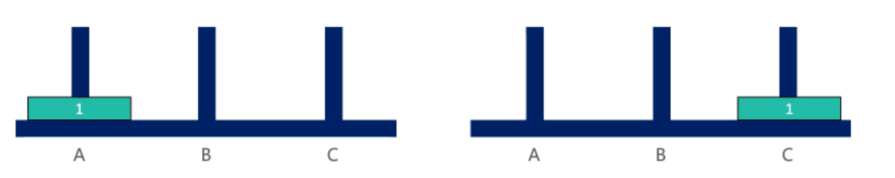
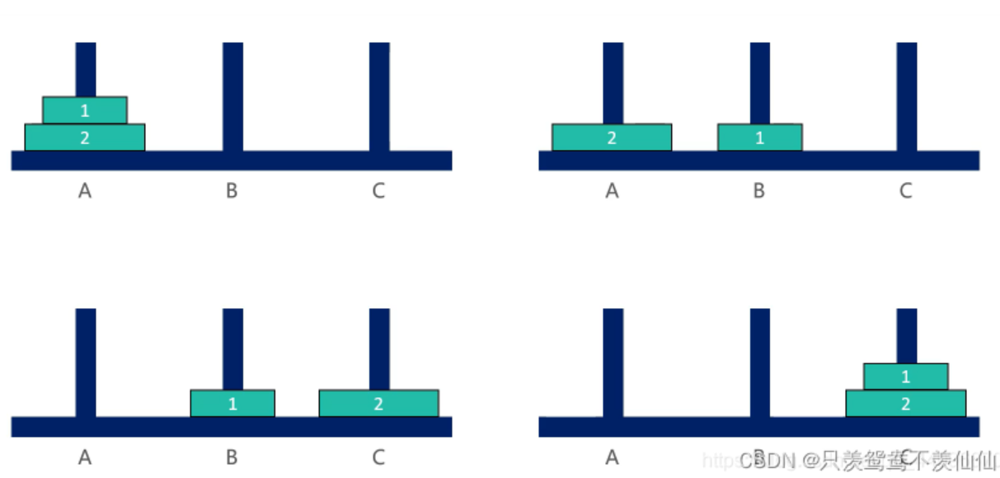
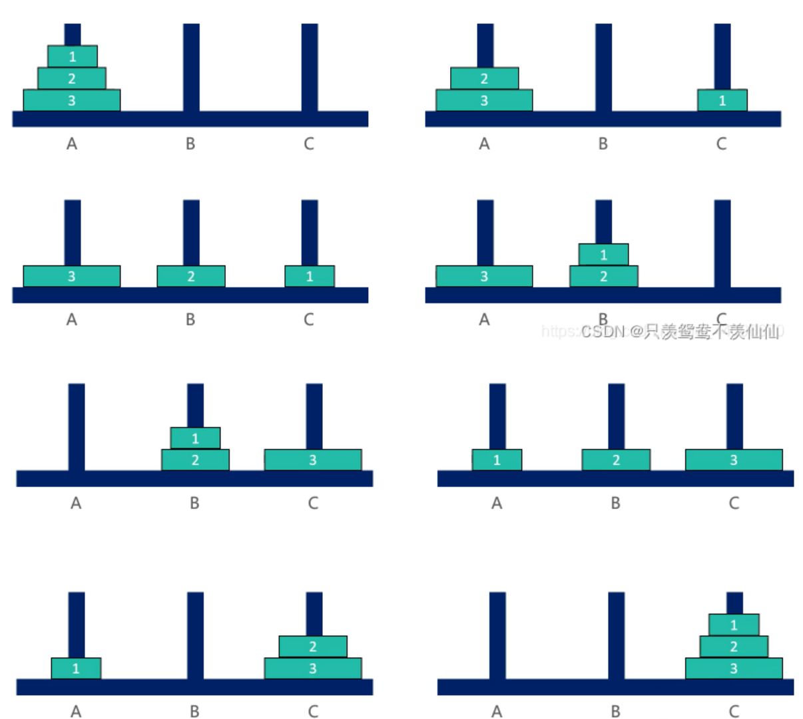
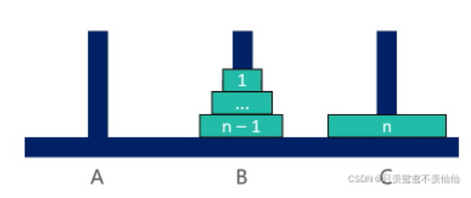
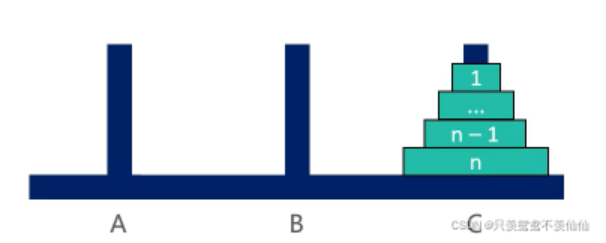

### 一、汉诺塔问题

​	汉诺塔问题是一个经典的问题。汉诺塔（Hanoi Tower），又称河内塔，源于印度一个古老传说。大梵天创造世界的时候做了三根金刚石柱子，在一根柱子上从下往上按照大小顺序摞着64片黄金圆盘。大梵天命令婆罗门把圆盘从下面开始按大小顺序重新摆放在另一根柱子上。并且规定，任何时候，在小圆盘上都不能放大圆盘，且在三根柱子之间一次只能移动一个圆盘。问应该如何操作？（**每次只能移动1个盘子，大盘子只能放在小盘子下面**）

### 1.1 汉诺塔一个盘子



### 1.2 汉诺塔两个盘子



### 1.3 汉诺塔三个盘子



### 1.4 解法思路

1. 当 n == 1时，直接将盘子从 A 移动到C

2. 当 n > 1时，可以拆分成3大步骤：

   ①. 将 n– 1 个盘子从 A 移动到B（递归）

   

   ②. 将编号为 n 的盘子从 A 移动到C

   

   ③. 将 n– 1 个盘子从 B 移动到C（递归）

   

### 1.5 代码实现

```go
func function(i int,start,end,other string) {
    if i == 1{
        fmt.Println("Move 1 from "+ start + " to "+ end)
    } else {
        function(i-1,start,other,end)
        fmt.Println("Move "+ i + " from "+start+" to "+end)
        function(i-1,other,end,start)
    }
}

func hanoi(n int) {
    if n > 0{
        function(n,"左","中","右")
    }
}

func main() {
    n := 3
    hanoi(n)
}
```

### 二、打印一个字符串的全部子序列，包括空字符串

> 思路：
>
> 这个问题可以想象成一个二叉树，每一次都分为要当前字符和不要当前字符两种情况

```go
func function(str string) {
    chs := str.toCharArray()
    list := make([]char,0)
    process(chs,0,list)
}
// 当前来到i位置，分为要和不要两条路
// res存储的是之前的选择所形成的字符列表(子串)
func process(str []char,i int,res []char) {
    if i == len(str) {
        fmt.Println(res)
        return
    }
    resKeep := copyList(res)
    resKeep = append(resKeep,str[i])  // 加上当前字符
    process(str,i+1,resKeep)   // 要此字符

    resNoInclude := copyList(res)
    process(str,i+1,resNoInclude)  // 不要此字符
}

// 空间优化
func function1(str string) {
    chs := str.toCharArray()
    process(chs,0)
}

// 空间优化
func process1(str []char,i int) {
    if i == len(str) {
        fmt.Println(str)
        return
    }
    
    process1(str,i+1)  // 要当前字符的路
    tmp := str[i]
    str[i] = ''  // 临时改为空字符
    process(str,i+1)  // 不要当前字符的路
    
    str[i] = tmp  // 完成下层递归后恢复该字符
}
```

### 三、打印字符串的全部排列(重复 and 不重复)

```go
// str[i...]范围上，所有的字符都可以在i位置上，后续都去尝试
// str[0...i-1]范围上，是之前做过的选择
// 请把所有的字符串形成的全排列，加到res中去
func process(str []char,i int,res []string) {
    if (i == len(str)) {
        res = append(res,str)  // 一种可能的排列字符串
    }
    // visit := &[26]bool{}  // visit[0] 表示字符'a'是否被访问过
    for j:=i;j<len(str);j++{
        //if (!visit[str[j] - 'a']) {  // 防止在str[i]上防止相同的字符
            //visit[str[j] - 'a'] = true
            swap(str,i,j)   // 临时交换str的第i个和第j个字符
            process(str,i+1,res)  // str[i] = str[j],然后再去对 i+1 位置上的字符排列
            swap(str,i,j)   // 再交换回去
        }
    }
    
}
```

上述代码可以求解带重复的字符串全排列，如果去掉visit数组相关的注释就可以实现不重复的全排列。

### 四、纸牌获胜者问题

给定一个整形数组arr，所有数值不同纸牌排成一条线。玩家A和玩家B依次拿走每张纸牌，规定玩家A先拿，玩家B后拿，但是每个玩家每次只能拿走最左或者最右的纸牌，玩家A和玩家B都绝顶聪明。请返回最后获胜者的分数。

【举例】

1.`arr = [1,2,100,4]`

开始时，玩家A只能拿走1或者4。如果开始时玩家A拿走1，则规则变成[2,100,4]，接下来玩家B可以拿走2或者4，然后继续轮到玩家A....

如果开始时玩家A拿走4，则排列变成[1,2,100]，接下来玩家B可以拿走1或者100，然后继续轮到玩家A...

玩家A作为绝顶聪明的人不会先拿4，因为拿了4之后，玩家B将拿走100。所以玩家A会先拿1，让排列变成[2,100,4]，接下来玩家B不管怎么选，100都会被玩家A拿走。玩家A会获胜，分数为101.所以最终返回101。

2.`arr = [1,100,2]`

开始时，玩家A不管是拿走1还是拿走2，玩家B作为绝顶聪明的人，都会把100拿走。玩家B会获胜，分数为100。所以返回100.

> 思路：
>
> 随机选择一个玩家进行分析，假设选中玩家A
>
> 玩家A有两种函数：先手函数和后手函数。
>
> 先手函数f：在arr[]数组的[i,j]上进行选择，要么选择arr[i]，要么选择arr[i]。作为一个绝顶聪明的人，A总是会做出对自己最有利的选择。
>
> 后手函数s：在arr[]数组的[i,j]上进行选择，因为是后手，因此必须等待B选择完之后才能再选。而B作为绝顶聪明的人，总是会做出对A最为不利的选择

```go

// 先手函数
func f(arr []int,i,j int) int {
    if i == j {
        return arr[i]
    }
    // math.Max表示A总是会做出对自己最有利的选择
    return math.Max(arr[i] + s(arr, i+1, j), arr[j] + s(arr, i, j-1))
}

// 后手函数
func s(arr []int,i,j) int {
    if i == j{   // 因为是后手，所以只有一个数是会被另一位选手抢走
        return 0
    }
    // math.Min表示B总是会做出对A最不利的选择。而且B先选择一个数，因此A只能从剩余的数中进行选择
    return math.Min(f(arr, i+1, j),f(arr, i, j-1))
}
```

### 五、逆序栈

给你一个栈，请你逆序这个栈，不能申请额外的数据结构，只能使用递归函数。

```go
// 弹出栈最底层的元素，并将上层的元素依次下落一位
func f(stack Stack) int {
    result := stack.pop()
    if stack.isEmpty() {   // 如果栈已经为空，则结束向下递归,开始向上返回
        return result
    } else {
        last := f(stack)  // 向下递归，持续从栈中取出元素
        stack.push(result)  //将本层弹出的元素再次归还到栈中(最后一次递归不会执行此步)
        return last   // 返回最后一次递归返回的元素(也就是栈最底层的元素)
    }
}

// 逆序函数
func reverse(stack Stack) {
    if stack.isEmpty() {
        return 
    }
    i := f(stack)  // 弹出栈最底层元素
    reverse(stack) // 递归式弹出栈最底层元素
    stack.push(i)  // 从最后一个弹出的元素(也是原本栈最顶层的元素)开始，将元素重新入栈
}
```

### 六、编码问题

规定1和A对应、2和B对应、3和C对应。。。

那么一个数字字符串比如“111”，就可以转化为“AAA”、“KA”、“AK”

给定一个只有数字字符组成的字符串str，返回有多少种转化结果

> 分析：
>
> 假设已经完成 0 ~ i-1位的转换，现在从 i 位 进行考虑，所有的情况如下：
>
> 1. 第i位是0，意味着此条路线转换失败，因为0不能转化为任何字符
> 2. 第i位是3~9，那么只能第i位单独进行转化为C~Z，不会与i+1有任何关系
> 3. 第i位是1，那么既可以单独对第i位进行转化，也可以结合第 i+1位一起进行转换
> 4. 第i位是2，那么既可以单独对第i位进行转化，也可以结合第 i+1位一起进行转换，但是对第i+1位有限制，必须是0~6

```go
func process(str []char,i int) int {
    if i == len(str) {  // 此路线成功，所有字符完成转换.可能性 + 1
        return 1
    }
    if str[i] == '0' {  // 此路线失败
        return 0
    }
    if str[i] == '1' {
        res := process(str,i+1)  // 仅考虑对第i位单独进行转换
        if i + 1 < len(str) {
            res += process(str,i+2) // 同时转换第i和i+1位( += 的原因是这里才会出现分叉的可能性)
        }
        return res
    }
    if str[i] == '2' {
        res := process(str,i+1)
        if (i+1 < len(str) && (str[i+1] >= '0' && str[i+1] <= '6')) {
            res += process(str,i+2)   // ( += 的原因是这里才会出现分叉的可能性)
        }
        return res
    }
    return process(str,i+1) // str[i] == '3'~'9'
}
```

### 七、载货最大价值问题

​	给定两个长度都为N的数组weights和values，weights[i]和values[i]分别代表i号物品的重量和价值。给定一个正数bag，表示一个载重bag的袋子，你装的物品不能超过这个重量。返回你能装下的最多的价值是多少？

> 思路：
>
> 这是一个动态规划问题，第i步时可以选择要或者不要该货物两条分支，从这两条分支中选出最有价值的

```go
func process1(weights []int,values []int,i int,alreadyWeight int,bag int) int {
    if alreadyWeight > bag {   // 上次交易不算数
        return 0
    }
    if i == len(weights) {   // 没有货物了，此次交易不算数
        return 0
    }
    return math.Max(process1(weights,values,i+1,alreadyWeight,bag),
                    	values[i]+process1(weights,values,i+1,alreadyWeight+weights[i],bag)) 
}

// 另一种等效的写法
func process2(weights []int,values []int,i int,alreadyWeight int,alreadyValue int,bag int){
    if alreadyWeight > bag {
        return 0
    }
    if i == len(values) {
        return alreadyValue
    }
    return math.Max(process2(weights,values,i+1,alreadyWeight,alreadyValue,bag),
                   process2(weights,values,i+1,alreadyWeight+weights[i],alreadyValue+values[i],bag))
}
```

