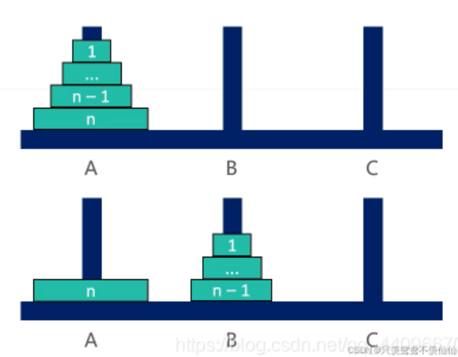

### 一、汉诺塔问题

​	汉诺塔问题是一个经典的问题。汉诺塔（Hanoi Tower），又称河内塔，源于印度一个古老传说。大梵天创造世界的时候做了三根金刚石柱子，在一根柱子上从下往上按照大小顺序摞着64片黄金圆盘。大梵天命令婆罗门把圆盘从下面开始按大小顺序重新摆放在另一根柱子上。并且规定，任何时候，在小圆盘上都不能放大圆盘，且在三根柱子之间一次只能移动一个圆盘。问应该如何操作？（**每次只能移动1个盘子，大盘子只能放在小盘子下面**）

### 1.1 汉诺塔一个盘子


### 1.2 汉诺塔两个盘子


### 1.3 汉诺塔三个盘子


### 1.4 解法思路

1. 当 n == 1时，直接将盘子从 A 移动到C

2. 当 n > 1时，可以拆分成3大步骤：

   ①. 将 n– 1 个盘子从 A 移动到B（递归）

   

   ②. 将编号为 n 的盘子从 A 移动到C

   

   ③. 将 n– 1 个盘子从 B 移动到C（递归）

   

### 1.5 代码实现

```go
func function(i int,start,end,other string) {
    if i == 1{
        fmt.Println("Move 1 from "+ start + " to "+ end)
    } else {
        function(i-1,start,other,end)
        fmt.Println("Move "+ i + " from "+start+" to "+end)
        function(i-1,other,end,start)
    }
}

func hanoi(n int) {
    if n > 0{
        function(n,"左","中","右")
    }
}

func main() {
    n := 3
    hanoi(n)
}
```

### 二、打印一个字符串的全部子序列，包括空字符串

> 思路：
>
> 这个问题可以想象成一个二叉树，每一次都分为要当前字符和不要当前字符两种情况

```go
func function(str string) {
    chs := str.toCharArray()
    list := make([]char,0)
    process(chs,0,list)
}
// 当前来到i位置，分为要和不要两条路
// res存储的是之前的选择所形成的字符列表(子串)
func process(str []char,i int,res []char) {
    if i == len(str) {
        fmt.Println(res)
        return
    }
    resKeep := copyList(res)
    resKeep = append(resKeep,str[i])  // 加上当前字符
    process(str,i+1,resKeep)   // 要此字符

    resNoInclude := copyList(res)
    process(str,i+1,resNoInclude)  // 不要此字符
}

// 空间优化
func function1(str string) {
    chs := str.toCharArray()
    process(chs,0)
}

// 空间优化
func process1(str []char,i int) {
    if i == len(str) {
        fmt.Println(str)
        return
    }
    
    process1(str,i+1)  // 要当前字符的路
    tmp := str[i]
    str[i] = ''  // 临时改为空字符
    process(str,i+1)  // 不要当前字符的路
    
    str[i] = tmp  // 完成下层递归后恢复该字符
}
```

### 三、打印字符串的全部排列(重复 and 不重复)