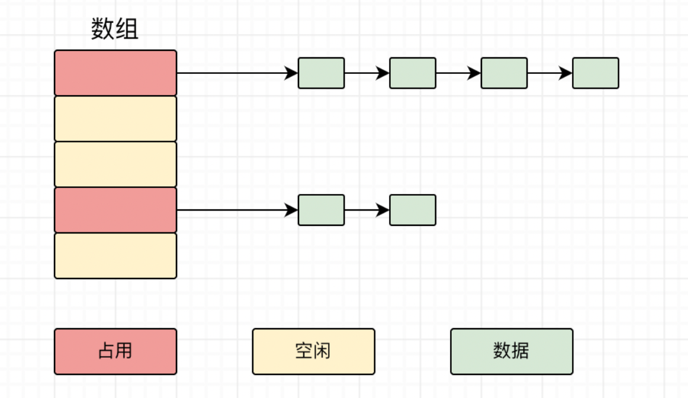

### 一、哈希函数

1. 哈希函数的输入域无穷大，输出域有限。
2. 对于相同的输入，必然有相同的输出。
3. 不同的输入，可能会有相同的输出（哈希碰撞）。
4. 将输入均匀分布到输出域上，映射是无规律、无记忆性的

### 二、词频统计问题

假设一个文件中一共有40亿个无符号整数，现在需要统计该文件的词频（即每一种无符号整数在文件中出现的频率），要求使用1G内存完成统计。

> 思路一：
>
> 最简单的想法是：创建一个哈希表，key为某一种无符号整数，value为该类整数在整个文件中出现的次数。但该问题是有内存限制的。如果使用哈希表的方法，key与value分别是uint和int类型，也就是一对键值对占用8字节。在最坏的情况下，文件中所有的无符号整数都不一样，那么我们需要40亿个键值对，也就是 8 * 40亿 = 320 亿 字节 ≈ 32G。也就是说这种方法很有可能将内存写爆。


> 思路二：
>
> 采用哈希函数：
>
> 1. 先将文件中所有出现的整数进行哈希计算，将其映射到 B 空间。借助于哈希函数的第四个特性，可知所有的映射点均匀分布在整个 B 平面
> 2. 再将整数值分配到100个文件（文件0~文件99）中，分配的方式为：用该整数的哈希值%100，假设得到的结果为3，那么该整数值被分配到3号文件。由于哈希表的第2个特性，可知所有相同类的整数必然都存在于一个文件中（其他文件不会出现该数）；再加之第四个特性，可知不同种类的整数必然会均匀分配到这100个文件中。
> 3. 我们可以对这100个文件分别进行词频统计（每个文件的内存要求下降100倍，32G/100 = 0.32G < 1G）。最后将100个文件的统计结果进行汇总，可以得到整个原文件中的词频统计结果
>
> 需要注意：在此方法中，虽然存在出现哈希碰撞的可能性，但是每个小文件中存储的是原本的数而非哈希值，因此对最终统计结果不会有任何影响。

### 三、哈希表原理



要使用哈希表存储键值对，比如{“abc”，14}和{“bcd”，7}和{“ak”，92}

首先会使用哈希函数 f 计算各个键值对的key值，假设f("abc") = 0，f("bcd") = 3，f("ak") = 3

1. f("abc") = 0，因此将{“abc”，14}键值对存放至0号链表的下一个节点
2. f("bcd") = f("ak") = 3，因此将{“bcd”，7}和{“ak”，92}按序存放至3号链表

基于hash函数输出均匀分布的特性，哈希表的每一条链表长度基本相同


随着键值对的增多，哈希表各链表的长度也会增大，这就导致了哈希表的查询时间复杂度变大。因此为了避免时间复杂度太高，当链表长度过大时需要对整个哈希表进行扩容：

假设现在的哈希表列数组容量为0，在插入某条键值对时发现当前被插入的链表长度接近于上限值。基于hash函数输出均匀分布的特性，可以认为其余链的链表长度也即将到达上限值。此时需要对哈希表进行扩容，将列数组容量扩大为原来的两倍，再将各键值对重新分配，从概率上新扩容的哈希表中每条链表的长度将会是原来的1/2。

#### 3.1 哈希表时间复杂度

因此，只要每条链表的长度上限值远小于键值对的总数，可以认为单次查询的时间复杂度为常数项O(1)。

但是如果是插入操作，很可能会导致哈希表扩容：

假设我们设定的单条链表长度上限值为2(最严格)，现在我们一共插入了N个元素，这就意味着我们经历了logN次哈希表扩容，每次扩容都要将已有的全部键值对重新在新的哈希表中存储，时间复杂度为O(N)（但其实远远不到O(N)，因为只有最后一次才会对N个元素进行重新存储 ）那么插入这N个元素总共的时间复杂度为 O(N*logN)（其实是2 * 4 * 8 *…… * N，要远小于 N * logN），平均到每个元素的插入其时间复杂度为 O(N *logN) / O(N)  (其实当N非常大时，可以认为这是一个常数项 O(1) )

### 四、设计`RandomPool`结构

设计一种结构，在该结构中有如下三个功能：

`insert(key)`：将某个key加入到该结构，做到不重复加入

`delete(key)`：将原本在结构中的某个key移除

`getRandom()`：等概率随机返回结构中的任何一个key

要求：`insert`、`delete`和`getRandom`方法的时间复杂度都是O(1)

> 思路：
>
> 准备两个map，一个map存储 key -> index的映射关系，另一个map存储 value -> key 的映射关系。在准备一个变量size存储当前的key数量。
>
> 1. 插入：
>
>    一次插入行为更新两个map（比如`map1`存储了 "A" -> 0的键值对，那么`map2`就去存储0 -> "A"的键值对，插入完成后，size++），因为map的插入操作的时间复杂度是常数项，因此`insert(key)`也是常数项操作。
>
> 2. 随机返回：
>
>    使用语言本身提供的随机函数，从0~size中选择一个随机数`random`，返回`map2[random]`。因为随机函数和`map2`的查询时间复杂度都是常数项，因此`delete(key)`是常数项操作
>
> 3. 删除：
>
>    简单的删除操作（即分别在`map1`和`map2`中进行对应键值对的删除）是不可取的。原因是这样会导致`getRandom()`有时候会返回一些空值（因为这些值已经被删除）。改进的措施是：
>
>    假设我们要删除的是{"C",2}，而我们截止现在最新插入的是{“Z”,25}，delete("C")将会采取以下步骤：
>
>    	1. 将map1中的{“Z”,25}改为{"Z",2}。然后将{“C”,2}直接删除
>    	1. 将map2中的{2，“C”}改为{2，“Z”}，然后删除{25，“Z”}
>    	1. 最后size--，屏蔽掉对{"Z",25}和{25，“Z”}的查询。
>


```go
type Pool struct {
    keyIndexMap map[Key]int
    indexKeyMap map[int]Key
    size int
}

func (p *Pool)insert(key K) {
    if _,ok:= p.keyIndexMap[key];!ok {
        p.keyIndexMap[key] = p.size
        p.indexKeyMap[p.size] = key
        p.size ++
    }
}

func (p *Pool)delete(key K) {
    if _,ok := p.keyIndexMap[key];ok{
        deleteIndex := p.keyIndexMap[key]   // 要进行删除的key对应的index
        p.size--
        lastIndex := p.size   // 当前未删之前最后一个key的index
        lastKey := p.indexKeyMap[lastIndex]  //未删之前最后一个key
        
        p.keyIndexMap[lastKey,deleteIndex]   // map1新增
        p.indexKeyMap[deleteIndex,lastKey]	// map2替换
        
        delete(p.keyIndexMap,key)   // map1删除指定的键值对
        delete(p.indexKeyMap,lastIndex)  // map2删除原最后的键值对
    }
}

func (p *Pool) getRandom() {
    if p.size == 0{
        return nil
    }
    randomIndex := (int)(math.Random()*p.size)  // 返回0~size-1的随机数
    return p.indexKeyMap[randomIndex]
}
```

### 五、布隆过滤器

布隆过滤器的作用：爬虫系统`url`去重、垃圾邮件过滤、黑名单

布隆过滤器相比于传统的通过哈希表过滤的方式，占用的内存空间更小。但是也有一定的缺点，就是牺牲了部分过滤准确性。

所谓的牺牲部分准确性是指：会出现“假阳性”，即使说可能会使某些原本不应该被过滤掉的数据被过滤掉了，但是永远不会出现应该被过滤的数据没有被过滤掉的情况。总结就是：**可能把好数据误判为坏数据，但是永远不会将坏数据误判成好数据。**

#### 5.1 位图

位图是布隆过滤器的底层数据结构，也是布隆过滤器相较于传统哈希表占用内存少的原因（一个m bit的布隆过滤器占据的内存空间为 m/8 字节）。

所谓的位图，就是数据是以bit位为基础计量单位的。每bit位有"0"和"1"两种状态，可以表示对数据过滤还是不过滤。

要实现位图这样的 bit数组，需要对已有的数据类型进行自定义：

```go
arr []int = new int[10]   // 一个int数据占据32bit，因此这个arr数组可以实现一个320bit的位图

var i int  // i表示想要获取的bit位的状态

numIndex := i / 32   // 找到i具体在哪一个int数上
bitInex := i % 32   // 找到i在这一个int数的哪一位上

// 拿到第i位的具体状态（是1还是0）
s := ( (arr[numIndex] >> (bitIndex))  & 1 )

// 把第i位的状态改成1
arr[numIndex] = arr[numIndex] | (1 << (bitIndex))

// 把第i位的状态改成0
arr[numIndex] = arr[numIndex] & (~ (1 << bitIndex) )
```

#### 5.2 布隆过滤器的工作原理

1. 新建一个 m bit的位图，准备k个不同的哈希函数
2. 开始填充布隆过滤器，之后查询时可以通过填充后的布隆过滤器确定某一数据是否会被过滤：
   1. 分别用 k 个哈希函数计算 ： res = fx(data) % m    (x = 1,2,……k  ，data就是数据)
   2. 将位图所有计算获得的res位填1，其余没填的都是0
3. 验证一个数据是否曾被加入到布隆过滤器：
   1. 分别用 k 个哈希函数计算 ： res = fx(data) % m    (x = 1,2,……k  ，data就是数据)
   2. 如果发现位图指定res位上至少有一个不为1，而是0。那么说明此数之前从未被加入到布隆过滤器中
   3. 需要注意：即使一个数据经过计算，在位图的指定位上都是匹配的。这并不能说明此数就一定曾被加入到布隆过滤器中。因为存在哈希碰撞的可能性。**如果想要尽量减少这种现象，可以尝试增大位图的大小m和哈希函数的数量k。**  更加形象的去想布隆过滤器：可以认为布隆过滤器就是在采集数据的特征，特征点越多越准确。
4. 位图大小m 和 哈希函数个数k 与 失误率P 的具体关系为：
   1. n不变，k不变，随着m的增大P逐渐降低，开始下降速率快后续会减慢(因为k固定)
   2. n不变，m不变，随着k的增大，P先降低后增大，原因是位图大小不够不能容纳更多的特征，k越多会导致不同的数据可能在此位图中的特征相同的概率上升。
   3. 依据第二点，可以在某一m值下获取到最优的k值。  

#### 5.3 如何设计一个布隆过滤器

1. 设计布隆过滤器首先要考虑场景适不适合，必须是黑名单之类的应用场景，通常只涉及数据添加到过滤器而不涉及数据从过滤器删除
2. 只需要根据样本量n和要求的最低失误率P这两个参数就能进行设计
3. m = - (n*lnP) / (ln2)^2  bit  (如果是小数，则向上取整)，再将m /8 可以获取所需布隆过滤器占用的内存大小(Byte)
4. k = ln2 * m/n ≈ 0.7 * m/n 个（如果是小数，则向上取整）
5. P = （1 - e^(-n*k/m)）^k  (此公式是在计算出m和k之后，再微调，可以再次获取最后的失误率)