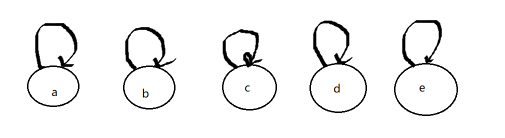
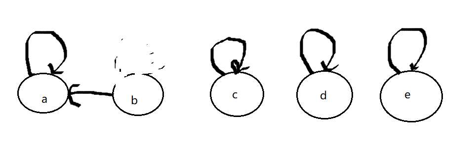
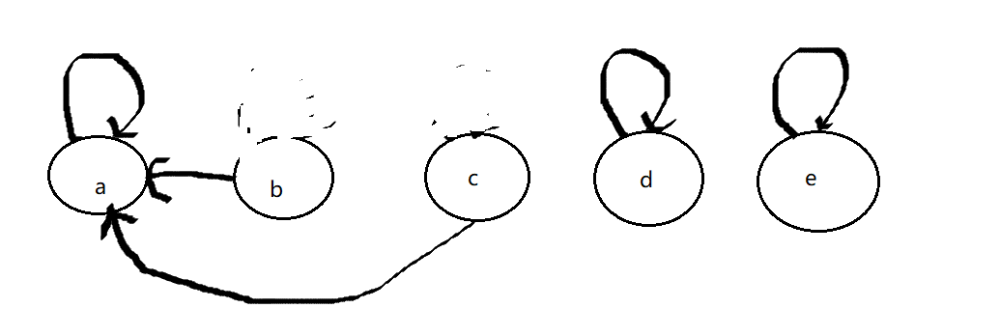

## 一、岛屿问题

### 1.1 基础

一个矩阵中只有0和1两种值，每个位置都可以和自己的上下左右四个位置相连，如果有一片1连在一起，这个部分叫做一个岛屿，求一个矩阵中有多少个岛屿？

举例：

```
001010
111010
100100
000000
```

这个矩阵中有三个岛屿。

> 思路：
>
> 遍历整个矩阵，一旦发现1则认为出现岛屿，将该1周围的所有1变成2(包括该1本身)，这样的目的是为了避免重复查询到一座相同的岛屿

```go
func countIslands(m [][]int) {
    if (m == nil || m[0] == nil) {
        return 0
    }
    N := len(m)   // 行数
    M := len(m[0])  // 列数
    res := 0   // 岛屿数量
    for i:=0 ;i < N ; i++ {
        for j:=0 ;i < M ; j++ {
            if m[i][j] == 1{   // 发现岛屿
                res++   // 岛屿数量++
                infect(m,i,j,N,M)   // 进行感染,将周围的1全部变成2
            }
        }
    }
    return res
}

func infect(m [][]int, i int ,j int,N int,M int) {
    if (i<0 || i>=N || j<0 || j>=M || m[i][j] != 1) {  // 不等于1意味着是0或者2
        return
    }
    m[i][j] = 2
    infect(m,i+1,j,N,M)
    infect(m,i-1,j,N,M)
    infect(m,i,j+1,N,M)
    infect(m,i,j-1,N,M)
}
```

### 1.2 进阶

请采用并发的方式解决这一问题。

在采用并发方式解决这一问题之前，先介绍一种特殊的数据结构：并查集。

并查集结构，操作的对象是一堆相互独立的集合，他提供如下操作：

```
func isSameSet(a,b) bool   // 判断集合a与集合b是否是同一集合
func union(a,b)  // 将集合a与集合b合并
```

并查集可以将上述两种方法的时间复杂度降为O(1)

实现并查集有多种方式，下面介绍一种比较常用的方式（通过图的形式组建）：

1. 假设一开始我们有和元素a、b、c、d、e，他们分属于不同的集合
2. 将a、b、c、d、e构成链表中的节点的数据结构，每个节点的下一节点指针指向其自己。让这些节点作为自己所在集合的**特征节点**



3. 假设现在要将集合a与集合b合并，即union(a,b):
   1. **首先我们要判断集合a与集合b是否位于同一集合，检查的方式就是查看两个集合的特征节点是否相同。**查询集合特征节点的有两种方式是：**第一种方式**是从当前节点出发，不断向下遍历，直到发现节点的下一节点就是自己（节点的下一节点指针指向自己），那么这个节点就是此集合的特征节点。**第二种方式**是采用一个额外的辅助空间，让每个集合单独记录所在集合的特征节点的地址。
   2. 我们发现集合a的特征节点是a，集合b的特征节点是b。特征节点不同，集合a与集合b不在同一个集合。
   3. 接着要进行集合的合并：因为集合a与集合b拥有的节点数相同，因此合并顺序任意，可以将集合b合并到集合a，反之也可以。这里就将集合b合并到集合a，**合并的方式就是将集合b的链表的特征节点指向集合a链表的特征节点**。



4. 假设现在又要将集合c与集合b合并，同样的步骤：
   1. 查看集合b与集合c不是同一集合，因为特征节点a与特征节点c不一样
   2. 因为集合b元素数目 > 集合c元素数目，因此将集合c合并到集合b
   3. 让集合c的特征节点c指向集合b的特征节点a



从上述的流程来看：此结构的`isSameSet()`和`union()`操作的时间复杂度都是O(1)

### 1.3 并查集实现

```go
type UnionFindSet struct {
    elementMap map[interface{}]Node   // 值 -> 节点
    fatherMap map[Node]Node    // 节点 -> 父节点
    sizeMap map[Node]int    // 集合特征节点存储集合节点个数
}


func NewUnionFindSet(list []interface{}) *UnionFindSet {
    ufs := new(UnionFindSet)
    ufs.elementMap = make(map[interface{}]Node)
    ufs.fatherMap = make(map[Node]Node)
    ufs.sizeMap = make(map[Node]int)
    
    for _,value := range list {
        element := Node{value:value}
        ufs.elementMap[value] = element
        ufs.fatherMap[Node] = Node
        ufs.sizeMap[Node] = 1
    }
    return ufs
}

func (ufs *UnionFindSet) findHead(element Node) Node {
    path := new(Stack)
    for {
        if element != ufs.fatherMap[element] {
            path.push(element)   // 把集合内不是特征节点的其他节点都入栈
            element = ufs.fatherMap[element]
        } else {
            break
        }
    }
    for {
        if !path.isEmpty() {  // 栈中元素全部出栈，将所有不是特征节点的父节点直接设置为特征节点，更加方便后续的查询
            ufs.fatherMap[path.pop(),element]
        } else {
            break
        }
    }
    return element   // 返回特征节点
}


func (ufs *UnionFindSet) isSameSet(a,b interface{}) bool {
    if ufs.elementMap[a] != nil && ufs.elementMap[b] !=nil {
        return ufs.findHead(ufs.elementMap[a]) == ufs.findHead(ufs.elementMap[b])
    }
    return false
}


func (ufs *UnionFindSet) union(a,b interface{}) {
    if ufs.elementMap[a] != nil && ufs.elementMap[b] != nil {
        aF := ufs.findHead(ufs.elementMap[a])   // 寻找a集合的特征节点
        bF := ufs.findHead(ufs.elementMap[b])   // 寻找b集合的特征节点
        
        big := &Node{}   // 大集合的特征节点
        small := &Node{}  // 小集合的特征节点
        if aF != bF {
            if ufs.sizeMap[aF] >= ufs.sizeMap[bF] {
                big = aF
                small = bF
            } else {
                 big = bF
                small = aF
            }
        }
        ufs.fatherMap[small] = big  // 将小集合的特征节点接到大集合的特征节点上
        ufs.sizeMap[big] = ufs.sizeMap[big] + ufs.sizeMap[small]
        delete(ufs.sizeMap,small)
    }
}
```

### 1.4 并发寻找岛屿

如果要用两个CPU进行并发查询，那么就将整个矩阵分割成两部分（最好是均分）。

假设：CPU1负责统计左边区域，CPU2负责统计右边区域。

各区域采取与单CPU时相同的查询策略。我们知道这种感染策略必然有一个最初的“1”节点，也就类似于并查集中的特征节点。

我们让统计后的各个岛屿的边界节点记录这个特征节点（所谓的边界就是各个岛屿的起始与终止节点，终止节点就是无法再进行“感染”的结束节点）。

最后，再让左右两个分区边界线上的节点进行“合并”操作，如果边界线相邻两侧都为“2”，那么可以进行集合合并(统一边界节点的特征节点)。最终我们可以获知整个矩阵的岛屿数量。