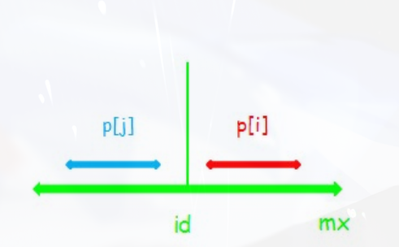
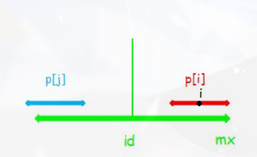
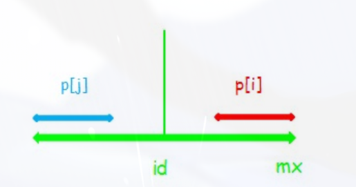

## 一、描述

`Manacher` 算法用于求解字符串中最长回文子串的问题。

回文串：对于字符串 s ， s = s逆序，则 s 是一个回文串。回文串分为奇回文串以及偶回文串


解法：直观的暴力做法时间复杂度为 O(n^3) ，即枚举所有的子串，对这些子串判断是否回文。

稍加思考便会发现，**对于一个回文串，他一定有一个对称中心点，这个点的左右两边是相同的**，如果按照对称中心来依次枚举，那么复杂度为变为 O(n^2) 

## 二、算法思想

`Manacher`算法实际上就是对枚举对称中心这一做法的优化。

字符个数的奇偶性不同，对称中心也是不同的，例如对于**奇回文串` a b a` ，对称中心点为 b** ，对于**偶回文串 `a b b a` ，对称中心点则为` b b`中间**，为了统一对称点，一般的做法是，将原字符串 s 的首尾以及**相邻的两个字符中间插入一个任意的字符**（例如：#）这样会**统一成一个奇回文串**，新字符串长度 = 原串 * 2 + 1

例如原串： a b b a 

新字符串： ∗ a ∗ b ∗ b ∗ a ∗ 


### 2.1 回文半径数组

考虑维护一个数组：L （回文半径数组）

其中 **L [ i ]表示以 i 为对称中心的最长回文串的最右边的字符到 str [ i ] 的长度**（即回文半径）

对于原串： a a b a b  ，添加一个字符变为 ∗ a ∗ a ∗ b ∗ a ∗ b ∗  ，他的 L 数组如下：


| *    | a    | *    | a    | *    | b    | *    | a    | *    | b    | *    |
| ---- | ---- | ---- | ---- | ---- | ---- | ---- | ---- | ---- | ---- | ---- |
| 1    | 2    | 3    | 2    | 1    | 4    | 1    | 4    | 1    | 2    | 1    |


L数组的作用： **L [ i ] − 1 可以表示该子串在原串中对应的回文串的总长度（回文直径）**，例如上面图片中 b  的 L  值为4，那么原串 a a b a b 中，以 b 为对称中心的回文串长度为 4 − 1 = 3 

因此，只需要找到  L 数组的所有值就可以求出最长回文串了。

### 2.2 如何求回文半径数组

假定要求位置 i  的 L 数组元素( i  之前的已经求出)，我们考虑维护两个值 k , r 。其中 **r 表示已遍历元素的最长回文字符串的右边界**， **k  表示 r 最大时回文字符串的中点位置**。

假设以 k 位中心的最大回文子串的范围是 [L,R]

**情况一：**i > r  （i在最大回文子串的右侧）

没有可以使用的信息，直接暴力更新即可(更新 k , r  的值)

**情况二：**i < r 且` i 关于 k 对称的 i' 所在的回文子串在 [L,R]内部`



此时 L[i] = L[i']

**情况三：**i < r 且` i 关于 k 对称的 i' 所在的回文子串的左边界在 L 的左侧`



此时L[i] = R - i

**情况四：**i < r 且` i 关于 k 对称的 i' 所在的回文子串的左边界恰好就是 L `



此时L[i] 的大小需要进一步外扩，需要查看左边界和 R+1 位置是否相等.....

### 2.3 程序代码

```go
func maxLcpsLength(s string) int {
    if s == nil || len(s) == 0 {
        return 0
    }
    str := manacherString(s)   // 1221 -> #1#2#2#1#
    pArr := new int[len(str)]  // 回文半径数组
    C:=-1  // 回文区域中心
    R:=-1  // 回文区域有边界的再往右一个位置(即出回文区域的下一个位置)
    max := -65535  // 扩出来的最大值
    for i:=0;i<len(str);i++{ 
        // 1.第一步：确定i至少的回文区域，先给pArr[i]
        if i > R {   // 在最大回文区域之外，那么i至少的回文区域是1，也就是单独该字符本身构成的字符串
            pArr[i] = 1
        } else {
            pArr[i] = math.Min(pArr[2*C-1],R-i)   // pArr[2*C-1]是i‘的回文半径
        }
        
        // 2.第二步：再进一步试探回文区域能否再外扩，能的话不断扩大pArr[i]
        for {
            if i+pArr[i] > len(str) || i-pArr[i] < -1 {  // i的回文区域右边界或左边界溢出
                break
            }
            if str[i+pArr[i]] == str[i-pArr[i]] {  // 左右边界可以外扩
                pArr[i]++
            } else {   // 不能外扩了，此即是str[i]的最大回文区域
                break
            }
        }
        
        if (i + pAdd[i] > R) {   // 更新最大回文区域右边界R及中点C
            R = i + pArr[i]
            C = i
        }
        max = math.Max(max,pArr[i])  // 记录最大回文半径(增加'#'后的)
    }
    return max - 1   // 修改后的回文字符串 = 原回文字符串 * 2 +1
}
```

