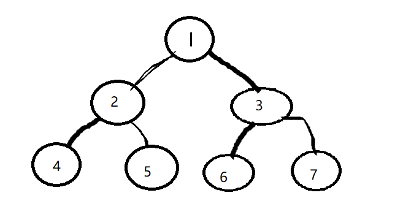

## 一、`Morris`遍历过程

假设来到当前节点`cur`，开始时`cur`来到头结点位置

1. 如果`cur`没有左孩子，`cur`向右移动(`cur` = `cur.right`)
2. 如果`cur`有左孩子找到左子树上最右的节点`mostRight`
   1. 如果`mostRight`的右指针指向空，让其指向`cur`，然后`cur`向左移动(`cur`= `cur.left`)
   2. 如果`mostRight`的右指针指向cur，让其指向`nill`，然后`cur`向右移动(`cur`= `cur.right`)
3. `cur`为空时停止遍历

## 二、`Morris`遍历的特点

这是一种遍历二叉树的方式，并且时间复杂度为O(N)，额外的空间复杂度为O(1)

通过利用原树中大量空闲指针的方式，到达节省空间的目的。

## 三、模拟一颗二叉树的`Morris`遍历

假设有以下一颗二叉树：



1. 遍历到根节点 `cur -> 1`，发现有左孩子，则找到了左子树上最右的节点`mostRight`= 5。遍历队列[ 1 ]
2. 5的右指针 = nil，让其指向1，cur向左移动`cur -> 2`   遍历队列 [1 2]
3. `cur -> 2`，发现有左孩子。`mostRight`= 4   遍历队列[1 2]
4. 4的右指针 = nil，让其指向2，cur向左移动`cur -> 4`  遍历队列[1 2 4]
5. `cur -> 4`，没有左孩子。cur向右移动`cur -> 2`  遍历队列[1 2 4 2]
6. `cur -> 2`  ，因为左子树上最右的节点`mostRight`指向自己，因此撤销掉`4 -> 2`的指针。cur右移，`cur -> 5`  遍历队列[1 2 4 2 5]
7. `cur -> 5`，没有左孩子。cur向右移动`cur -> 1`  遍历队列[1 2 4 2 5 1]
8. `cur -> 1`，因为左子树上最右的节点`mostRight`指向自己，因此撤销掉`5 -> 1`的指针。cur右移，`cur -> 3`  遍历队列[1 2 4 2 5 1 3]
9. `cur -> 3`，发现有左孩子。`mostRight`= 6   遍历队列[1 2 4 2 5 1 3]
10. 6的右指针 = nil，让其指向3，cur向左移动`cur -> 6`  遍历队列[1 2 4 2 5 1 3 6]
11. `cur -> 6`，没有左孩子。cur向右移动`cur -> 3`  遍历队列[1 2 4 2 5 1 3 6 3]
12. `cur -> 3`，因为左子树上最右的节点`mostRight`指向自己，因此撤销掉`6 -> 3`的指针。cur右移，`cur -> 7`  遍历队列[1 2 4 2 5 1 3 6 3 7]
13. `cur -> 7`，没有左孩子。cur向右移动`cur -> nil`  ，结束遍历。

**结论：最后的遍历队列是 【1 2 4 2 5 1 3 6 3 7】。可以看到：所有有左子树的节点都会被打印两次，否则只会被打印一次。**

## 四、程序流程

```go
func morris(head Node) {
    if (head == nil) {
        return
    }
    cur := head
    mostRight := new(Node)
    for {
        if cur == nil{   // cur == nil,结束遍历
            return
        }
        mostRight = cur.left   // mostRight更新为cur的左孩子
        if mostRight!=nil {  // 有左子树
            for {    // 寻找左子树的最右节点(最右节点必须是曾未访问过得)
                if mostRight.right == nil || mostRight.right == cur {
                    break
                } else {
                    mostRight = mostRight.right
                }
            }
            // 此时mostRight变成了cur左子树上最右的节点
            if mostRight.right == nil{  // 结束循环的原因是第一次被访问
                mostRight.right = cur
                cur = cur.left
                continue
            } else {    // 第二次访问，删掉指向cur的指针
                mostRight.right = nil
            }
        }  
        cur = cur.right  // 没有左子树，直接右移
    }
}
```

## 五、实现先序遍历

对于只访问一次的元素，在访问的时候直接打印。对于访问两次的元素，在第一次进行访问的时候打印。

```go
func morris(head Node) {
    if (head == nil) {
        return
    }
    cur := head
    mostRight := new(Node)
    for {
        if cur == nil{   // cur == nil,结束遍历
            return
        }
        mostRight = cur.left   // mostRight更新为cur的左孩子
        if mostRight!=nil {  // 有左子树
            for {    // 寻找左子树的最右节点(最右节点必须是曾未访问过得)
                if mostRight.right == nil || mostRight.right == cur {
                    break
                } else {
                    mostRight = mostRight.right
                }
            }
            // 此时mostRight变成了cur左子树上最右的节点
            if mostRight.right == nil{  // 结束循环的原因是第一次被访问
                mostRight.right = cur
                fmt.Println(cur.value)   // 有左子树的，第一次访问的时候打印
                cur = cur.left
                continue
            } else {    // 第二次访问，删掉指向cur的指针
                mostRight.right = nil
            }
        } else {
        	fmt.Println(cur.value)   // 没有左子树的，访问的时候直接打印
        }
        cur = cur.right  // 没有左子树了，直接右移
    }
}  
```

## 六、实现中序遍历

对于只访问一次的元素，在访问的时候直接打印。对于访问两次的元素，在第二次进行访问的时候打印。

```go
func morris(head Node) {
    if (head == nil) {
        return
    }
    cur := head
    mostRight := new(Node)
    for {
        if cur == nil{   // cur == nil,结束遍历
            return
        }
        mostRight = cur.left   // mostRight更新为cur的左孩子
        if mostRight!=nil {  // 有左子树
            for {    // 寻找左子树的最右节点(最右节点必须是曾未访问过得)
                if mostRight.right == nil || mostRight.right == cur {
                    break
                } else {
                    mostRight = mostRight.right
                }
            }
            // 此时mostRight变成了cur左子树上最右的节点
            if mostRight.right == nil{  // 结束循环的原因是第一次被访问
                mostRight.right = cur
                cur = cur.left
                continue
            } else {    // 第二次访问，删掉指向cur的指针
                mostRight.right = nil
            }
        }
         fmt.Println(cur.value)   // 不管有无左子树，在右移之前 进行打印
        cur = cur.right  // 没有左子树了，直接右移
    }
}  
```

## 七、实现后序遍历

**比较特殊。**对于只访问一次的元素，在访问的时候不打印。对于访问两次的元素，在第二次进行访问的时候：并不打印自身，而是逆序打印当前节点的左子树的右边界节点。最后当`Morris`遍历完成以后，再逆序打印整颗二叉树的右边界。

以下图为例：


`Morris`遍历的结果是：【1 2 4 2 5 1 3 6 3 7】

在第二次访问2的时候，逆序打印其左子树的右边界：[4]

在第二次访问1的时候，逆序打印其左子树的右边界：[5 2]

在第二次访问3的时候，逆序打印其左子树的右边界：[6]

最后再逆序打印整颗二叉树的右边界：[7 3 1]

最后得到的后序遍历结果是：【4 5 2 6 7 3 1】

```go
func morris(head Node) {
    if (head == nil) {
        return
    }
    cur := head
    mostRight := new(Node)
    for {
        if cur == nil{   // cur == nil,结束遍历
            return
        }
        mostRight = cur.left   // mostRight更新为cur的左孩子
        if mostRight!=nil {  // 有左子树
            for {    // 寻找左子树的最右节点(最右节点必须是曾未访问过得)
                if mostRight.right == nil || mostRight.right == cur {
                    break
                } else {
                    mostRight = mostRight.right
                }
            }
            // 此时mostRight变成了cur左子树上最右的节点
            if mostRight.right == nil{  // 结束循环的原因是第一次被访问
                mostRight.right = cur
                cur = cur.left
                continue
            } else {    // 第二次访问，删掉指向cur的指针
                mostRight.right = nil
                printEdge(cur.left)  // 逆序打印左子树的右边界
            }
        }
        cur = cur.right  // 没有左子树了，直接右移
    }
    printEdge(head)  // 最后逆序打印整颗树的右边界
    fmt.Println()
}  

func printEdge(x Node) {
    tail := reverseEdge(x)  // 右边界逆序，并获取逆序后的头结点(原来的最右节点)
    cur := tail
    for {
        if cur == nil{
            break
        }
        fmt.Printf("%d ",cur.value)
        cur = cur.right
    }
    reverseEdge(tail)   // 顺序恢复
}

// 节点的右孩子指针逆序
func reverseEdge(from Node) Node {
    pre := new(Node)
    next := new(Node)
    
    for {
        if from == nil{
            break
        }
        next = from.right
        from.right = pre   // 右孩子指针指向自己的父节点
        pre = from   
        from = next
    }
    return pre
}
```

## 八、传统二叉树遍历与`Morris`遍历的使用场景

如果问题需要在第三次遍历节点时强制进行数据汇总（比如：节点必须汇总从左、右子树获取的信息，进行处理之后才能得出本轮的返回信息），就必须使用传统二叉树遍历；否则，使用`Morris`遍历将是更优的选择。