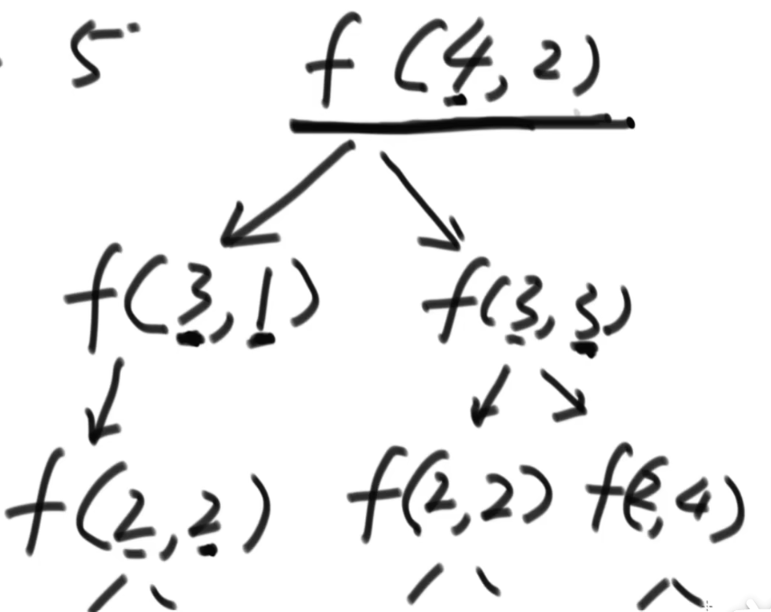

## 一、题目一

假设现在有 1~ N 总共N个位置，现在有一个机器人：机器人从S位置出发，经过K步到达E位置。规定机器人每次必须走一步，要么向左走、要么向右走。特别的，如果机器人当前在1位置就只能向右走，如果在N位置就只能向左走。求机器人总共有多少种走法。

### 1.1 解法一：暴力尝试

```go
//  一共是1~N 这么多位置 （N是固定参数）
// 最终的目标是E (E是固定位置)
// 还剩rest步需要走
// 当前在cur位置
// 返回方法数
func f(N,E int,rest int,cur int) int {
    if (rest == 0) {  // 已经没有步数了
        return cur == E ? 1:0
    }
    // rest > 0 
    if (cur == 1) {  // 当前在1位置，只能向右走
        return f(N,E,rest-1,2)
    }
    // 
    if (cur == N) {  // 当前在E位置，只能向左走
        return f(N,E,rest-1,N-1)
    }
    return f(N,E,rest-1,cur-1) + f(N,E,rest-1,cur+1)  // 其他位置，分为向左和向右两种可能
}
```

这种暴力递归的方式虽然简单，但是存在许多重复情况的计算，我们省去对固定参数N和E的表示：




如上图所示，在递归的过程中，重复出现了 f(2,2)的递归计算（意味着当前在2位置，还剩两步需要走）。

如果我们能对每一种递归的结果值进行一个留存记录，当次递归情况重复出现时，就不需要进行相同的计算而是可以直接多去留存值即可。

### 1.2 解法二：记忆化缓存搜索

```go
func walkWay2(N,E int) int {
    int[][] dp = new int[K+1][N+1]//剩余步数总是位于 0~k之间;所处位置总是位于0~N之间
    for i:=0;i<=K;i++{
        for j:=0;j<=N;j++{
            dp[i][j] = -1
        }
    }
    return f2(N,E,N,1,dp)
}

func f2(N,E int,rest int,cur int,dp [][]int) int {
    if (dp[rest][cur] != -1){   // 缓存命中
        return dp[rest][cur]
    }
    // 缓存没命中
    if rest == 0{
        if cur == E {
            dp[rest][cur] = 1
        } else {
            dp[rest][cur] = 0
        }
        return dpMemory[res][cur]
    }
    if cur == 1{
        dp[rest][cur] = f1(N,E,rest-1,2)
    } else if cur == N {
        dp[rest][cur] = f1(N,E,rest-1,N-1)
    } else {
        dp[rest][cur] = f1(N,E,rest-1,cur-1) + f1(N,E,rest-1,cur+1)
    }
    return dp[rest][cur]
}
```

### 1.3 解法三：严格表结构

假设现在有 1 2 3 4 5 五个位置，起始时位于2位置，剩余4步需要走，需要求解到位置4时的所有走法。我们可以画出下面的表结构：

行表示当前所处的位置，列表示剩余的步数

| rest/cur |  0   |  1   |     2      |  3   |  4   |  5   |
| :------: | :--: | :--: | :--------: | :--: | :--: | :--: |
|    0     |  x   |  0   |     0      |  0   |  1   |  0   |
|    1     |  x   |      |            |      |      |      |
|    2     |  x   |      |            |      |      |      |
|    3     |  x   |      |            |      |      |      |
|    4     |  x   |      | 目标求解值 |      |      |      |

 根据初始条件，可以获取一些位置的返回值：

1. cur = 0是不存在的，因此对应的列全部为`x`，表示无效（因为不会停留在0位置之上）
2. rest = 0 时，只有当cur = 4时，返回值为1，否则都为0
3. cur = 2 ， res =4 正是当前问题需要求解的目标值。

''

再对其他三类情况进行分析：

1. 如果当前cur = 1 、rest = k，那么此时的返回值仅依赖于 cur = 2 ，rest = k-1(即右上方的格子)
2. 如果当前cur = N 、rest =k，那么此时的返回值仅依赖于 cur = N-1 ,rest = k-1(即左上方的格子)
3. 如果当前为普通情况，cur = m( 2~ N-1 之间)，rest =k，那么此时的返回值等于 cur = m-1 ,rest = k-1 和  cur = m+1 ,rest = k-1 这两种情况返回值之和(即左上方与右上方格子之和)

根据我们的分析，可以一行一行进行计算：

- 第1行：

| rest/cur |  0   |  1   |     2      |  3   |  4   |  5   |
| :------: | :--: | :--: | :--------: | :--: | :--: | :--: |
|    0     |  x   |  0   |     0      |  0   |  1   |  0   |
|    1     |  x   |  0   |     0      |  1   |  0   |  1   |
|    2     |  x   |      |            |      |      |      |
|    3     |  x   |      |            |      |      |      |
|    4     |  x   |      | 目标求解值 |      |      |      |

- 第2行：

| rest/cur |  0   |  1   |     2      |  3   |  4   |  5   |
| :------: | :--: | :--: | :--------: | :--: | :--: | :--: |
|    0     |  x   |  0   |     0      |  0   |  1   |  0   |
|    1     |  x   |  0   |     0      |  1   |  0   |  1   |
|    2     |  x   |  0   |     1      |  0   |  2   |  0   |
|    3     |  x   |      |            |      |      |      |
|    4     |  x   |      | 目标求解值 |      |      |      |

- 第3行：

| rest/cur |  0   |  1   |     2      |  3   |  4   |  5   |
| :------: | :--: | :--: | :--------: | :--: | :--: | :--: |
|    0     |  x   |  0   |     0      |  0   |  1   |  0   |
|    1     |  x   |  0   |     0      |  1   |  0   |  1   |
|    2     |  x   |  0   |     1      |  0   |  2   |  0   |
|    3     |  x   |  1   |     0      |  3   |  0   |  2   |
|    4     |  x   |      | 目标求解值 |      |      |      |

- 第4行：

| rest/cur |  0   |  1   |       2        |  3   |  4   |  5   |
| :------: | :--: | :--: | :------------: | :--: | :--: | :--: |
|    0     |  x   |  0   |       0        |  0   |  1   |  0   |
|    1     |  x   |  0   |       0        |  1   |  0   |  1   |
|    2     |  x   |  0   |       1        |  0   |  2   |  0   |
|    3     |  x   |  1   |       0        |  3   |  0   |  2   |
|    4     |  x   |  0   | 目标求解值 = 4 |  0   |  5   |  0   |

根据一行一行的计算，最终得出求解的目标值的走法数 = 4。

#### 1.3.1 时间复杂度

此种方法的时间复杂度为 K*M (K是初始步数，M是位置个数)

相较于暴力DP有很大的提升，暴力DP的时间复杂度为 2^k，也就是求解一颗深度为K（K为初始步数）的满二叉树

## 二、题目二

假设现在有若干个硬币[ 2 3 5 9 4 7]，要求凑齐10块钱但使用最少数目的硬币数。

这个题目中凑齐10块钱，可能的拼凑方法有：

1.  [2 3 5]
2. [ 3 7 ]

数量最少得是[3 7]，需要使用2枚硬币。

### 2.1 解法一：暴力DP

```go
func minCoin1(arr []int, aim int) {
    return process(arr,0,aim)
}

// index表示当前正在遍历的硬币在数组中的下标; rest表示还需要凑的钱数。返回值是当前情况的最少硬币数
func process1(arr []int,index int,rest int) int {
    if rest < 0 {   // 无效情况,钱币数超额
        return -1
    } 
    if rest == 0{  // 刚好凑满,不需要多余的硬币了
        return 0
    }
    // rest > 0  还没凑满,且没有硬币了
    if index == len(arr) {  // 没有剩余可使用的硬币了
        return -1
    }
    // rest > 0, 还没凑满，但是还有硬币
    p1 := process(arr,index+1,rest)   // 不要当前硬币
    p2Next := process(arr,index+1,rest - arr[index])  // 要当前硬币
    
    if (p1 == -1 && p2Next == -1) {  // 两种子分支情况都是不可能实现的，意味着当前分支就是无效的
        return -1
    } else {   // 至少一种分支是可能的
        if p1 == -1 {
            return p2Next+1
        } else if p2Next == -1 {
            return p1
        } else {
            return math.Min(p1,1+p2Next)
        }
    }
}
```

### 2.2 解法二：记忆化缓存搜索

```go
func minCoin2(arr []int,aim int) {
    int[][] dp = new int[len(arr)+1][aim+1]
    
    for i:=0;i<=len(arr);i++{
        for j:=0;j<=aim;j++{
            dp[i][i] = -2
        }
    }
    return process2(arr,0,aim,dp)
}

func process2(arr []int,index int,rest int.dp [][]int) int {
    if rest < 0 {   // 因为rest为负会导致dp数组越界,因此该情况要放在缓存之前。将其视为一种缓存的无效情况即可
        return -1
    }
    if dp[index][rest] != -2 {   // 缓存命中
        return dp[index][rest]
    }
    if rest == 0{   // rest == 0
        dp[index][rest] = 0
    }else if (index == len(arr)) {  // rest > 0,但没有硬币了
        dp[index][rest] = -1
    }else {   // rest > 0,但还有硬币了
        p1 := process(arr,index+1,rest)   // 不要当前硬币
        p2Next := process(arr,index+1,rest - arr[index])  // 要当前硬币
        
        if (p1 == -1 && p2Next == -1){
            dp[index][rest] = -1
        } else {
            if p1 == -1 {
                dp[index][rest] = p2Next + 1
            } else if(p2Next == -1) {
                dp[index][rest] = p1
            } else {
                dp[index][rest] = math.Min(p1,p2Next+1)
            }
        }
        
    }
    return dp[index][rest]
}
```

### 2.3 解法三：严格表结构

假设硬币数组是 [2 3 5 7 2]，目标硬币数值是10，求凑齐所需的最少硬币数。构建的表结构如下：

| index/rest |    0 |  1   |  2   |  3   |  4   |  5   |  6   |  7   |  8   |  9   |     10     |
| :--------: | ---: | :--: | :--: | :--: | :--: | :--: | :--: | :--: | :--: | :--: | :--------: |
|     0      |    0 |      |      |      |      |      |      |      |      |      | 目标求解值 |
|     1      |    0 |      |      |      |      |      |      |      |      |      |            |
|     2      |    0 |      |      |      |      |      |      |      |      |      |            |
|     3      |    0 |      |      |      |      |      |      |      |      |      |            |
|     4      |    0 |      |      |      |      |      |      |      |      |      |            |
|     5      |    0 |  -1  |  -1  |  -1  |  -1  |  -1  |  -1  |  -1  |  -1  |  -1  |     -1     |

行rest表示剩余需要凑的硬币数额

列index表示当前正在扫描硬币数组的哪一个硬币

根据初始条件：

1. 如果rest = 0，那么无论index为多少，都不会选择该硬币，因此返回值都为0  `dp[index][0] = 0`
2. 如果index =5 , 因为超出了硬币数组有效范围，是无效情况，因此返回值都为-1 `dp[5][rest] = -1`
3. `dp[0][10]`是我们最终要求解的目标值。当前位于0位置，需要凑齐10数额的硬币。


对于其余的情况（假设为`dp[i][j]`），其值来源于两种可能：

1. `dp[i+1][j]`，也就是下方的格子
2. `dp[i+1][j-arr[i]]`，位于下一列左下方的格子(左偏`arr[i]`)

如果上述两种情况都为-1，则`dp[i][j]`也是-1；如果仅有一个为-1，`dp[i][j]`等于不为-1的那个；如果都为有效值，`dp[i][j]`等于较小的那一个（当然，如果来源是`dp[i+1][j-arr[i]]`,那么值需要+1）

```go
func minCoin3(arr []int,aim int) int {
    N := len(arr)
    int[][] dp = new int[N+1][aim+1]
    
    for index:=0;index <= N;index++{   // 第0列
        dp[index][0] = 0
    }
    for rest:=1;rest <= aim;rest++{  // 第N行
        dp[N][rest] = -1
    }
    // 正常情况
    for index:= N-1;index >=0;index-- {  // 从第N-1行开始
        for rest :=1;rest <= aim; rest++ {   // 从第一列开始
            p1 := dp[index+1][rest]
            //p2Next := dp[index+1][rest-arr[index]]   // 第二维数组索引可能为负
            p2Next = -1
            if (rest-arr[index] >= 0) {
                p2Next = dp[index+1][rest-arr[index]]
            } 
            // 与正常的暴力DP代码是一样的
            if (p1 == -1 && p2Next == -1) {
                dp[index][rest] = -1
            } else {
                if p1 == -1 {
                    dp[index][rest] = p2Next + 1
                } else if(p2Next == -1) {
                    dp[index][rest] = p1
                } else {
                    dp[index][rest] = math.Min(p1,p2Next+1)
                }
            }
        }
    }
    return dp[0][aim]  // 目标求解值
}
```


### 2.4 严格表结构求解思路

1. 找出可变参量（也是表格的维度）
2. 确定目标求解值是哪一个格子
3. 根据base case 实现填充表格
4. 找出其他正常情况的相互依赖关系
5. 确定正常情况格子的求解顺序

## 三、题目三

### 3.1 解法一：暴力DP

​	给定一个整形数组arr，所有数值不同纸牌排成一条线。玩家A和玩家B依次拿走每张纸牌，规定玩家A先拿，玩家B后拿，但是每个玩家每次只能拿走最左或者最右的纸牌，玩家A和玩家B都绝顶聪明。请返回最后获胜者的分数。

```go
func win1(arr []int) {
    if (arr == nil || len(arr) == 0) {
        return 0
    }
    return math.Max(
        f(arr,0,len(arr)-1),
        s(arr,0,len(arr)-1))
}

// 先手函数
func f(arr []int,i,j int) int {
    if (i == j) {   // 先手，所以剩一个必取
        return arr[i]
    }
    return math.Max(
        arr[i] + s(arr,i+1,j),
        arr[j] + s(arr,i,j-1))
}

// 后手函数
func s(arr []int,i,j int) int {
    if (i==j){  // 后手，剩下一个的时候拿不到
        return 0
    }
    // 对方先手，总会给出对后手最不利的选择(后手就只能选两种选择中最小的那个)
    return math.Min(
        f(arr,i+1,j),
        f(arr,i,j-1))
}
```

### 3.2 解法二：严格表结构

假设arr = [3 100 4 50]。

先手函数 `f` 对应的表结构如下：   (  `i 表示left`    `j表示right`)

| i/j  |  0   |  1   |  2   |     3      |
| :--: | :--: | :--: | :--: | :--------: |
|  0   |  3   |      |      | 目标求解值 |
|  1   |  x   | 100  |      |            |
|  2   |  x   |  x   |  4   |            |
|  3   |  x   |  x   |  x   |     50     |

1. 初始时，`i=0`，`j=3`，因此(0,3)是目标求解值

2. 因为此类型问题中，`i`不可能大于`j`，因此左下角区域都是无效值。
3. 当`i == j`，单元格取值是arr[i]

后手函数`s`对应的表结构如下：

| i/j  |  0   |  1   |  2   |     3      |
| :--: | :--: | :--: | :--: | :--------: |
|  0   |  0   |      |      | 目标求解值 |
|  1   |  x   |  0   |      |            |
|  2   |  x   |  x   |  0   |            |
|  3   |  x   |  x   |  x   |     0      |

1. 初始时，`i=0`，`j=3`，因此(0,3)是目标求解值

2. 因为此类型问题中，`i`不可能大于`j`，因此左下角区域都是无效值。
3. 当`i == j`，单元格取值是0


对于其他正常的情况，可以利用两个表的对角线上的值，依次项右上方开始求解。

s表的每一个单元格 = f表相同位置单元格的 `min(正下方单元格，正左方单元格)`

f表的每一个单元格 = Max（arr[行坐标]+s表中正下方单元格值，arr[列坐标]+s表中正左方单元格值）

先求一次s表格：

| i/j  |  0   |  1   |  2   |     3      |
| :--: | :--: | :--: | :--: | :--------: |
|  0   |  0   |  3   |      | 目标求解值 |
|  1   |  x   |  0   |  4   |            |
|  2   |  x   |  x   |  0   |     4      |
|  3   |  x   |  x   |  x   |     0      |

再求一次f表格

| i/j  |  0   |  1   |  2   |     3      |
| :--: | :--: | :--: | :--: | :--------: |
|  0   |  3   | 100  |      | 目标求解值 |
|  1   |  x   | 100  | 100  |            |
|  2   |  x   |  x   |  4   |     50     |
|  3   |  x   |  x   |  x   |     50     |

先求一次s表格：

| i/j  |  0   |  1   |  2   |     3      |
| :--: | :--: | :--: | :--: | :--------: |
|  0   |  0   |  3   | 100  | 目标求解值 |
|  1   |  x   |  0   |  4   |     50     |
|  2   |  x   |  x   |  0   |     4      |
|  3   |  x   |  x   |  x   |     0      |

再求一次f表格

| i/j  |  0   |  1   |  2   |     3      |
| :--: | :--: | :--: | :--: | :--------: |
|  0   |  3   | 100  |  7   | 目标求解值 |
|  1   |  x   | 100  | 100  |    104     |
|  2   |  x   |  x   |  4   |     50     |
|  3   |  x   |  x   |  x   |     50     |

先求一次s表格：

| i/j  |  0   |  1   |  2   |  3   |
| :--: | :--: | :--: | :--: | :--: |
|  0   |  0   |  3   | 100  |  7   |
|  1   |  x   |  0   |  4   |  50  |
|  2   |  x   |  x   |  0   |  4   |
|  3   |  x   |  x   |  x   |  0   |

再求一次f表格

| i/j  |  0   |  1   |  2   |  3   |
| :--: | :--: | :--: | :--: | :--: |
|  0   |  3   | 100  |  7   | 150  |
|  1   |  x   | 100  | 100  | 104  |
|  2   |  x   |  x   |  4   |  50  |
|  3   |  x   |  x   |  x   |  50  |

**结论：后手结果是7，先手结果是150**