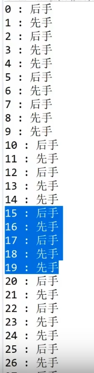

## 一、题目一

给定一个有序数组arr，代表数轴上从左到右的n个有序点 arr[0] 、arr[1] 、 …… arr[n-1]。给定一个正数L，代表一根长度为L的绳子，求绳子最多能覆盖其中的几个点。

> 解法一

每次让绳子末端指向 arr 中的一个数，这样就可以直到绳子的左端落在数轴的哪一个点上。对于绳子左端指向的数字，可以在整个arr中求出在该数右侧大于其的距离最近的元素是谁。至此我们就可以获得绳子所覆盖的有序数组 左右两侧的 下标，从而知道覆盖的点数。

复杂度是 ： N次遍历 + N次求某数右侧最近的比他大的值(如果用二分法每次就是O(logN))

> 解法二

采用滑动窗口，滑动窗口的左侧遍历整个arr数组（左侧只会使arr中的元素）。当选定本轮滑动窗口的左侧位置时，就在arr中找到最大的不会让滑动窗口大小 大于 绳子长度的右侧位置，这样就确定了当arr[i]作为滑动窗口起点时包含的点数个数。

复杂度是：N次遍历确定窗口左侧位置 + 确定右侧位置( O(1)  )

```go
package lesson1

import "math"

// arr[]必须是有序数组
func ScopeIncluedSpot(arr []int, L int) int {
	if len(arr) == 0 {
		return 0
	}

	maxCover := math.MinInt
	for i := 0; i < len(arr); i++ {
		end := arr[i]    // arr[i]作为终点
		start := end - L // 根据绳子长度算出起点

		_, index := FindRightNearest(arr, start)

		coverPoint := i - index + 1
		maxCover = int(math.Max(float64(maxCover), float64(coverPoint)))
	}
	return maxCover
}

// 在有序数组中找出大于等于num的最小的数字以及其下标
func FindRightNearest(arr []int, num int) (int, int) {

	left := 0
	right := len(arr) - 1
	mid := (left + right) / 2

	res := math.MaxInt
	index := -1

	for {
		if left > right {
			break
		}
		if num == arr[mid] { // arr[mid]刚好等于num，那么就返回num
			res = num
			index = mid
			break
		} else if num > arr[mid] { // num > arr[mid],则找大于num的要到右区域找
			left = mid + 1
			mid = (left + right) / 2
		} else { // num < arr[mid],则还需要检测左侧是否有比arr[mid]更小的，大于等于num的数
			res = int(math.Min(float64(res), float64(arr[mid])))
			index = mid
			right = mid - 1
			mid = (left + right) / 2
		}
	}
	return res, index
}
```


## 二、题目二

小虎去商店买苹果，商店只提供6个每袋和8个每袋的包装。小虎现在只想购买恰好n个苹果，小虎想购买尽量少的袋数。如果不能购买恰好n个苹果，那么小虎将不会购买。输入一个整数n，表示想购买的苹果数，返回最少使用的袋子数。如果无论如何都不能正好装下，返回  -1。

> 方法一：

```go
func MinBags(apples int) int {

	if apples <= 0 || apples%2 != 0 {
		return -1
	}

	bag6 := -1         // 使用的6容积袋子数目，初始为-1
	bag8 := apples / 8 //  使用的8容积袋子数目，初始为apples/8

	remain := apples - bag8*8 // 剩余需要6容积袋子装的苹果数

	for {
		if bag8 < 0 || remain >= 24 { // 凑不齐
			return -1
		}
		curBag6 := getBag6Count(remain)
		if curBag6 != -1 {
			bag6 = curBag6
			break
		}
		bag8--
		remain = apples - bag8*8
	}
	fmt.Printf("苹果数:%d  6袋子:%d   8袋子:%d\n", apples, bag6, bag8)
	return bag6 + bag8
}

// 剩余苹果能否正好全部用6容积袋子装起来，如果可以返回需要的袋子数
func getBag6Count(remain int) int {
	if remain%6 == 0 {
		return remain / 6
	} else {
		return -1
	}
}

```

> 方法二

```go
打表法，不考虑问题本身的数学原理，而是从结果中查找规律。

使用比较函数，苹果数从1~1000(甚至更大)，采用一种简单但暴力的算法找到凑齐当前苹果所需要的最少袋子数，规则如下：
1.当苹果数为奇数时，都返回-1，因为无法凑齐
2.当苹果数小于18时，没有特定的规律
3.当苹果数大于18时，展现出如下规律：每8个数为一组，奇数为-1，偶数为 (apple-18)/8+3


func minBags2(apples int) int {
	if apples == 0 || apples%2 != 0 {
		return -1
	}
	if apples < 18 {
		switch apples {
		case 0:
			return 0
		case 6, 8:
			return 1
		case 12, 14, 16:
			return 2
		default:
			return -1
		}
	} else {
		return (apples-18)/8 + 3
	}
}
```


## 三、题目三

现在有n份青草和两只羊，两只羊分为先手和后手分别去吃这n份草。每只羊在吃的时候只能吃 4^m (1、4 、16 、64……)份草。规定每只羊都是绝顶聪明的，最后完成吃草动作的为获胜者。返回最后的获胜者

> 方法一

```go
// grass 是草的份数
func SheepEatGrass(grass int) string {
	// 设置边界条件(边界条件越多，递归花费的时间越少。 只有0和1两个边界条件是必须的)
	// 0  1  2  3  4
	// 后 先 后 先  先
	if grass == 0 || grass == 2 {
		return "后手"
	} else if grass == 1 || grass == 3 || grass == 4 {
		return "先手"
	}

	first := 1 // 先手羊吃的份数

	for {
		if first > grass { // 先手羊遍历了所有可能，也不能赢
			return "后手"
		}
		// 后手羊的先手函数返回后手，就等同于先手羊获得胜利
		if SheepEatGrass(grass-first) == "后手" {
			return "先手"
		}

		if first > math.MaxInt/4 { // 下一次先手羊吃的份数将溢出
			return "后手"
		}
		first *= 4

	}

}
```

> 方法二

```go
打表法
试验了50次，草的份数从1~50,结果如下：
```



```go
规律为：
每5个为一组，分别是“后先后先先”

func SheepEatGrass2(n int) string {
	if n%5 == 0 || n%5 == 2 {
		return "后手"
	} else {
		return "先手"
	}
}

```


## 四、题目四

有一些排成一行的正方形。每个正方形已经被随机染成了绿色或者红色。

现在可以选择一个正方形然后用这两种颜色的任何一种进行染色，这个正方形的颜色将会被新的颜色覆盖。我们的最终目标是完成染色之后，每个红色R都比每个绿色G距离最左侧更近。

如：假设一开始的颜色为 s = RGRGR

我们重新染色之后变成RRRGG，重新涂染的正方形个数为2，而且没有比这个更好的染色方案了(最好是指需要重新染色的正方形个数最少)

> 方法一

```go
// 要染成题目要求的样式，其实就是让一行正方形分为两组，染色的目标就是让左半区域的正方形都是'R',右半区域的正方形都是'G'

// RR……GGG
func MinPain(lattice []string) int {
	N := len(lattice)
	dryCount := math.MaxInt

	for lLattice := 1; lLattice <= N; lLattice++ { // 统计左右区域不同大小的情况下，需要染色的格子数
		if lLattice == 0 { // 左边的格子数为0
			// 统计lattice[0...N-1]一共有多少个R，将其全部染成G
			count := countRed1(lattice, 0, N-1)
			dryCount = int(math.Min(float64(dryCount), float64(count)))
		} else if lLattice == N { //左边格子数为N
			// 统计lattice[0...N-1]一共有多少个G，将其全部染成R
			count := countGreen1(lattice, 0, N-1)
			dryCount = int(math.Min(float64(dryCount), float64(count)))
		} else { // 左边的格子数为 1~N-1
			// 统计左区域lattice[0...lLattice-1]一共有多少个G，将其全部染成R + 右区域lattice[lLattice……N-1]一共有多少个R，将其全部染成G
			count := countGreen1(lattice, 0, lLattice-1) + countRed1(lattice, lLattice, N-1)
			dryCount = int(math.Min(float64(dryCount), float64(count)))
		}
	}
	return dryCount
}

// 统计lattice指定范围内红色格子的数量
func countRed1(lattice []string, left, right int) int {
	count := 0
	for i := left; i <= right; i++ {
		if lattice[i] == "R" {
			count++
		}
	}
	return count
}

// 统计lattice指定范围内绿色格子的数量
func countGreen1(lattice []string, left, right int) int {
	count := 0
	for i := left; i <= right; i++ {
		if lattice[i] == "G" {
			count++
		}
	}
	return count
}
```

这种方式的时间复杂度是 O(N^2)

> 方式二

```go
上述的方案中我们需要反复使用原始数组arr来提取信息。也即以某一位i为分割点，统计arr[0...i]区域'G'的个数和arr[i+1...N-1]区域'R'的个数。
既然如此，我们可以对arr数组进行预处理，事先准备好两个数组：
1.数组一：长度和arr相同，每一位元素的含义是统计从0到该位时的'G'的个数
2.数组二：长度和arr相同，每一位元素的含义是统计从N-1到该位时的'R'的个数

再次对arr数组进行遍历，每次需要对左半区域统计染色个数时只需要根据数组一进行统计；每次需要对右半区域统计染色个数时只需要根据数组二进行统计
```

```go
func MinPain2(lattice []string) int {
	N := len(lattice)
	dryCount := math.MaxInt

	help1 := make([]int, N, N) // help1[i]会统计lattice[0]~lattice[i] ‘G’的数量
	help2 := make([]int, N, N) // help2[i]会统计lattice[i]~lattice[N-1] ‘R’的数量

	Gcount := 0
	for right := 0; right < N; right++ {
		if lattice[right] == "G" {
			Gcount++
		}
		help1[right] = Gcount
	}

	Rcount := 0
	for left := N - 1; left >= 0; left-- {
		if lattice[left] == "R" {
			Rcount++
		}
		help2[left] = Rcount
	}

	for lLattice := 1; lLattice <= N; lLattice++ { // 统计左右区域不同大小的情况下，需要染色的格子数
		if lLattice == 0 { // 左边的格子数为0
			// 统计lattice[0...N-1]一共有多少个R，将其全部染成G
			count := help2[0]
			dryCount = int(math.Min(float64(dryCount), float64(count)))
		} else if lLattice == N { //左边格子数为N
			// 统计lattice[0...N-1]一共有多少个G，将其全部染成R
			count := help1[N-1]
			dryCount = int(math.Min(float64(dryCount), float64(count)))
		} else { // 左边的格子数为 1~N-1
			// 统计左区域lattice[0...lLattice-1]一共有多少个G，将其全部染成R + 右区域lattice[lLattice……N-1]一共有多少个R，将其全部染成G
			count := help1[lLattice-1] + help2[lLattice]
			dryCount = int(math.Min(float64(dryCount), float64(count)))
		}
	}
	return dryCount
}
```


## 五、题目五

给定一个N*N的矩阵，只有0和1两种值，返回`边框`全部为1的最大正方形的边长长度。

例如：

```
01111
01001
01001
01111
01011
```

其中边框全部是1的最大正方形的大小为4*4，所以返回4

> 辅助知识

```go
对于一个N*N的正方形，其内部：
1.长方形的个数为 N^4,原因是在一个正方形中任取两个点分别作为长方形的左上角和右下角，可能的个数为N^2*N^2 = N^4
2.正方形的个数为 N^3,原因是在一个正方形中任取一个点作为左上角，可能的个数为N^2。再选取一个边长，可能性个数为N。因此正方形的个数就是N^2*N = N^3  (正方形的右下角不能随机选取)
```

> 方式一

```go
// 返回01矩阵中最大边框的边长
func MaxFrame1(matrix [][]int) int {

	width := len(matrix)     // 矩阵的宽度
	length := len(matrix[0]) // 矩阵的长度

	maxFrame := math.MinInt // 记录最大边框长度
	// 选择起点(row,col)
	for row := 0; row < width; row++ { // 横坐标
		for col := 0; col < length; col++ { // 纵坐标
			if matrix[row][col] == 0 { // 左上角起点不能是0
				continue
			}
			// 选择边长
			maxSide := int(math.Min(float64(length-col), float64(width-row))) // 选择的左上角决定最大边长
			for side := 1; side <= maxSide; side++ {
				standardFrame := true // true表示当前边框全为1，false表示边框存在0
				// 1.上方行必须全为1
				for start := col; start < col+side; start++ {
					if matrix[row][start] == 0 {
						standardFrame = false
						break
					}
				}
				if !standardFrame { // 发现边框上有0，即可退出，重新选择边长
					continue
				}
				// 2.下方行必须全为1
				for start := col; start < col+side; start++ {
					if matrix[row+side-1][start] == 0 {
						standardFrame = false
						break
					}
				}
				if !standardFrame {
					continue
				}
				// 3.左侧列必须全为1
				for start := row; start < row+side; start++ {
					if matrix[start][col] == 0 {
						standardFrame = false
						break
					}
				}
				if !standardFrame {
					continue
				}
				// 4.右侧列必须全为1
				for start := row; start < row+side; start++ {
					if matrix[start][col+side-1] == 0 {
						standardFrame = false
						break
					}
				}

				if standardFrame { // 表示边框的四个边全部是1
					maxFrame = int(math.Max(float64(maxFrame), float64(side)))
				}
			}
		}
	}
	return maxFrame
}
```

上述方法的时间复杂度为 O(N^4)

> 方式二

```go
这个题中可以进行改进的是：验证一个正方形的四条边，查看是否值都是1

可以实现准备两个矩阵：矩阵一的每一个点存储向右数连续1的个数；矩阵二的每一个点存储向下数连续1的个数

这样一来，在进行验证的时候：我们只需要对选中的左上角(row,col)进行验证，验证选中的边长border向右和向下是否是连续的1。验证通过的话再验证左下角向右是否是连续border个1，右上角向下是否是连续border个1。
这三个点全部验证通过，则可以确定是一个正方形边框。
```

该方法的时间复杂度为 O(N^3*1) = O(N^3)

```go
func MaxFrame2(matrix [][]int) int {

	width := len(matrix)     // 矩阵的宽度
	length := len(matrix[0]) // 矩阵的长度

	rightwardMatrix := make([][]int, length) // 记录matrix矩阵每一个节点所在行向右的连续1的个数
	downwardMatrix := make([][]int, length)  // 记录matrix矩阵每一个节点所在列向下的连续1的个数

	// 选择一个点(row,col),计算该点在所在行，从所在列开始向右的连续1的个数
	for row := 0; row < width; row++ { // 横坐标
		rightwardMatrix[row] = make([]int, length)
		for col := 0; col < length; col++ { // 纵坐标
			consecutive := 0
			// 计算点在row行,col列向右的连续1的个数
			for index := col; index < length; index++ {
				if matrix[row][index] == 1 {
					consecutive++
				} else {
					break
				}
			}
			rightwardMatrix[row][col] = consecutive
		}
	}

	// 选择一个点(row,col),计算该点在所在列，从所在行开始向下的连续1的个数
	for row := 0; row < width; row++ { // 横坐标
		downwardMatrix[row] = make([]int, length)
		for col := 0; col < length; col++ { // 纵坐标
			consecutive := 0
			// 计算点在row行,col列向下的连续1的个数
			for index := row; index < width; index++ {
				if matrix[index][col] == 1 {
					consecutive++
				} else {
					break
				}
			}
			downwardMatrix[row][col] = consecutive
		}
	}

	maxFrame := math.MinInt // 记录最大边框长度
	// 选择起点(row,col)
	for row := 0; row < width; row++ { // 横坐标
		for col := 0; col < length; col++ { // 纵坐标
			if matrix[row][col] == 0 { // 左上角不能是0
				continue
			}
			// 选择边长
			maxSide := int(math.Min(float64(length-col), float64(width-row))) // 选择的左上角决定最大边长
			for side := 1; side <= maxSide; side++ {
				standardFrame := true // true表示当前边框全为1，false表示边框存在0

				// 1.左上角向右必须全为1
				if rightwardMatrix[row][col] < side {
					standardFrame = false
					continue // 并非全为1，重新选边长
				}
				// 2.左上角向下必须全为1
				if downwardMatrix[row][col] < side {
					standardFrame = false
					continue // 并非全为1，重新选边长
				}
				// 3.左下角向右必须全为1
				if rightwardMatrix[row+side-1][col] < side {
					standardFrame = false
					continue // 并非全为1，重新选边长
				}
				// 4.右上角向下必须全为1
				if downwardMatrix[row][col+side-1] < side {
					standardFrame = false
					continue // 并非全为1，重新选边长
				}

				if standardFrame { // 表示边框的四个边全部是1
					maxFrame = int(math.Max(float64(maxFrame), float64(side)))
				}
			}
		}
	}
	return maxFrame
}
```


## 六、题目六

给定一个函数f，可以在1~5中等概率返回一个数字。请加工出在1~7中等概率返回一个的函数g

给定一个函数f，可以在a~b中等概率返回一个数字。请加工在c~d中等概率返回一个的函数g

```go
函数f可以在1、2、3、4、5中等概率返回一个，我们可以基于函数f设计出一个等概率返回0、1的函数function01

// 将一个等概率返回1~5的函数修改为等概率返回0和1的函数
func EqualP01(f func() int) int {
	for {
		res := f()

		if res == 0 || res == 1 {
			return 0
		} else if res == 2 || res == 3 {
			return 1
		}
	}
}

题目要求我们获取一个等概率返回1~7的函数g，其实等价于等概率返回0~6，只要最后再+1即可
要等概率返回0~6，我们可以基于函数function01 用二进制拼凑的思想构造这个函数g
0~6至少需要3bit二进制数据才能表示，3bit可以表示0~7，但我们不要7，因此当摇到7的时候需要重新再摇一次
// 将一个等概率返回1~5的函数修改为等概率1~7的函数
func EqualP1_7(f func() int) int {
	// 生成一个等概率返回 0~6 的函数(0~6至少需要3bit表示)
	res := 0
	for {
		res = EqualP01(f)<<2 + EqualP01(f)<<1 + EqualP01(f)<<0

		if res == 7 { // 3bit生成了7(111)，则需要重新生成
			continue
		} else {
			break
		}
	}
	return res + 1 // 0~6 + 1 == 1~7
}

再举一个例子，如果要等概率返回30~59范围内的一个数，等价于返回0~29范围的数
0~29至少需要5bit，5bit可以表示0~31，一旦遇到30、31则重新摇一个
// 将一个等概率返回1~5的函数修改为等概率30~59的函数
func EqualP30_59(f func() int) int {
	// 生成一个等概率返回 0~29 的函数(0~29至少需要5bit表示)
	res := 0
	for {
		res = EqualP01(f)<<5 + EqualP01(f)<<4 + EqualP01(f)<<3 +
			EqualP01(f)<<2 + EqualP01(f)<<1 + EqualP01(f)<<0

		if res == 30 || res == 31 { // 5bit生成了30(11110)或者31(11111)，则需要重新生成
			continue
		} else {
			break
		}
	}
	return res + 30 // 0~29 + 30 == 30~59
}
```

## 七、题目七

给定一个函数f ，以p概率返回0，以1-p 概率返回1。请加工出等概率返回0和1的函数g。

```go
重复使用f两次，分别作为0bit和1bit，如果结果是00或者11则重新摇。
如果是01则返回0，如果是10则返回1。01的概率和10的概率都是 p(1-p),等概率。
```

```go
// 将非等概率返回0/1的函数修改为等概率返回0/1的函数
func EqualP(f func() int) int {
	for {
		str := ""
		for i := 0; i < 2; i++ { // 使用两次f函数
			str += fmt.Sprintf("%d", f())
		}
		if str == "01" { // p(1-p)的概率
			return 0
		} else if str == "10" { // p(1-p)的概率
			return 1
		}
		// 如果摇出的是 00(p*p) 或者 11((1-p)*(1-p), 则需要重新摇
	}
}
```

