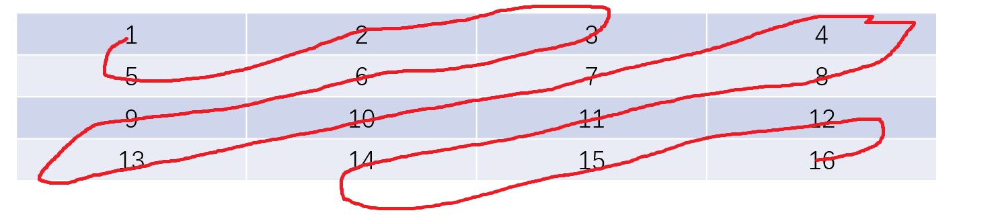

## 一、问题一

洗衣机问题：

假设现在有n台洗衣机，m件待洗衣物。m件待洗衣物现在被随意放在n台机器中，现在要求将m件衣物均匀分布到n台洗衣机中。规定：每一轮移动中，每台机器都最多只能移出一件衣服，但是可以接受若干件衣服。

请求解：m件衣物完成均匀分布时，所需要的最少轮次。

```go
对于任何一台洗衣机，我们都可以通过下述方法求解出其需要的最少轮次：
1.计算第i台洗衣机左侧:  已有的衣服数-平均分配时应有的衣服数 = 需要处理的衣服数wait。 
①如果wait<0,表示第i台洗衣机左侧需要移入wait件衣服
②如果wait>0,表示第i台洗衣机左侧需要移出wait件衣服
2.同样的方法计算第i台洗衣机右侧 wait
3.根据waitLeft和waitRight的不同情况，可以获得最少轮次：
① waitLeft<0 且 waitRight<0 , 左右两侧都需要由当前i号洗衣机移入衣服，由于每轮每台机器只能移出一件衣服，因此至少需要 abs(waitLeft)+abs(waitRight) 轮
② waitLeft>0 且 waitRight>0 , 左右两侧都需要向当前i号洗衣机移入衣服，因为每轮一台机器可以接受若干件衣服，因此至少需要 max(abs(waitLeft),abs(waitRight))
③ waitLeft<0 且 waitRight>0 或者 waitLeft>0 且 waitRight<0 , 一侧需要移入衣服，一侧需要移出衣服。因此至少需要max(abs(waitLeft),abs(waitRight))

通过上述的方法，计算出每一台洗衣机需要的最少轮次。接着从获得的[]wait数组中获取最大的wait
```

```go
func WashMachine(washer []int) int {
	totalCloth := 0
	for _, laundry := range washer {
		totalCloth += laundry
	}
	washerCount := len(washer)
	avgCloth := totalCloth / washerCount // 平均每台洗衣机要洗的衣物

	roundSet := make([]int, washerCount) // 以每台洗衣机为中心，达成待洗衣物的均分需要的轮次各自是多少

	for i := 0; i < washerCount; i++ {
		leftLaundry := 0 // 左侧已有的待洗衣物
		for left := 0; left < i; left++ {
			leftLaundry += washer[left]
		}
		rightLaundry := 0 // 右侧已有的待洗衣物
		for right := i + 1; right < washerCount; right++ {
			rightLaundry += washer[right]
		}
		leftAdjust := leftLaundry - avgCloth*i                   // 左侧需要调整的待洗衣物数量
		rightAdjust := rightLaundry - avgCloth*(washerCount-1-i) // 右侧需要调整的待洗衣物数量

		if leftAdjust < 0 && rightAdjust < 0 { // 左右都需要移入待洗衣物
			roundSet[i] = abs(leftAdjust) + abs(rightAdjust)
		} else if leftAdjust > 0 && rightAdjust > 0 { // 左右都需要移入待洗衣物
			roundSet[i] = getMax(leftAdjust, rightAdjust)
		} else if leftAdjust > 0 && rightAdjust < 0 {
			roundSet[i] = getMax(leftAdjust, abs(rightAdjust))
		} else if leftAdjust < 0 && rightAdjust > 0 {
			roundSet[i] = getMax(abs(leftAdjust), rightAdjust)
		} else if leftAdjust == 0 && rightAdjust == 0 {
			roundSet[i] = 0
		} else if leftAdjust == 0 && rightAdjust != 0 {
			roundSet[i] = abs(rightAdjust)
		} else if leftAdjust != 0 && rightAdjust == 0 {
			roundSet[i] = abs(leftAdjust)
		}
	}

	minRound := math.MaxInt
	for _, round := range roundSet {
		if round < minRound {
			minRound = round
		}
	}
	return minRound
}

func abs(before int) int {
	if before < 0 {
		return -before
	} else {
		return before
	}
}

func getMax(num1, num2 int) int {
	if num1 > num2 {
		return num1
	} else {
		return num2
	}
}
```


## 二、题目二

用螺旋的方式打印矩阵，比如下面的矩阵

|  0   |  1   |  2   |  3   |
| :--: | :--: | :--: | :--: |
|  4   |  5   |  6   |  7   |
|  8   |  9   |  10  |  11  |

最终打印的顺序要求是 0  1  2  3  9  10  11  4  9  7  6  5

|  0   |  1   |  2   |  3   |
| :--: | :--: | :--: | :--: |
|  9   |  10  |  11  |  4   |
|  8   |  7   |  6   |  5   |

```go
1.从矩阵的最外圈开始，一层一层向里转。  
2.找准矩阵当前圈的 左上角(假设为(a,b)，这里是(0,0)) 和 右下角(假设为(c,d)，这里是(3,3)) 的坐标
3.左上角开始向右遍历，直到纵坐标 == d ，接着向下遍历，直到横坐标 == c。此时从左上角到了右下角。
4.右下角开始向左遍历，直到纵坐标 == b ，接着向上遍历，直到横坐标 == a-1。此时从右下角到了左下角的正下方。
5.转到第二圈，更新左上角为(a-1,b-1),更新右下角为(c-1,d-1)。这里就是(1,1)和(2,2)。重复3、4

注意:在以下的几个条件时结束
1.当 a == c，也就是左上角和右下角在 同一行 ，此时从左到右打印完成后退出
2.当 b == d，也就是左上角和右下角在 同一列 ，此时从上到下打印完成后退出
3.当 a > c,也就是左上角在右下角 下方 时，退出
4.当 b > d,也就是左上角在右下角 右侧 时，退出
```

```go
package lesson4

import "fmt"

func SpiralPrint(matrix [][]int) {
	maxRow := len(matrix) - 1
	maxCol := len(matrix[0]) - 1

	luRow := 0      // 左上角的行号
	luCol := 0      // 左上角的列号
	rlRow := maxRow // 右下角的行号
	rlCol := maxCol // 右下角的列号

	defer fmt.Println()
	for {
		if luRow == rlRow { // 左上角与右下角在同一行
			for col := luCol; col <= rlCol; col++ { // 打印完这一行后退出
				fmt.Printf(" %d ", matrix[luRow][col])
			}
			return
		}
		if luCol == rlCol { // 左上角与右下角在同一列
			for row := luRow; row <= rlRow; row++ { // 打印完这一列后退出
				fmt.Printf(" %d ", matrix[row][luCol])
			}
			return
		}
		if luRow > rlRow || luCol > rlCol { // 左上角在右下角的下方或者右侧时，退出
			return
		}

		// 1.打印矩阵顶层行
		for col := luCol; col < rlCol; col++ {
			fmt.Printf(" %d ", matrix[luRow][col])
		}
		// 2.打印矩阵的最右列
		for row := luRow; row < rlRow; row++ {
			fmt.Printf(" %d ", matrix[row][rlCol])
		}
		// 3.打印矩阵的最底层
		for col := rlCol; col > luCol; col-- {
			fmt.Printf(" %d ", matrix[rlRow][col])
		}
		// 4.打印矩阵的最左列
		for row := rlRow; row >= luRow+1; row-- {
			fmt.Printf(" %d ", matrix[row][luCol])
		}

		luRow++
		luCol++
		rlRow--
		rlCol--
	}

}
```


## 三、题目三

给定一个正方形矩阵，只用有限几个变量，实现矩阵中每个位置的顺指针90°转动，比如如下的矩阵：

|  0   |  1   |  2   |  3   |
| :--: | :--: | :--: | :--: |
|  4   |  5   |  6   |  7   |
|  8   |  9   |  10  |  11  |
|  12  |  13  |  14  |  15  |

矩阵应该被调整为：

|  12  |  8   |  4   |  0   |
| :--: | :--: | :--: | :--: |
|  13  |  9   |  5   |  1   |
|  14  |  10  |  6   |  2   |
|  15  |  11  |  7   |  3   |

```go
经过分析此题，可以得出一个结论：任何一圈的矩阵元素在旋转90°之后，仍然在此圈上。我们以最外层为例：
0 3 15 12 为一组，旋转后格子向后移动一个位置
1 7 14 8 为一组，旋转后格子向后移动一个位置
2 11 13 4 为一组，旋转后格子向后移动一个位置

因此，此题的做法为：(依旧假设 左上角为(a,b)  右下角为(c,d)  )
1.最外层循环次数即为圈数，我们依旧通过控制左上角和右下角的坐标作为循环变量：每轮循环 a++ b++ c-- d--,当出现 a>=c 或者 b>=d 时退出
2.对于每一圈的操作如下：
①每一圈要分为 c-a 组，每一组固定有4个矩阵元素
②内部循环即为 c-a 次，假设当前为第i次，那么就将第i组进行旋转，4个元素分别是：m[a][b+i] 、 m[a+i][d] 、 m[c][d-i] 、 m[c-i][d]   (起点的位置都很好想，分别是m[a][b] 、 m[a][b+1] 、 m[a][b+2] ; 余后的每一个位置都是上一个位置顺时针走i步得到的)
```

```go
package lesson4

import "fmt"

func NinetyRotation(matrix *[][]int) {
	maxRow := len(*matrix) - 1
	maxCol := len((*matrix)[0]) - 1

	luRow := 0      // 左上角的行号
	luCol := 0      // 左上角的列号
	rlRow := maxRow // 右下角的行号
	rlCol := maxCol // 右下角的列号

	for {
		if luRow > rlRow || luCol > rlCol { // 对于一个正方形矩阵，不可能出现左上角与右下角同行或同列，因此没有 ==
			return
		}

		group := rlCol - luCol // 矩阵的当前圈被分成的组数，每一组固定会有4个点
		for i := 0; i < group; i++ {
			// 四个点的位置分别是 (luRow,luCol+i)  (luRow+i,rlCol) (rlRow,rlCol-i) (rlRow-i,luCol)
			rotation(&(*matrix)[luRow][luCol+i], &(*matrix)[luRow+i][rlCol], &(*matrix)[rlRow][rlCol-i], &(*matrix)[rlRow-i][luCol])
		}

		// 更新左上角与右下角
		luRow++
		luCol++
		rlRow--
		rlCol--
	}

}

func PrintMatrix(matrix [][]int) {
	maxRow := len(matrix) - 1
	maxCol := len(matrix[0]) - 1

	for row := 0; row <= maxRow; row++ {
		for col := 0; col <= maxCol; col++ {
			fmt.Printf(" %d ", matrix[row][col])
		}
		fmt.Println()
	}
}

func rotation(ele1, ele2, ele3, ele4 *int) {
	val1 := *ele1
	val2 := *ele2
	val3 := *ele3
	val4 := *ele4

	*ele1 = val4
	*ele2 = val1
	*ele3 = val2
	*ele4 = val3
}
```


## 四、题目四

按照zigzag方式打印矩阵。

所谓的zigzag打印方式如下：



以上是一个 4 x 4 的矩阵，按照zigzag输入打印的结果为：1 5 2 3 6 9 13 10 7 4 8 11 14 15 12 16

其实规则也很简单，就是从左上角开始到右下角来回打印斜对角线。

```go
准备两个临时整型变量a和b，这两个变量都从左上角开始，当到达右下角时结束。再准备一个布尔变量direction
具体对于每一轮：
1.对于变量a，让他每轮向下移动一位，如果到达矩阵最后一行无法再向下移动，那么每次就向右移动，直到到达右下角
2.对于变量b，让他每轮向右移动一位，如果到达具有最右一列无法再向右移动，那么每次就向下移动，直到到达右下角
3.每一轮都打印从变量a到变量b斜对角线上的所有元素，具体是从a到b还是从b到a取决于direction，每打印完一轮direction都要取反。

结果：
第一轮：1
第二轮：5 2
第三轮：3 6 9
第四轮：13 10 7 4
第五轮：8 11 14
第六轮：15 12 
第七轮：16
```

```go
package lesson4

import "fmt"

type Pos struct {
	row int
	col int
}

func ZigZag(matrix [][]int) {
	maxRow := len(matrix) - 1
	maxCol := len(matrix[0]) - 1

	leftLower := Pos{0, 0}  // 对角线的左下角
	rightUpper := Pos{0, 0} // 对角线的右上角

	direction := true // 打印对角线时的方向

	for {
		if leftLower.row == maxRow && leftLower.col == maxCol { // 到达右下角
			fmt.Printf(" %d \n", matrix[leftLower.row][leftLower.col])
			return
		}

		if direction { // 从右上角到左下角顺序打印
			start := rightUpper
			end := leftLower

			for {
				if start.row == end.row && start.col == end.col {
					fmt.Printf(" %d ", matrix[start.row][start.col])
					break
				}
				fmt.Printf(" %d ", matrix[start.row][start.col])
				start.row++
				start.col--
			}

		} else { // 从左下角到右上角顺序打印
			start := leftLower
			end := rightUpper

			for {
				if start.row == end.row && start.col == end.col {
					fmt.Printf(" %d ", matrix[start.row][start.col])
					break
				}
				fmt.Printf(" %d ", matrix[start.row][start.col])
				start.row--
				start.col++
			}
		}

		direction = !direction
		if leftLower.row < maxRow {
			leftLower.row++
		} else {
			leftLower.col++
		}
		if rightUpper.col < maxCol {
			rightUpper.col++
		} else {
			rightUpper.row++
		}
	}
}
```


## 五、题目五

假设字符串s和字符串m初始化操作为：s="a"; m=s

再定义两种操作：

1.操作一：

```
m = s
s = s + m
```

2.操作二：

```
s = s + m
```

求将s拼接到长度等于n时需要的最少操作步骤。

```go
1.操作一可以让 s 的长度每次都倍增。每次操作完成后，s都会变成偶数长度，m从第二次开始每次都会变成偶数(m第一次是不是偶数取决于s初始时是否是偶数长度)
2.操作二可以让 s 的长度每次都+1
```

因此：

```
如果运算需要将 s 的长度变为原来的质数倍，那么只能用操作二
```

此题的解法为：

```
任意的n都可以拆解为若干质数之积的形式，例如： n = a * b * c * d， a b c d 都是质数(且都不为1)

因此此题的求解策略就是从 a b c d 的所有排列组合中选取一个最优的(a*b*c*d 、 a*c*d*b 、b*a*c*d……)
假设 a*b*c*d 是最优的顺序，其实就是说先变成长度为a的字符串，然后再扩展为原来的b倍，再扩展为原来的c倍，最后扩展为原来的d倍

我们从后往前看：
1. (a*b*c)*d , 就是将长度为(a*b*c)的字符串扩展为原来的d倍，因为d是一个质数，因此只能用操作二，需要进行的次数为：d—1
2. 同理，a*b*c = (a*b)*c , 需要进行c-1次操作二
3. a*b 需要进行b-1次操作二
4. a 需要进行a-1次操作二

因此，将s拼接到长度等于n时需要的最少操作步骤 =((a-1)+(b-1)+(c-1)+(d-1))
```

```go
package lesson4

func SpStr(length int) int {
	primeSet := Primefac(length)

	res := 0
	for _, v := range primeSet {
		res += (v - 1)
	}
	return res
}

// 质因数分解
func Primefac(n int) []int {
	primeSet := make([]int, 0)

	dividend := n // 被除数
	for {
		if dividend == 1 { // 被除数变为1，完成质因数分解
			return primeSet
		}
		for div := 2; div <= dividend; div++ { // 除数从2开始，且必须小于等于被除数
			if dividend%div == 0 { //能除尽
				primeSet = append(primeSet, div)
				dividend = dividend / div
				break
			}
		}
	}
}
```

## 六、题目六

给定一个字符串类型的数组arr，求其中出现次数最多的前K个

```go
准备一个哈希表，统计每一个字符串出现的词频。打印词频最高的前K个
```

进阶版：如果数组arr是动态的，随时可以新增新的字符串元素，又要如何实现随时随地获取出现次数最多的前K个？

```go
1.准备一个hashTable做词频表，每插入一个新字符串，就更新词频表
2.准备一个容量为K的小根堆，小根堆只存储出现次数最多的K个字符串节点（字符串节点包括两个成员: ①.代表的字符串 	②.字符串出现的次数）
3.准备一个hashTable做定位表，定位一个字符串在小根堆中的位置。如果字符串不在小根堆上，那么位置就是-1

所以，插入一个字符串时，需要进行以下的几步操作：
1.检查词频表，是否存在于词频表中，如果不存在则需要新建key-value;如果存在就频率++
2.检查定位表，是否存在于定位表中，如果不存在则需要新建key-value，位置初始化为-1；如果存在可以分两种情况：① == -1，说明该字符串被统计过但是不在小根堆上； ② == (0~k-1),说明该字符串就在小根堆上
3.经过步骤2的检查：
 1）字符串就在小根堆上，那么更新小根堆中该节点对应节点的出现次数，然后heapify
 2）字符串不在小根堆上，分为两种情况：
	① 小根堆未满，则将该字符串对应的节点插入到小根堆，然后heapify
	② 小根堆已满，则需要判断当前字符串出现次数是否 大于 小根堆堆顶节点字符串出现次数，若大于则插入然后		heapify；若不不能，则不插入。

需要注意：在进行heapify时，小根堆节点在进行位置交换时，需要更新定位表
```

```go
package lesson4

import "DataStructure2/utils"

type Word struct {
	Str   string // 单词字符串
	Count int    // 单词出现的次数
}

func LessWord(a, b interface{}) bool {
	aWord := a.(Word)
	bWord := b.(Word)

	if aWord.Count < bWord.Count {
		return true
	} else {
		return false
	}
}

type DymMostFreq struct {
	FreqTable     map[string]int // 词频表
	SmallRootHeap []interface{}  // 小根堆
	SRHeapLoc     map[string]int // 记录单词在小根堆中的位置

	K int // 只打印出现次数最多的k个单词
}

func NewDymMostFreq(k int) *DymMostFreq {
	return &DymMostFreq{
		FreqTable:     make(map[string]int),
		SmallRootHeap: utils.NewHeap(make([]interface{}, 0, k), false, LessWord),
		SRHeapLoc:     make(map[string]int),
		K:             k,
	}
}

// 小根堆完成一次heapify后,需要更新SRHeapLoc
func Hook(srHeapLoc *map[string]int, a, b *interface{}) {
	aWord := (*a).(Word)
	bWord := (*b).(Word)
	temp := (*srHeapLoc)[aWord.Str]
	(*srHeapLoc)[aWord.Str] = (*srHeapLoc)[bWord.Str]
	(*srHeapLoc)[bWord.Str] = temp
}

func (dmf *DymMostFreq) AddWord(word string) *DymMostFreq {
	if _, ok := dmf.FreqTable[word]; ok {
		dmf.FreqTable[word]++
	} else {
		dmf.FreqTable[word] = 1
	}

	if loc, ok := dmf.SRHeapLoc[word]; ok && loc != -1 { // 单词存在于小根堆上. 更新节点的出现次数后重新heapify
		node := dmf.SmallRootHeap[loc].(Word)
		node.Count++
		dmf.SmallRootHeap[loc] = node
		Heapify(dmf.SmallRootHeap, 0, len(dmf.SmallRootHeap), false, LessWord, Hook, &dmf.SRHeapLoc) // 需要重新调整SRHeapLoc
	} else { // 单词不在小根堆上
		if len(dmf.SmallRootHeap) < dmf.K { // 小根堆未满
			newLoc := 0
			newLoc = utils.HeapInsert(&dmf.SmallRootHeap, Word{Str: word, Count: 1}, false, LessWord)
			dmf.SRHeapLoc[word] = newLoc
		} else { // 小根堆已经满了，需要看堆顶元素是否可以被替换掉
			topCount := dmf.SmallRootHeap[0].(Word).Count
			if dmf.FreqTable[word] <= topCount {
				dmf.SRHeapLoc[word] = -1
			} else {
				dmf.SRHeapLoc[dmf.SmallRootHeap[0].(Word).Str] = -1
				dmf.SmallRootHeap[0] = Word{word, dmf.FreqTable[word]}
				dmf.SRHeapLoc[word] = 0
				Heapify(dmf.SmallRootHeap, 0, len(dmf.SmallRootHeap), false, LessWord, Hook, &dmf.SRHeapLoc)
			}
		}
	}
	return dmf
}

func (dmf *DymMostFreq) Pop() string {
	var data interface{}
	dmf.SmallRootHeap, data = PopAndheapify(dmf.SmallRootHeap, false, LessWord, Hook, &dmf.SRHeapLoc)
	word := data.(Word)

	dmf.FreqTable[word.Str]--
	dmf.SRHeapLoc[word.Str] = -1

	return word.Str
}

func Heapify(heap []interface{}, start, end int, form bool, less func(interface{}, interface{}) bool,
	hook func(*map[string]int, *interface{}, *interface{}), srHeapLoc *map[string]int) {
	currentIndex := start // 对以 heap[start]为根节点的子树进行heapify
	leftChildIndex := currentIndex*2 + 1
	rightChildIndex := currentIndex*2 + 2

	for {
		if leftChildIndex > end { // 没有任何孩子节点(最多到heap[end-1])
			break
		}
		newRootIndex := currentIndex
		if form { // 大根堆
			// 获得当前节点 左右孩子 中较大节点的下标
			maxIndex := leftChildIndex
			max := heap[leftChildIndex]
			if rightChildIndex <= len(heap)-1 { // 可能只有左孩子，没有右孩子
				max = BackMax(heap[leftChildIndex], heap[rightChildIndex], less)
				if max == heap[rightChildIndex] {
					maxIndex = rightChildIndex
				}
			}
			// 如果较大节点比根节点还要大，则交换两者
			if less(heap[currentIndex], max) {
				swap(&heap[maxIndex], &heap[currentIndex], hook, srHeapLoc)
			}
			newRootIndex = maxIndex
		} else { // 小根堆
			// 获得当前节点 左右孩子 中较小节点的下标
			minIndex := leftChildIndex
			min := heap[leftChildIndex]
			if rightChildIndex <= len(heap)-1 { // 可能只有左孩子，没有右孩子
				min = BackMin(heap[leftChildIndex], heap[rightChildIndex], less)
				if min == heap[rightChildIndex] {
					minIndex = rightChildIndex
				}
			}
			// 如果较小节点比根节点还要小，则交换两者
			if less(min, heap[currentIndex]) {
				swap(&heap[minIndex], &heap[currentIndex], hook, srHeapLoc)
			}
			newRootIndex = minIndex
		}
		// 更新循环变量
		currentIndex = newRootIndex
		leftChildIndex = currentIndex*2 + 1
		rightChildIndex = currentIndex*2 + 2
	}
}

func PopAndheapify(heap []interface{}, form bool, less func(interface{}, interface{}) bool,
	hook func(*map[string]int, *interface{}, *interface{}), srHeapLoc *map[string]int) ([]interface{}, interface{}) {

	num := heap[0]              // 每次总是返回根堆的根节点
	heap[0] = heap[len(heap)-1] // 让末尾的叶子结点替换掉根节点
	heap = heap[:len(heap)-1]

	// 将新的根节点下沉到合适的位置
	Heapify(heap, 0, len(heap)-1, form, less, hook, srHeapLoc) // 注意：end必须是heapIndex - 1，作用是相当于heap[heapIndex]被删除
	return heap, num
}

func BackMax(a, b interface{}, less func(interface{}, interface{}) bool) interface{} {
	if less(a, b) {
		return b
	} else {
		return a
	}
}

func BackMin(a, b interface{}, less func(interface{}, interface{}) bool) interface{} {
	if less(a, b) {
		return a
	} else {
		return b
	}
}

func swap(a, b *interface{}, hook func(*map[string]int, *interface{}, *interface{}), srHeapLoc *map[string]int) {

	hook(srHeapLoc, a, b)
	temp := *a
	*a = *b
	*b = temp
}
```

