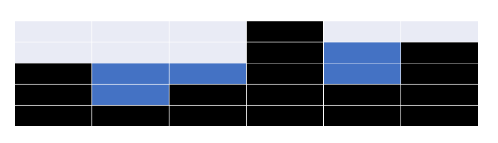

## 一、题目一

实现一个特殊的栈，在实现栈的基本功能的基础上，再实现返回栈中最小元素的操作。

要求：1.`pop`、`push`、`getMin`操作的时间复杂度都是O(1)   2.设计的栈类型可以使用现成的栈结构。

```go
1.准备一个栈用来存数据，完成pop和push操作，这样时间复杂度是O(1)
2.再准备一个栈用来存当前栈中的最小值，方式是：每当数据栈push进一个元素时，最小值栈也要push进一个元素，这个元素需要是 min(当前push到数据栈的元素,最小值栈保留的最小值) ; 每当数据栈pop出一个元素时，最小值栈也要pop出一个元素。这样以来，利用最小值栈可以实现getMin的时间复杂度为O(1)
```

## 二、题目二

1.如何仅用队列结构实现栈结构？

```go
准备一个队列，数据进入的时候从尾部进入，数据弹出的时候也从尾部弹出，即可实现栈结构
```

2.如何仅用栈结构实现队列结构？

```go
准备两个栈结构：栈1和栈2
1.当用户给数据的时候，将数据从头到尾压入到栈1中
2.当用户需要弹出数据时，进行如下操作：
1）先检查栈2是否为空，如果栈2中有数据，就将这些数据按需要的数量弹出给用户；如果栈2中没有数据，进行下面第2）步
2）将栈1中的所有已有元素弹出，并压入到栈2中。然后按照用户需要的数量进行弹出
```


## 三、动态规划的空间压缩技巧

案例一：

动态规划需要一个二维表，每一个位置的值都依赖于：1.该坐标正上方位置的值   2.该坐标正左方位置的值。

按照传统的动态规划求解问题，我们需要挨行挨行的求解，直到求完整个二维矩阵，找到返回值进行返回。

我们可以通过下面的方式节省空间复杂度，让空间复杂度从O(M*N)变成O(N)或者O(M)

```go
1.如果二维表(M*N)的行比较多，列比较少(M>>N)，采用下面的方式：
① 最上方一行可以直接从上到下求出，因为最上方一行的元素没有上方位置的值,此时使用了一个长度为N的数组
② 根据第一行我们就可以求出第二行的各元素，第二行从左到右进行求解，每求解出一个就用这个新值更新N数组对应位置的值，完成后，N数组存储的就是矩阵第二行元素的值
③ 重复步骤二，分别求第3、4、5 …… 行的值

总的空间复杂度是O(N)

2.如果二维表的列比较多，行比较少(N>>M)，采用下面的方式：
① 最左侧一列可以直接从上到下求出，因为最左侧列的元素没有左侧位置的值,此时使用了一个长度为M的数组
② 根据第一列我们就可以求出第二列的各元素，第二列从上到下进行求解，每求解出一个就用这个新值更新M数组对应位置的值，完成后，M数组存储的就是矩阵第二列元素的值
③ 重复步骤二，分别求第3、4、5 …… 列的值

总的空间复杂度是O(M)

```

案例二：

与案例一不同，二维矩阵的每一个矩阵元素的值可能依赖于：1.正左方  2.正上方  3.左上角  三个位置的值：

```go
基本思路与案例一方式类似，只不过由于多了一个 3.左上角 的依赖，导致我们在用求解的第二行去更新N数组时，还需要额外用一个临时变量去保存第一行上一次的值（保留作为左上角的值）
```

案例三：

如果每一个二维矩阵不仅仅只依赖于本行和上一行的元素的值，而且可能依赖于更上方行的值，如何求？

```go
可以保留若干行，比如当前行的元素会依赖于本行、前一行、前前一行 三行的元素，那么我们可以每次使用三行即3*N大小的数组，每次遍历完当前行，都用当前第2行去替换第1行、第1行去替换第0行，空出来的第2行用来求解新的一行。
```

案例四：

如果是一个三维矩阵，每个矩阵的第i层依赖于其上一层即i-1层，那么我们准备一个M*N的二维矩阵，每次都有第i-1层去计算第i层


## 四、题目四

给定一个数组arr，已知其中所有的值都是非负的，将这一个数组看作是一个容器，请返回容器最多能装多少水？

比如：arr=[3 1 2 5 2 4]，根据数组各元素值画出来的直方图就是容器形状(**黑色格子**)，该容器可以装下5格水(**蓝色格子**)



```go
1.我们可以先求第i个位置的蓄水量：
计算公式为 water_i = max{0, min[max(左侧直方图高度),max(右侧直方图盖度)] - i位置直方图高度}
比如i=1，左侧高度为3，右侧高度为5，因此蓄水量 = 3-1 = 2
特殊的，对于i=0和i=len(arr)-1 这两个位置由于分别在左侧和右侧是0，因此无法存水。

2.求完每一个位置的蓄水量之和，我们在将所有 water_i 加起来，得到总的蓄水量 water_sum

3.为了方便求解，可以实现准备一个 左侧直方图最大高度 辅助数组，存储每一个位置的 max(左侧直方图高度); 然后再准备一个 右侧直方图最大高度 辅助数组，存储每一个位置的 max(右侧直方图高度)

4.如果为了节省空间，可以不准备上述两个辅助数组，而是通过以下方式：
①准备两个指针，分别从左右两侧开始扫描，当两个指针错过的时候结束
②左右两侧无法蓄水，因此蓄水量都是0。此时相当于分别完成了左右两个指针的第一次扫描，leftmax=3，rightmax=4
③左指针右移到i=1位置，右指针左移到i=4位置。
1）此时对于左指针位置：leftmax==3（因为左侧区域已经全部完成变量，因此==3），rightmax>=4（因为右侧区域还没有遍历完，因此>=4）。那么可知左指针i=1蓄水高度取决于leftmax，因此可以直接求 water_i = 2。完成后左指针++，lefrmax = max(leftmax,1) = leftmax
2）此时对于右指针位置：rightmax==4（因为右侧已经完成遍历），leftmax>=3（因为左侧还没有遍历完）。所以右指针i=4位置不可求。因为i=4位置蓄水高度不取决于右侧，但是左侧还是未知，所以没法求。

④重复步骤③的操作，继续求解。
```


## 五、题目五

给定一个数组arr长度为N,可以把任意长度大于0且小于N的前缀作为左部分，剩下的为右部分。每种划分情况下都会有左部分的最大值和右部分的最大值。

请返回当 abs(左部分max - 右部分max)最大时是如何划分的？

```go
1.先求出整个数组的最大值max
2.现在将整个数组划分为两部分，划分后max必然落在左右两个区域中的一个:
情况一：max落在左区域，leftmax = max。此时就要获得右区域最大值最小的划分情况，结果只有一种：只有当右区域只有一个元素，也就是arr[N-1]时，rightmax与leftmax的差值是最大的（因为如果右区域长度>1,那么导致的rightmax只可能>=arr[N-1]）

情况二：max落在右区域，righttmax = max。此时就要获得左区域最大值最小的划分情况，结果只有一种：只有当左区域只有一个元素，也就是arr[0]时，rightmax与leftmax的差值是最大的（因为如果左区域长度>1,那么导致的leftmax只可能>=arr[0]）

因此，此题的求解只需要求两种情况：
1.max-arr[N-1]  和  2.max-arr[0]   哪一个大就选那种划分情况

```


## 六、题目六

如果一个字符串str，把str前面任意长度（长度可以是0）的子串挪到后面形成的字符串叫做str的旋转词。

比如str = "12345" , str的旋转词有 "12345"   "23451"  "34512"  "45123" "51234"

给定两个字符串a和b，请判断a和b是否互为旋转词？

比如：

a = "cdab" b="abcd" ,返回true

a = "1ab2" b="ab12" ,返回false

a = "2ab1" b="ab12" ,返回true

```go
1.首先判断字符串a和字符串b的长度是否相等，不相等直接返回false，若相等继续下面操作
2.让 a = a + a ，使用KMP算法检查字符串b是否是 修改后a 的子串，如果是则返回true;否则返回false

原因：a = a + a , 修改后的a以任意点为起点长度为len(b)的子串都是原始a字符串的旋转词
```

## 七、题目七

1.现在有若干台咖啡机，每台咖啡机冲泡一杯咖啡的时间是固定的，而且咖啡机每次只能冲一杯咖啡。假设现在给出一个冲泡时间表 coffeeArr = []int{3,2,7}  ，表示现在有三台咖啡机，冲泡一杯咖啡所需要的时间分别是：3 、2 、7。

2.假设现有有N个人想要喝咖啡，他们必须排队使用这几台咖啡机

3.现在只有一台洗咖啡杯的机器，每次只能洗一杯，冲洗的时间固定为a，洗完的杯子会"变干净"

4.用完的咖啡杯也可以不洗，在等待时间b之后，杯子内咖啡自动挥发，挥发后的杯子会"变干净"

5.每个人喝咖啡的时间忽略不计，认为是瞬间的

问题：请求出N个人喝完咖啡并完成所有杯子的"变干净"所需要的最短时间

```go
这个问题需要分两步求解：第一步，使用贪心算法求解N个人完成喝咖啡的最佳安排(最快时间让N个人都喝完咖啡)；第二步，完成第一步后可以得到一个时间表数组，此数组记录者所有人喝完咖啡的时刻，使用暴力递归可以求出最早洗完所有杯子的时刻。

第一步：
1.用一个二维点(x,y)表示每台咖啡机的状态：x表示该咖啡机刚好空闲的时间，y表示该咖啡机冲一杯咖啡需要的时长
2.起始时刻，三台咖啡机的二维点分别是：(0,2)  (0,3)  (0,7)
3.创建一个小根堆，将三台咖啡机的二维点进行存储，大小比较的依据是：x+y的大小(x+y可以表示该咖啡机冲泡下一杯咖啡的时间，因此可以作为贪心策略的基准)
4.每次从小根堆弹出一个二维点。然后对这个二维点进行更新，由(x,y) --> (x+y,y) (相当于某一个人用这台咖啡机进行冲咖啡)。将x+y这个时间点append到drinkedTime数组中，作为此人喝完咖啡的时间点。接着再将更新后的这个二维点重新加入到小根堆中，进行heapify。
5.重复进行步骤4，直到N个人都喝到了咖啡
6.我们得到了一个长度为N的 drinkedTime 数组，它记录了N个人没人喝完咖啡的时间点。

第二步：
// 1.washLine表示洗咖啡的机器在washLine时刻刚好开始空闲
// 2.a表示洗一杯咖啡需要的时间
// 3.b表示咖啡杯自然挥发需要的时间
// 4.此函数的意义是洗完drinkedTime[index……N-1]这些咖啡杯，最早完成的时间点
func minTime(drinkedTime []int,a int,b int,index int,washLine int) int {
    if (index == len(drinkedTime)-1) {  // 还剩下当前这最后一杯未洗的咖啡杯
        // 1. washTime:= Math.max(washLine,drinkedTime[index]) 求出第index咖啡杯开始清洗的时间(清洗机器空闲且咖啡已经喝完)
        // 2. way1:= washTime + a  求出用清洗机器洗完该咖啡杯的时间点
        // 3. way2:= drinkedTime[index] + b   求出从喝完该咖啡那一刻采用自然挥发方式变干净的时间点
        // 4. math.Min(way1,way2)   最后一个杯子变干净的最早时刻
        return math.Min(Math.max(washLine,drinkedTime[index]) +a,drinkedTime[index] + b)
    }
    // 求出用清洗机器洗完该咖啡杯的时间点
    wash := math.Max(washLine, drinkedTime[index])+a )
    // 剩余[index+1 …… N-1]杯子变干净的时间点(这里注意：因为变干净又两种方式,所以next1不一定就比wash晚)
    next1:= minTime(drinkedTime,a,b,index+1,wash)
    // 当前第index杯子采用机器清洗的方式，完成[index……N-1]所有杯子变干净的时间点
    p1 := math.Max(wash,next1)
    
    // 当前杯子采用挥发的方式，变干净的时间点
    dry := drinkedTime[index]+b
    // 剩余[index+1 …… N-1]杯子变干净的时间点，因为没有用清洗机器，因此依旧是washLine
    next2 := minTime(drinkedTime,a,b,index+1,washLine)
    // 当前第index杯子采用自然挥发的方式，完成[index……N-1]所有杯子变干净的时间点
    p2 := math.Max(dry,next2)
    
    return math.Min(p1,p2)
}
```


## 八、题目八

给定一个数组arr，如果通过调整可以做到arr中任意两个相邻的数字相乘是4的倍数，返回true; 如果不能则返回false

```go
数组中所有数可以分为三大类：①.奇数   ②.2   ③.4的倍数的偶数
假设奇数个数为a ; 2的个数为b  ;  4倍数偶数的个数为c

情况一：
数组中没有2(b==0)，那么arr调整成： 奇4奇4奇4……的形式即可，任意两个相邻的数乘积必然是4的倍数
这种情况下：1）若a == 1，那么要求 c >= 1  ;  2）若 a>= 2 , 那么要求 c >= a-1

情况二：
b≠0，那么arr调整成 2222……4奇4奇4奇…… 的形式即可
这种情况下： 若a >= 0，那么要求 c >= a  

```

