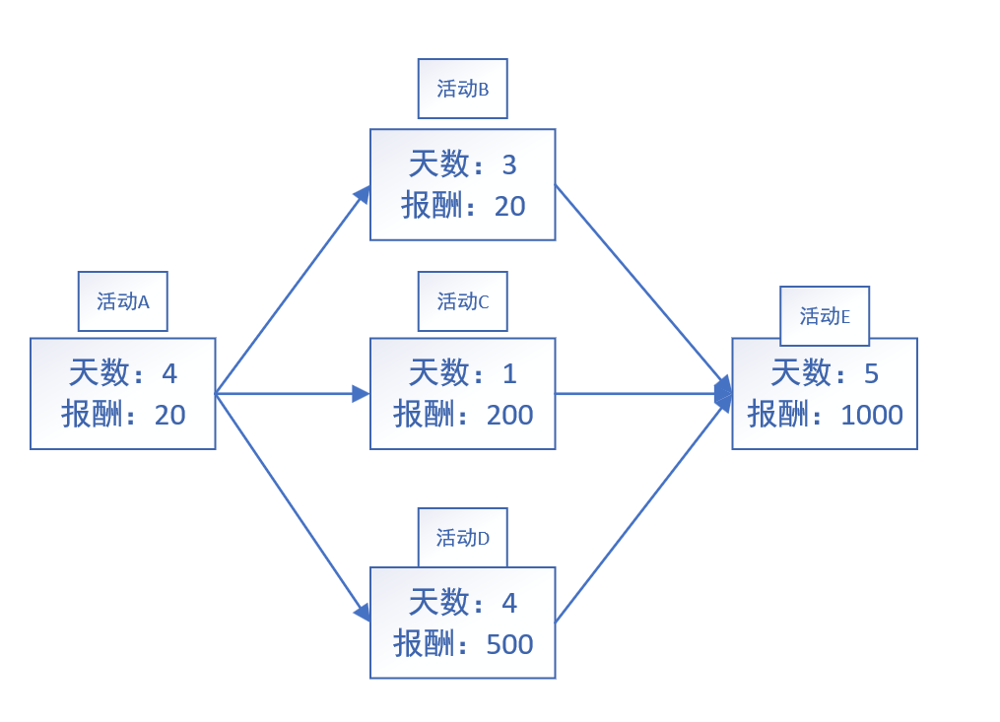

## 一、题目一

给定一个整型数组A，长度为n，有 1 <= A[i] <= n , 且对于[1,n] 的整数，其中部分整数会重复出现，部分整数不会出现。

实现算法找到[1,n] 中所有未出现在A中的整数。

提示：尝试实现 O(n) 的时间复杂度和 O(1) 的空间复杂度

```go
思路：争取让每一个 i 位置都存储 i+1 , 完成此任务后再遍历数组，就知道缺的数字是什么了。
比如：
    3 2 1 6 2 7 5
    0 1 2 3 4 5 6
1.从arr[0]开始，3应该放在arr[2]上，arr[2] = 1 就拿出来
      2 3 6 2 7 5
    0 1 2 3 4 5 6
2. 1应该放在arr[0]上，arr[0]现在没数字，正好放入：
    1 2 3 6 2 7 5
    0 1 2 3 4 5 6
3.一轮交换以回到起始位置为结束，开始下一轮交换。
4.从arr[1]开始，2就应该放在arr[1]上，因为回到了新起始位置，开始下一轮交换。
5.从arr[2]开始，3就应该放在arr[2]上，因为回到了新起始位置，开始下一轮交换。
6.从arr[3]开始，6应该放到arr[5]上, arr[5] = 7 就拿出来
    1 2 3   2 6 5
    0 1 2 3 4 5 6
7. 7就应该放到arr[6]上，arr[6] = 5 就拿出来
    1 2 3   2 6 7
    0 1 2 3 4 5 6
8. 5就应该放到arr[4]上，arr[4] = 2 就拿出来
    1 2 3   5 6 7
    0 1 2 3 4 5 6
9. 2就应该放到arr[1]上，但是arr[2]已经是1了，因此不需要交换。一旦遇到不需要交换的场景，意味着本轮结束，开始下一轮交换。
10.从arr[4]开始，5就应该放在arr[4]上，因为回到了新起始位置，开始下一轮交换。
11.从arr[5]开始，6就应该放在arr[5]上，因为回到了新起始位置，开始下一轮交换。
12.从arr[6]开始，7就应该放在arr[6]上，因为回到了新起始位置，开始下一轮交换。
13.结束了，所有交换完成。
14.再次遍历arr数组，发现arr[3] != 4 , 说明整个数组缺少4
```

```go
func matchAbsence(arr []int) int {
    if len(arr) == 0 {
        return
    }
    for _,ele := range arr {  // 争做让 每一个 i位置放的数字是 i+1
        modify(ele,arr)
    }
    for i:=0;i<len(arr);i++ {
        if arr[i] != i+1 {
            fmt.Println("缺少的数字为: ",i+1)
        }
    }
}

func modify(value int,arr []int) {
    for {
        if arr[value-1] == value {
            return
        }
        tmp := arr[value-1]
        arr[value-1] = value
        value = tmp
    }
}
```

## 二、题目二

最近CC直播平台在举办主播唱歌比赛，假设某一女主播的初始人气值为start，能够晋升到下一轮人气需要刚好达到end，给主播增加人气的方法有：

1. 点赞，花费 x C币，人气+2
2. 送礼，花费 y C币，人气*2
3. 私聊，花费 z C币，人气-2

其中end远远大于start，且start和end都是偶数，请问最少花费多少C币能帮助该主播人气达到end从而完成晋级？

```go
经典的暴力递归问题，关键在于边界条件的设置：

一眼就能看出的边界条件： 假设当前人气值用cur表示，那么cur == end 即为边界条件。
但是仅靠这一个边界条件是不够的。

1.寻找频繁解
因为start和end都是偶数，必定可以只通过点赞就完成晋级，如果只通过点赞的方式，需要花费的C币为： count:= (end - start)/2 * x。如果发现花费的C币总数大于count，那么就必然不是最优解。

2.从业务本身考虑获取边界条件
1）人气数不能为负数，因为start、end以及三种人气变化方式的原因，当前的人气值必然只能是偶数，一旦为负数，那必然只能是先为-2，-2人气变回整数还需要额外的一次点赞。因此人气一旦为负数，那必然不是最优解
2）人气值必然不可能超过 2*end，因为在最优解中使用私聊的方式只会发生在 end < cur < 2*end的情况下。

// add,double,del 分别表示点赞、送礼、私聊会增加的人气值
func  minCoin(add,double,del int,start,end int) int {
    if start > end {
        return -1
    }
    return process(0,end,add,double,del,start,end*2,( (end-start)/2 )*add)
}

// preMoney表示已经花费的C币
// cur表示当前的人气
// limitAim表示人气达到什么程度就不需要再尝试了
// limitCoin表示C币使用到什么程度就不需要再尝试了
func process(preMoney,end int,add,double,del int,cur int,limitAim,limitCoin int) {
    if preMoney > limitCoin {
        return math.MaxInt
    }
    if cur < 0 {
        return math.MaxInt
    }
    if cur > limitAim {
         return math.MaxInt
    }
    if cur == end {
        return preMoney
    }
    min := math.MinInt
    
    // 点赞，花费add币，人气+2
    p1 := process(preMoney+add,end,add,double,del,cur+2,limitAim,limitCoin)
    if p1 != math.MaxInt{
        min = p1
    }
    
     // 送礼，花费double币，人气*2
    p2 := process(preMoney+double,end,add,double,del,cur*2,limitAim,limitCoin)
    if p2 != math.MaxInt{
        min = math.Min(min,p2)
    }
    
     // 私聊，花费del币，人气-2
    p3 := process(preMoney+del,end,add,double,del,cur-2,limitAim,limitCoin)
    if p3 != math.MaxInt{
        min = math.Min(min,p3)
    }
    
    return min
}
```

## 三、题目三

CC直播的运营部门组织了很多运营活动，每个活动需要花费一定的时间参与，主播每参加完一个活动就可以得到一定的奖励，**参与活动可以从任意活动开始，但是一旦参与活动就必须将后续的活动全部参加完毕**。活动之间存在一定的依赖关系(但不存在环的情况)，现在给出所有的活动时间和依赖关系，请计算出在任意天数，能够获得的最大奖励都分别是多少？

假设活动依赖关系图为：



```go
需要从最后结尾的活动开始向前依次计算：
图的每一个节点都是一个活动，活动有它自己的消耗天数以及报酬。除此之外，每一个活动节点还包括一个有序表（要求活动天数递增的，报酬也必须是递增的），有序表负责记录从当前活动节点到结尾节点的天数+报酬信息。
1.从活动E开始，有序表的只有一条记录： {5,1000}
2.活动B,计算到结尾的活动信息： {8,1020}, 有序表也只有这一条记录 {8,1020}
3.活动C,计算到结尾的活动信息： {6,1200}, 有序表也只有这一条记录 {6,1200}
4.活动D,计算到结尾的活动信息： {9,1500}, 有序表也只有这一条记录 {9,1500}
5.活动A,计算到结尾的活动信息有三条，分别是：{12,1040} {10,1220} {13,1520}，因为活动路线1{12,1040}明显劣于(消耗天数多，但报酬却少)路线2{10,1220}，所以活动节点A的有序表只保存两条路线 [ {10,1220}，{13,1520} ]

6.最后从头到尾遍历整个图，获取每个节点的有序表，组成一个完整的有序表，合并后要排除掉所有活动天数递增但报酬没有递增的路线
合并结果： [ {10,1220}，{13,1520},{8,1020},{6,1200},{9,1500},{5,1000}  ]
有序化： [ {5,1000}，{6,1200}，{8,1020}，{9,1500}，{10,1220}，{13,1520}  ]
过滤后： [ {5,1000}，{6,1200}，        ，{9,1500}，         ，{13,1520}  ]

最终就得到了各工作天数下能获得的最大报酬都是多少。
```

## 四、题目四

给定一个只由 0（假）、1（真）、&（逻辑与）、|（逻辑或）、和^（异或）五种字符组成的字符串express，再给定一个布尔值desired。返回express能有多少种组合的方式，可以达到desired的结果？

```
提示：这个问题其实就是在问怎么加()字符串中的各个关系运算式最终得到desired
```

1. 方法一（暴力递归）

```go
1.首先要判断字符串的有效性，有效性需要满足下面三个点：
1）偶数下标位置(0、2、4、……)必须是0或者1
2）奇数下标位置(1、3、5、……)必须是位运算符
3) 字符串总长度必须是奇数(如 1&0、 1|0&1)

2.外循环每次都访问奇数下标位置(也就是位运算符)，i从1开始，i每轮后+2
3.外循环访问到位运算符后，根据desired是true还是false分为不同的分支，需要通过递归的方式分别获取位运算符左右返回指定bool值的数量

func num(exp string,desired bool) int {
    if exp == "" {
        return 0
    }
    if (!isValid(exp)) {  // 如果字符串无效则返回
        return 0
    }
    return p(exp,desired,0,len(exp)-1)
}

// 在exp[L……R]上运算，返回期待为desired的方法数
func p(exp string,desired bool,L,R int) int {
    // 边界条件
    if L == R {   // 区域只有一个数，只能为0或1
        if exp[L] == "1" {
            if desired {   // 1本身正好就是true，因此方法数为1
                return 1
            } else {  
                return 0
            }
        } else {   // 为0
            if desired {   
                return 0
            } else {   // 0本身正好就是false，因此方法数为1
                return 1
            }
        }
    }
    res := 0
    if desired {  // 期待为true
        // i位置尝试L……R范围上的每一个逻辑符号
        for i:=L+1;i<R;i+=2 {
            switch exp[i] {
                case "&":
                // 左右计算结果必须都为true
                res += p(exp,true,L,i-1)*p(exp,true,i+1,R)
                case "|":
                res += p(exp,true,L,i-1)*p(exp,true,i+1,R)
                res += p(exp,true,L,i-1)*p(exp,false,i+1,R)
                res += p(exp,false,L,i-1)*p(exp,true,i+1,R)
                case "^":
                res += p(exp,true,L,i-1)*p(exp,false,i+1,R)
                res += p(exp,false,L,i-1)*p(exp,true,i+1,R)
            }
        }
    } else { // 期待为false
        for i:=L+1;i<R;i+=2 {
            switch exp[i] {
                case "&":
                // 有一个false即可
                res += p(exp,false,L,i-1)*p(exp,false,i+1,R)
                res += p(exp,true,L,i-1)*p(exp,false,i+1,R)
                res += p(exp,false,L,i-1)*p(exp,true,i+1,R)
                case "|":  // 都为false
                res += p(exp,false,L,i-1)*p(exp,false,i+1,R)
                case "^":
                res += p(exp,true,L,i-1)*p(exp,false,i+1,R)
                res += p(exp,false,L,i-1)*p(exp,true,i+1,R)
            }
        }
    }
    return res
}
```

2. 方法二（动态规划）

```go
1.可变参量只有L和R，因此是一个二维表
2.期待的结果desired可能是true，也可能是false，因此需要有两张表
3.L不可能小于R，因此表格的下半区域都是无效的
4.对角线区域，意味着 L == R , 因此对角线区域就是初始条件可以获得的
5.因为最后一行只有一个位置需要求解，也就是对角线，而对角线已知，因此求解的顺序是从下往上，从左往右。

func dpLive(exp string,desired bool) int {
    N := len(str)
    tMap := new int[N][N]
    fMap := new int[N][N]
    // 获取对角线
    for i:=0;i<N;i+=2 {
        tMap[i][i] = str[i] == "1"?1:0
        fMap[i][i] = str[i] == "0"?1:0
    }
    // 行需要隔行求，N-1 行是数字，row每次+2，这样每次访问的才都是数字
    for row := N-3;row >= 0;row-=2 {   // row表示左边界(必须是数字)
        // 对角线上的都是数字，因此需要+2
        for col:=row+2 ; col < N ; col+=2 { //col表示右边界(必须是数字)
            for i:=row+1; i<col;i+=2 {  // i每次都访问每一行所有的关系运算符
                // 1.计算tMap
                switch exp[i] {
                    case "&":
                    // 左右计算结果必须都为true
                    tMap[row][col] += tMap[row][i-1]*tMap[i+1][col]
                    case "|":
                    tMap[row][col] += tMap[row][i-1]*fMap[i+1][col]
                    tMap[row][col] += fMap[row][i-1]*tMap[i+1][col]
                    tMap[row][col] += fMap[row][i-1]*fMap[i+1][col]
                    case "^":
                    tMap[row][col] += tMap[row][i-1]*fMap[i+1][col]
                    tMap[row][col] += fMap[row][i-1]*tMap[i+1][col]
            	}
                // 2.计算fMap
                switch exp[i] {
                    case "&":  // 有一个false即可
                    fMap[row][col] += tMap[row][i-1]*fMap[i+1][col]
                    fMap[row][col] += fMap[row][i-1]*tMap[i+1][col]
                    fMap[row][col] += fMap[row][i-1]*fMap[i+1][col]
                    case "|":  // 都为false
                    fMap[row][col] += fMap[row][i-1]*fMap[i+1][col]
                    case "^":
                    fMap[row][col] += tMap[row][i-1]*fMap[i+1][col]
                    fMap[row][col] += fMap[row][i-1]*tMap[i+1][col]
            	}
            }
        }
    }
    // 求解的目标，左边界为0，右边界为N-1
    return desired ? tMap[0][N-1]:fMap[0][N-1]   
}
```

## 五、题目五

在一个字符串中找到没有重复字符子串中最长的长度。

例如：

`abcabcbb` 没有重复字符的最长子串是 `abc` ，长度是3

`bbbbb`，答案是b，长度为1

`pwwkew`，答案是`wke`，长度为3

```go
遍历整个字符串arr。
假设当前遍历的是arr[i]，查询以arr[i]作为结尾的最长不重复子串是什么。
以arr[i]为结尾的不重复子串的长度取决于两个量：
1.假设arr[i]上的字符是'a',其中一个变量就是arr[i]左侧最近一次'a'出现的位置。
2.以arr[i-1]字符结尾的不重复子串的长度。

以arr[i]结尾的不重复子串的左边界取自上述两种情况中，距离arr[i]最近的那一个

func maxUnique(str string) int {
    if str == "" {
        return 0
    }
    charSet := toCharArray(str)  // string变成byte切片
    recentAppear := make(map[int]int) // 存储每一种字符最近在字符串中出现的位置
    for i:=0;i<256;i++ {  // 假设字符的编码是 0~255
        map[i] = -1
    }
    len := 0
    pre := -1   // 用来存储以上一位(i-1位)作为结尾的最长不重复子串的左边界
    cur := 0
    
    for i:=0;i<len(charSet);i++ {
        pre = math.Max(pre,recentAppear[charSet[i]])  // 最大的 == 距离str[i]最近的
        cur = i - pre  // 当前以str[i]结尾的不重复子串的长度
        recentAppear[charSet[i]] = i  // 更新字符str[i]最近出现的位置
        
        len = math.Max(len,cur)   // 更新最长不重复子串的长度
    }
    
    return len
}

```

## 六、题目六

给定两个字符串str1和str2，再给定三个整数ic 、dc和rc，分别代表插入、删除和替换一个字符串的代价，返回将str1编辑成str2的最小代价。

举例：

1. str1 == "abc" , str2 == "adc"  , ic = 5 , dc =3 , rc = 2

​       从"abc"编辑成"adc" , 把'b' 替换成'd'是代价最小的，所以返回2

2. str1 == "abc" , str2 == "adc"  , ic = 5 , dc =3 , rc = 100

   从"abc"编辑成"adc" , 先删除'b'，然后再插入'd'是代价最小的，所以返回8

3. str1 == "abc" , str2 == "abc"  , ic = 5 , dc =3 , rc = 2

   因为本来就是一样的字符串，所以不用编辑，返回0

```go
这是一个编辑距离问题，需要用动态规划解决。

假设str1 == "abcdef"   str2 == "skbcdf"

1.下面的dp表，列表示str1的各个字符；行表示str2的各个字符

2.动态规划表dp的每一个元素 dp[i][j] 表示：
str1中以str1[i]结尾的子串完全转化为str2中以str2[j]结尾的子串需要的代价。

3.第一行表示str1的空串要与str2对应字符结尾的子串相等，那么str2的子串只能执行删除操作

4.第一列表示str2的空串要与str1对应字符结尾的子串相等，那么str1的子串只能执行删除操作
```

|       | 0-"s" | 1-"k" | 2-"b" | 3-"c" | 4-"d" | 5-"f" |
| :---: | :---: | :---: | :---: | :---: | :---: | :---: |
| 0-"a" |   0   |  rc   | 2*rc  | 3*rc  | 4*rc  | 5*rc  |
| 1-"b" |  rc   |       |       |       |       |       |
| 2-"c" | 2*rc  |       |       |       |       |       |
| 3-"d" | 3*rc  |       |       |       |       |       |
| 4-"e" | 4*rc  |       |       |       |       |       |
| 5-"f" | 5*rc  |       |       |       |       |       |

```go
对于余下的普通位置，也就是常规的dp[i][j]的求法分为四种：
1.将以 str1[i-1]结尾的子串编辑成以str2[j]结尾的子串，然后删除str1[i] , 总代价为 dp[i-1][j] + dc (依赖于上方格子)
2.将以 str1[i]结尾的子串编辑成以str2[j-1]结尾的子串，然后在str1[i]上添加一个str2[j], 总代价为 dp[i][j-1] + ic (依赖于左侧格子)
3.将以 str1[i-1]结尾的子串编辑成以str2[j-1]结尾的子串,然后用str2[j]替换str1[i],总代价为 dp[i-1][j-1] + rc (依赖于左上角格子)
4.当str1[i] == str2[j]这种特殊情况下，将以 str1[i-1]结尾的子串编辑成以str2[j-1]结尾的子串 ，总代价为 dp[i-1][j-1](依赖于左上角格子)

每一个dp[i][j] 所需要的代价是上述4种代价中最小的那一个。
```

## 七、题目七

给定一个全是小写字母的字符串str，删除多余字符，使得每种字符只保留一个，并让最终结果字符串的字典序最小。

举例：

str = "acbc"，删除第一个'c'，得到"abc"，是所有结果字符串中字典序最小的。

str = "dbcacbca"，删除第一个'b'、第一个'c'、第二个'c'、第二个'a'，得到"dabc"，是所有结果字符串中字典序最小的。

```go
1.先遍历一遍字符串，组建一个词频表
2.准备一个变量minACSInex,用来记录每一轮中ACSII码最小的字符的下标。这个变量开始为0
3.用一个新字符串res保留结果字符串
3.每一轮都从头开始遍历字符串，每访问一个字符，将其在词频表中的记录--。一旦遇到词频 == 0 的情况，退出本轮循环，让res记录本轮最小ascii码的字符，res += str[minACSInex],然后将minACSInex以及其之前的字符全部变为空字符''，同时将后续字符串中的 str[minACSInex] 字符也变成空字符''
4.接着进行下一轮循环。下一轮循环从minACSInex+1开始，重新组建词频表，然后访问。
5.结束条件：直到字符串长度为1（将这个字符加入到res中）
```

