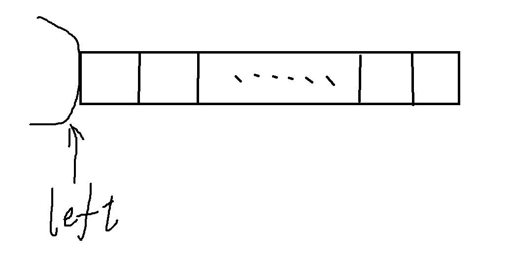
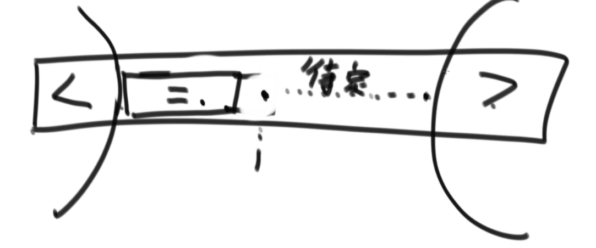
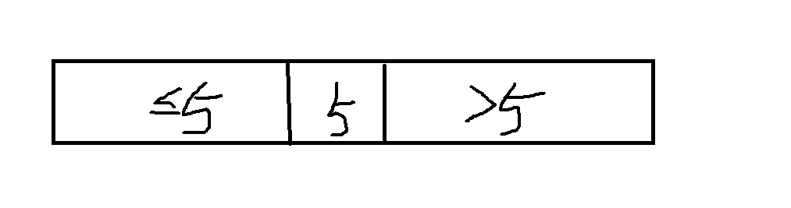
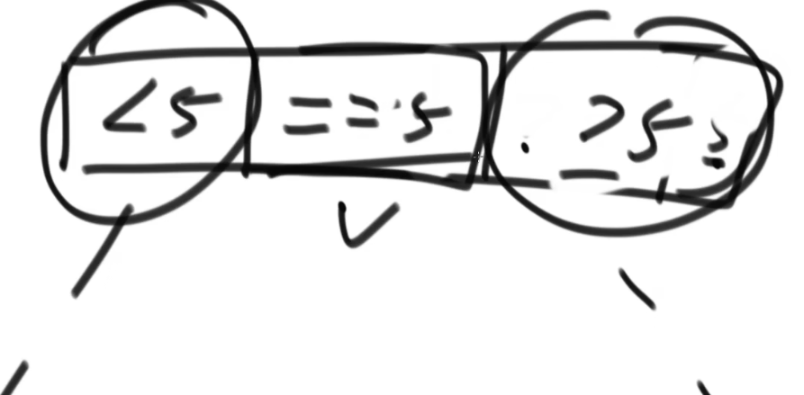

### 一、问题一

给定一个数组arr，和一个数num，请把小于等于num的数放在数组的左边，大于num的数放在数组的右边。要求额外空间复杂度为O(1),时间复杂度O(N)

思路：设定一个指针left，其用来指向 <=num部分数组的下一个位置。从0开始遍历整个数组，一旦当前数 <=num，将其(arr[i])与arr[left]进行交换 ,接着 i++ ，left++；如果当前数 > num，则只有 i++

如下图：left区域在逐渐”吞噬“数组



举例：数组[3,5,6,7,4,3,5,8],num = 5

1. i = left =0 , arr[0] <= 5。swap(arr[0],arr[0])   arr= [3,5,6,7,4,3,5,8]
2. i = left= 1,arr[1] <= 5。 swap(arr[1],arr [1])   arr= [3,5,6,7,4,3,5,8]
3. i = left= 2, arr[2] > 5。 arr= [3,5,6,7,4,3,5,8]
4. i = 3 , left= 2， arr[3] > 5     arr= [3,5,6,7,4,3,5,8]
5. i = 4， left= 2 ，arr[4]<=5。 swap(arr[4],arr[2])    arr= [3,5,4,7,6,3,5,8]
6. i = 5 , left= 3，arr[5]<=5。swap(arr[5],arr[3])     arr= [3,5,4,3,6,7,5,8]
7. i = 6，left= 4，arr[6]<=5。swap(arr[6],arr[4])   arr = [3,5,4,3,5,7,6,8]

```go
package quickSort

// 将数组arr中小于等于target统一移动到左半区域，右半区域都是大于target的数字
func DiscreteSort(arr []int, target int) {
	process(arr, target)
}

func process(arr []int, target int) {
	leftIndex := 0
	for i := 0; i < len(arr); i++ {
		if arr[i] <= target {
			swap(&arr[leftIndex], &arr[i])
			leftIndex++
		}
	}
}

func swap(a, b *int) {
	temp := *a
	*a = *b
	*b = temp
}
```


### 二、问题二(荷兰国旗)

给定一个数组arr，和一个数num，请把小于num的数放在数组的左边，等于num的放在中间，大于num的数放在数组的右边。要求额外空间复杂度为O(1),时间复杂度O(N)


思路：需要有左右两个区域， < num区域（left）和 > num区域(right)。left指向左区域的下一个，right指向右区域的上一个。

1. 如果arr[i]<num，则swap(arr[i],arr[left]) ,i++  left++
2. 如果arr[i]=num，则i++
3. 如果arr[i]>num，则swap(arr[i],arr[right]),right--



如图：如果是情况2，则只是=区域在右扩；如果是情况3，则只是>区域在左扩；如果是情况1，则可以看作是<区域在推动=区域在前进(=区域的首元素被换到尾部，原来的尾元素被<区域"吞噬")

```go
package quickSort

func DutchFlag(arr []int, target int) {
	process2(arr, target)
}

func process2(arr []int, target int) {
	leftIndex := -1
	rightIndex := len(arr)
	i := 0

	for {
		if i >= rightIndex { // 右区域必然都是比target大的数字，没有继续向下遍历的必要(重要：这里的rightIndex从len(arr)开始，因此是≥)
			break
		}
		//if i == len(arr) {
		//	break
		//}
		if arr[i] < target {
			leftIndex++
			swap(&arr[i], &arr[leftIndex])
			i++ // 可以 i++ , 因为左侧区域的数字都已经经过检测(因为整体是从左向右遍历的)，必定位于 <= target区域。
		} else if arr[i] == target {
			i++
		} else {
			rightIndex--
			swap(&arr[i], &arr[rightIndex])
			//i++     // 这里不能有 i++ , 因为从右侧区域并没有进行过检测，因此移动过来的数字可能不在 <= target 范围内
		}
	}

}
```


### 三、快速排序法1.0

加入待排序的数组为arr = [3,5,6,7,4,3,8,5]，那么将此数组的最后一个元素arr[n-1] = 5作为num，对arr[0:n-2]采用问题一同样的方法进行分区，<= num的排到前面，> num的排到后面。完成此次排序之和，将>num区域的第一个元素与arr[n-1]进行交换，效果如下：



完成本次移动之后，采用递归的方法分别对<=5区域和>5区域采用相同的方法进行移动(采用个分区的**最后一个元素作为num**)

递归完成后，可以得到一个有序数组

```go
package quickSort

func QuickSort1(arr []int) {
	left := 0
	right := len(arr) - 1
	sort1(arr, left, right)
}

func sort1(arr []int, left, right int) {
	if left >= right { // 区域最多只有一个元素，无需进行排序
		return
	}

	leftIndex := left
	rightIndex := right - 1
	target := arr[right]
	i := left // i从区域的最左侧开始

	// 先将整个数组分割为两个区域：1.小于等于arr[right]的  2.大于arr[right]的
	for {
		if i > rightIndex {
			swap(&arr[right], &arr[rightIndex+1]) // 分割完成，将arr[right]与大于区域的第一个数进行交换(扩大小于等于区域)
			break
		}
		if arr[i] <= target {
			swap(&arr[i], &arr[leftIndex])
			i++
			leftIndex++
		} else {
			swap(&arr[i], &arr[rightIndex])
			//i++
			rightIndex--
		}
	}
	sort1(arr, left, leftIndex-1)   // 对小于等于区域进行递归分区
	sort1(arr, rightIndex+2, right) // 对大于区域进行递归分区

}
```


### 四、快速排序法2.0

思路基本与1.0相同，只不过采用了问题二(荷兰国旗)的分区思想，新增了=5的区域，最后一个作为num的数在完成本次区域划分、元素交换之和，依旧与>num区域的第一个元素进行交换。

接着分别对<num区域和>num区域进行递归划分。。。

相比于1.0版本，因为不需要对=num区域进行递归，因此计算量有所下降。



```go
package quickSort

func QuickSort2(arr []int) {
	left := 0
	right := len(arr) - 1
	sort1(arr, left, right)
}

func sort2(arr []int, left, right int) {
	if left >= right { // 区域最多只有一个元素，无需进行排序
		return
	}

	leftIndex := left
	rightIndex := right - 1
	target := arr[right]
	i := left

	// 先将整个数组分割为三个区域：1.小于arr[right]的 2.等于arr[right]的  3.大于arr[right]的
	for {
		if i > rightIndex {
			swap(&arr[right], &arr[rightIndex+1]) // 分割完成，将arr[right]与大于区域的第一个数进行交换(扩大等于区域)
			break
		}
		if arr[i] < target {
			swap(&arr[i], &arr[leftIndex])
			i++
			leftIndex++
		} else if arr[i] == target {
			i++
		} else {
			swap(&arr[i], &arr[rightIndex])
			//i++
			rightIndex--
		}
	}
	sort2(arr, left, leftIndex-1)   // 对小于区域进行递归分区
	sort2(arr, rightIndex+2, right) // 对大于区域进行递归分区

}
```


### 五、快速排序法的时间复杂度

如果每次num都能刚好落在区域的中位数，那么时间复杂度将是O(N*logN)，随着num的逐渐向两侧偏移，复杂度将会从O(N *logN)想着O(N^2)的方向恶化。

```go
package quickSort

import (
	"math/rand"
	"time"
)

func QuickSort3(arr []int) {
	left := 0
	right := len(arr) - 1
	sort3(arr, left, right)
}

func sort3(arr []int, left, right int) {
	if left >= right {
		return
	}
	leftIndex := left
	rightIndex := right - 1
	i := left

	targetIndex := getRandomTarget(arr, left, right) // 从当前区域中获取随机获取一个数作为target
	swap(&arr[targetIndex], &arr[right])             // 将该数与区域的最后一个数进行交换
	target := arr[right]

	for {
		if i > rightIndex {
			swap(&arr[right], &arr[rightIndex+1])
			break
		}
		if arr[i] < target {
			swap(&arr[i], &arr[leftIndex])
			leftIndex++
			i++
		} else if arr[i] == target {
			i++
		} else {
			swap(&arr[i], &arr[rightIndex])
			rightIndex--
		}
	}

	sort3(arr, left, leftIndex-1)
	sort3(arr, rightIndex+2, right)

}

func getRandomTarget(arr []int, left, right int) int {
	rand.Seed(time.Now().UnixNano())
	if left >= right {
		return right
	}
	index := rand.Intn(right-left+1) + left

	return index
}
```


### 六、针对`num`优化的快排3.0

由于快排算法时间复杂度高低取决于num选择的好坏，因此快排3.0的做法是每次进行分区前先从整个arr数组中随机选择一个数，将其与arr[n-1]（或者是当前分区的最后一个元素）进行交换，然后采用快排2.0进行排序。

**由于num的选择引入了随机，变相的优化了快排算法，最后根据数学期望，可以让快排3.0的时间复杂度变为O(N*logN)**

### 七、快速排序法的空间复杂度

最差的情况：每次选取的num都是最大值，这样子递归的深度就是 N。需要连续开辟N次栈空间。

最好的情况：每次选取的num都是中点值，这样子递归的深度就是logN。需要连续开辟logN次栈空间。


快速排序3.0 平均之后，**平均的空间复杂度就是 logN**