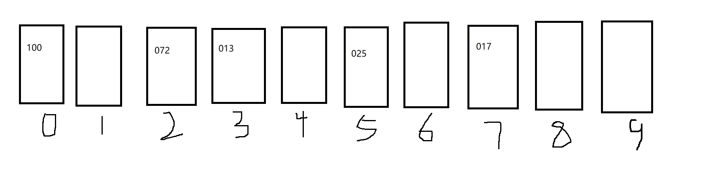
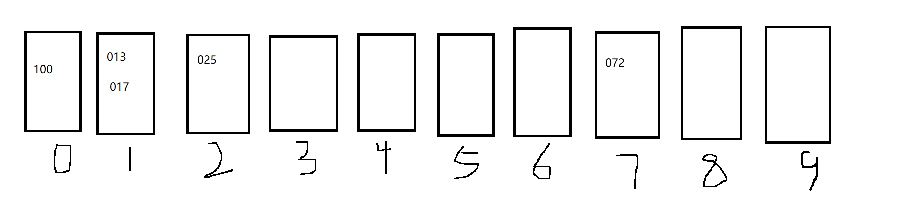
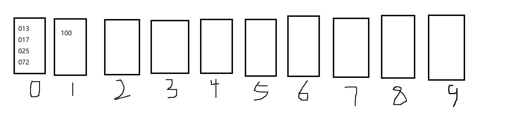

## 一些不基于比较的排序

### 一、计数排序(`hashMap`)

​	计数排序的思想如下：

​	现在我们要对公司内所有员工的年龄进行一个排序，因为每个员工的年龄是有上下限的，年龄必须位于[0,200]之间。要实现这个年龄数组的排序，我们可以设置一个辅助数组，长度为200，arr[0] ~ arr[200]。

​	遍历每一个员工的年龄，将对应年龄下标的arr[i]++。例如，现在有4个20岁的员工，那么arr[20] 最终就 == 4。	遍历完整个年龄数组之后，我们再遍历arr数组，如果arr[i] = j ，那么就打印j次arr[i]。这样我们最终也可以得到排序完成的年龄数组。

​	整个计数排序的时间复杂度为 O(N)

```go
package nonComparativeSort

func CountingSort(arr []int) {
	var maxValue int = 100              // 测试用数组中每个元素的最大值
	sortArr := make([]int, 0, len(arr)) // 存储最终排序完成的数组(升序)
	countArr := make([]int, maxValue)   // 计数用哈希表
	for _, v := range arr {             // 遍历原始数组，每遇到一个数字，将其在hash表中对应的出现次数+1
		countArr[v]++
	}
	for num, count := range countArr { // num表示一个元素，count表示该元素在arr数组中出现的次数
		if count <= 0 {
			continue
		} else {
			for j := 0; j < count; j++ { // 将这count个num追加到sortArr中
				sortArr = append(sortArr, num)
			}
		}
	}

	for i, v := range sortArr {
		arr[i] = v
	}

}
```


### 二、基数排序(桶排序)

​	如果我们要对一个**十进制**数组进行排序，那么我们需要实现准备好**十个**容器，这些容器叫做“桶”。桶的实现可以是数组、链表。。但必须满足"**先进先出**"的原则(队列)

​	假设我们要进行排序的数组是：arr = [17,13,25,100,72]   

1. 将所有数字存储为字符串
2. 找出具有最多位数(字符串长度最长)的数，这里是100，因为他占三位，其余数字都占2位
3. 接着将其余数前面填0与最长数进行补齐，补齐后的数组应该是 ： [017,013,025,100,072]
3. 第一次入桶：因为我们有十个桶，桶的编号设置为 0~9。从数的个位开始，将对应编号的数字放到对应的桶中：



5. 第一次出桶：从0号桶开始，开始取数，每个桶按照先进先出原则进行取，取完之后的新数组为：[100,072,013,025,017]
6. 第二次入桶：按照数字的十位数进行入桶：



7. 第二次出桶：取完之后的新数组为：[100,013,017,025,072]
8. 第三次入桶：按照数字的百位数进行入桶：



9. 第三次出桶：取完之后的新数组为：[013,017,025,072,100]

```go
package nonComparativeSort

import (
	"fmt"
	"strconv"
)

const (
	baseNum = 10 // 默认要统计的数组元素都是十进制
)

func BucketSort(arr []int) {

	strArr := make([]string, 0, len(arr))
	eleMaxLen := 0            // 位数最多元素的位数
	for _, ele := range arr { // 将arr数组转化为各元素数值相等的字符串数组
		eleStr := fmt.Sprintf("%d", ele)
		if len(eleStr) > eleMaxLen {
			eleMaxLen = len(eleStr)
		}
		strArr = append(strArr, eleStr)
	}

	// 将其余各元素的位数补齐至eleMaxLen位(前方补0)
	for index, eleStr := range strArr {
		eleLen := len(eleStr)
		diff := eleMaxLen - eleLen
		if diff != 0 {
			for i := 0; i < diff; i++ {
				strArr[index] = "0" + strArr[index] // 重要：修改的是strArr[index]，而非eleStr
			}
		}
	}

	buckets := make([][]string, baseNum) // 事先创建与进制数量相等的 "桶(bucket)"

	for i := eleMaxLen - 1; i >= 0; i-- { // 循环次数 == 位数最多元素的位数  (从最低位开始--- 重要：元素的最高位是位数的最低位)
		for _, eleStr := range strArr { // 第一次遍历，将所有元素 "入桶"
			bucketNum, _ := strconv.ParseInt(string(eleStr[i]), baseNum, 32) // 找到当前位需要存放的bucket的编号
			buckets[bucketNum] = append(buckets[bucketNum], eleStr)
		}
		// 将所有元素从桶中排出（每个桶都要按照先进先出的原则），完成i位的排序
		strArr = make([]string, 0, len(arr))
		for index, bucket := range buckets {
			strArr = append(strArr, bucket...)
			buckets[index] = []string{} // 重要：对应的桶清空上一次的缓存
		}
	}

	// 完成排序，将元素从字符串转换回数字形式
	for i, eleStr := range strArr {
		ele, _ := strconv.ParseInt(eleStr, baseNum, 32)
		arr[i] = int(ele)
	}

}
```


### 三、基于前缀和实现桶排序

该方法的复杂度不会改变，只是在程序实现上对桶排序算法做了优化：

1. 首先，我们需要准备一个辅助数组bucket，辅助数组的大小和待排序数组的大小相等
2. 查看待排序数组中所有数字的个位数，用一个额外的数组（该数组的长度固定，如果是十进制数字的排序，那么长度为10）存储个位出现的次数，比如：待排序的数组为 arr = [013,021,011,052,062]。那么额外数组将是：count = [0,2,4,5,5,5,5,5,5,5]，这是一个前缀和数组，count[1] = 2表示个位数 <= 1的有2个，count[2] = 4 表示个位数 <= 2 的有4个
3.  接着，我们需要从后往前遍历待排序数组arr。
   1. 从arr[4] = 062开始，因为个位数 == 2，而 count[2] == 4，所以我们让 bucket[4-1] = 062**（4-1的原因：因为个位数小于等于2的一共只有4个，也就是分布在0~3上，因此我们将位于原数组最后的元素放在这个3位置上，相当于实现了一种先进先出、后进后出的方式），接着让count[2] --（这一步就相当于入桶再出桶操作）**；
   2. arr[3] = 052，个位数依旧是2，此时count[2] == 3，所以bucket[3-1] = 052，count[2]--；
   3. arr[2] = 011，个位数为1，此时count[1] =2,所以bucket[2-1] = 011，count[1]--；
   4. arr[1] = 021，个位数为1，此时count[1] = 1,所以bucket[1-1] = 021，count[1]--；
   5. arr[0] = 013，个位数为3，此时count[3] = 5,所以bucket[5-1] = 013，count[3]--;
   6. 完成一轮，此时bucket = [021,011,052,062,013]。可以看到数组根据每个元素个位数的大小完成了排序
   7. 用bucket数组去更新arr数组
4. 重复步骤2（但是count数组存储的不再是个位数的前缀和，而是十位数的前缀和），然后再重复步骤3，完成按照十位数的排序
5. 重复步骤2（但是count数组存储的不再是十位数的前缀和，而是百位数的前缀和），然后再重复步骤3，完成按照百位数的排序

```go
package nonComparativeSort

import (
	"fmt"
	"strconv"
)

func ImprovedBucketSort(arr []int) {
	strArr := make([]string, 0, len(arr))
	eleMaxLen := 0            // 位数最多元素的位数
	for _, ele := range arr { // 将arr数组转化为各元素数值相等的字符串数组
		eleStr := fmt.Sprintf("%d", ele)
		if len(eleStr) > eleMaxLen {
			eleMaxLen = len(eleStr)
		}
		strArr = append(strArr, eleStr)
	}

	// 将其余各元素的位数补齐至eleMaxLen位(前方补0)
	for index, eleStr := range strArr {
		eleLen := len(eleStr)
		diff := eleMaxLen - eleLen
		if diff != 0 {
			for i := 0; i < diff; i++ {
				strArr[index] = "0" + strArr[index] // 重要：修改的是strArr[index]，而非eleStr
			}
		}
	}

	// 从这里开始改进算法
	bucket := make([]string, len(strArr)) // 代替桶的临时数组
	count := make([]int, baseNum)         // 前缀和数组

	for i := eleMaxLen - 1; i >= 0; i-- { // 从个位开始，进行排序

		for index, _ := range count { // 重要：每一轮运行前，清空前缀和数组count
			count[index] = 0
		}

		for _, eleStr := range strArr { // 第一次遍历待排序数组(顺序无所谓)，填充前缀和数组count
			bitCount, _ := strconv.ParseInt(string(eleStr[i]), baseNum, 32)
			for j := int(bitCount); j < len(count); j++ { //
				count[j]++
			}
		}

		for k := len(strArr) - 1; k >= 0; k-- { // 第二次遍历(必须从后往前)，相当于同时完成了入桶+出桶
			bitCount, _ := strconv.ParseInt(string(strArr[k][i]), baseNum, 32)
			suffixCount := count[bitCount]
			bucket[suffixCount-1] = strArr[k] // 等价于有桶的后进后出(后进桶的排在后面)
			count[bitCount]--
		}
		// 相当于完成了一轮 针对一位的排序。用bucket更新strArr
		for index, eleStr := range bucket {
			strArr[index] = eleStr
		}

	}

	// 完成排序，将元素从字符串转换回数字形式
	for i, eleStr := range strArr {
		ele, _ := strconv.ParseInt(eleStr, baseNum, 32)
		arr[i] = int(ele)
	}

}
```

