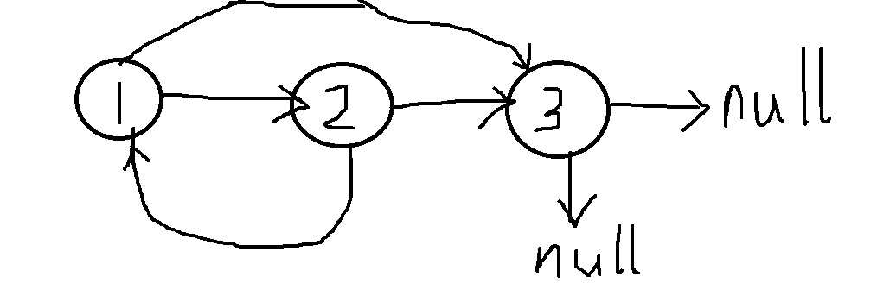
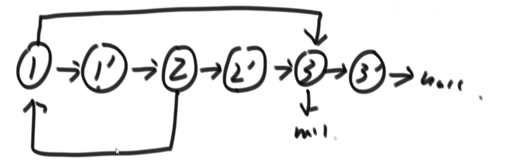
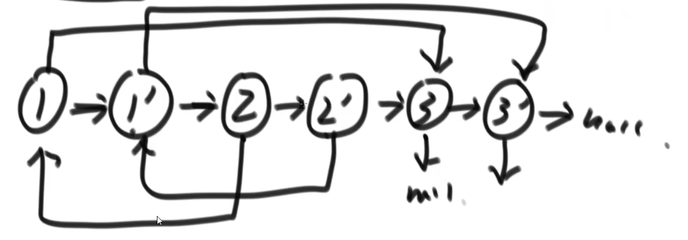
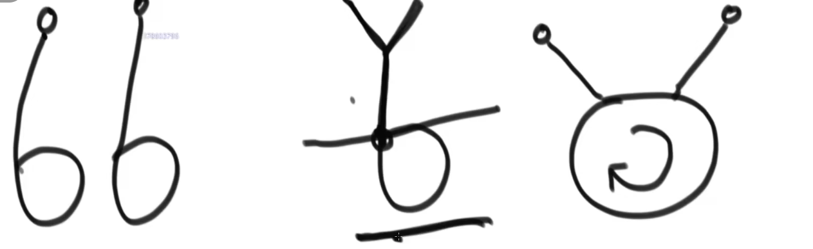

### 一、反转单向和双向链表

题目：分别实现反转单向链表(http://c.biancheng.net/view/8105.html)和反转双向链表(https://www.techiedelight.com/zh/reverse-doubly-linked-list/)的函数

要求：如果链表长度为N，时间复杂度要求为O(N)，额外空间复杂度要求为O(1)

```go
package linkList

import "fmt"

type Node struct {
	Data interface{}
	Next *Node
}

type LinkList struct {
	Head *Node // 头指针
	Len  int   // 链表长度
}

func NewLinkList() *LinkList {
	return &LinkList{
		Head: nil,
		Len:  0,
	}
}

// 尾插法
func (ll *LinkList) TailAdd(data interface{}) *Node {
	node := new(Node)
	node.Data = data
	node.Next = nil

	if ll.Head == nil {
		ll.Head = node
		ll.Len++
		return node
	}
	var current *Node = ll.Head
	for {
		if current.Next == nil {
			current.Next = node
			ll.Len++
			break
		}
		current = current.Next
	}
	return node
}

// 删除链表尾部元素,并且返回该元素值
func (ll *LinkList) TailDel() interface{} {
	if ll.Len == 1 {
		data := ll.Head.Data
		ll.Head = nil
		ll.Len--
		return data
	}
	var current *Node = ll.Head
	for {
		if current.Next.Next == nil {
			data := current.Next.Data
			current.Next = nil
			ll.Len--
			return data
		}
		current = current.Next
	}
}

func (ll *LinkList) HeadAdd(data interface{}) {
	node := new(Node)
	node.Data = data
	node.Next = nil

	if ll.Head == nil {
		ll.Head = node
		ll.Len++
		return
	}
	node.Next = ll.Head
	ll.Head = node
	ll.Len++
}

func (ll *LinkList) Print() {
	if ll.Head == nil {
		fmt.Println("当前链表为空....")
		return
	}
	var current *Node = ll.Head
	for {
		if current == nil {
			fmt.Println("\n链表长度为:", ll.Len)
			break
		} else {
			fmt.Printf("%v ", current.Data)
			current = current.Next
		}

	}
}

func CloneLinkList(ll *LinkList) *LinkList {
	newll := NewLinkList()
	current := ll.Head
	if current == nil {
		return newll
	}
	for {
		if current == nil {
			break
		}
		newll.TailAdd(current.Data)
		current = current.Next
	}
	return newll
}

// 1.迭代翻转链表
func (ll *LinkList) Reverse1() {
	if ll.Len <= 1 { // 没有翻转的必要
		return
	}
	var beg *Node = nil
	mid := ll.Head
	end := ll.Head.Next

	for {
		mid.Next = beg // 链表指向反转

		if end == nil {
			break
		}

		beg = mid // 三个指针依次往后移动一位
		mid = end
		end = end.Next
	}
	ll.Head = mid // 重新修正头指针指向
}

// 递归翻转链表
func (ll *LinkList) Reverse2() {
	if ll.Len <= 1 { // 没有翻转的必要
		return
	}
	newHead := Recursive_reverse(ll.Head)
	ll.Head = newHead
}

func Recursive_reverse(head *Node) *Node {
	if head.Next == nil { // 边界条件,找到尾节点
		return head
	}
	newHead := Recursive_reverse(head.Next) // 不断递归，直到当前节点的后继结点是尾节点,停止递归

	head.Next.Next = head // 让当前节点的后继节点指向自己
	head.Next = nil       // 因为后继节点已经指向自己，所以自己不必再指向后继节点

	return newHead // newHead在递归过程中不会发生变化，永远指向尾节点(反转后的新头结点)
}

// 头插法反转链表
func (ll *LinkList) Reverse3() {
	if ll.Len <= 1 { // 没有翻转的必要
		return
	}
	newLinkList := NewLinkList()
	current := ll.Head
	for { // 从头到尾遍历原始链表，读取到的节点以头插法插入到新的反向链表中
		if current == nil {
			break
		}
		newLinkList.HeadAdd(current.Data)
		current = current.Next
	}
	ll.Head = newLinkList.Head
}

// 就地逆置法反转链表
func (ll *LinkList) Reverse4() {
	if ll.Len <= 1 { // 没有翻转的必要
		return
	}

	beg := ll.Head
	end := beg.Next

	for {
		if beg.Next == nil {
			break
		}
		beg.Next = end.Next // 将end剥离，移动到首部
		end.Next = ll.Head  // end的next更新为头结点
		ll.Head = end       // 头指针指向end

		// beg = beg.Next // 重点：beg总是指向一个节点，那就是最初的头结点
		end = beg.Next // 更新循环变量end
	}
}
```


### 二、打印两个有序链表的公共部分

题目：给定两个有序链表的头指针`head1`和`head2`，打印两个链表的公共部分

要求：如果两个链表的长度之和为N，时间复杂度要求为O(N)，额外空间复杂度要求为O(1)

> 思路：分别从`head1`和`head2`出发，如果指针指向的节点数值相等则打印；如果`head1`指向元素大于`head2`，那么`head2++`，`head1`不变，也就是说两链指针指向数相比，小数值的链指针++

```go
package linkList

import "fmt"

const (
	TypeInt = iota
	TypeFloat
	TypeString
)

func PublicSection(l1, l2 *LinkList) {
	l1current := l1.Head
	l2current := l2.Head
	commonSection := make([]interface{}, 0)
	if l1current == nil || l2current == nil {
		fmt.Println("没有公共部分")
		return
	}
	for {
		if l1current == nil || l2current == nil {
			break
		}
		compare := NodeDataCompare(l1current.Data, l2current.Data, TypeInt)
		if compare == 0 {
			commonSection = append(commonSection, l1current.Data)
			l1current = l1current.Next
			l2current = l2current.Next
		} else if compare == -1 {
			l1current = l1current.Next
		} else if compare == 1 {
			l2current = l2current.Next
		} else {
			panic("链表节点数据段类型不匹配")
		}
	}

	fmt.Printf("公共部分为：%v", commonSection)
}

func NodeDataCompare(d1, d2 interface{}, dataType int) int {
	switch dataType {
	case TypeInt:
		data1, _ := d1.(int)
		data2, _ := d2.(int)
		if data1 == data2 {
			return 0
		} else if data1 < data2 {
			return -1
		} else {
			return 1
		}
	case TypeFloat:
		data1, _ := d1.(float32)
		data2, _ := d2.(float32)
		if data1 == data2 {
			return 0
		} else if data1 < data2 {
			return -1
		} else {
			return 1
		}
	case TypeString:
		data1, _ := d1.(string)
		data2, _ := d2.(string)
		if data1 == data2 {
			return 0
		} else if data1 < data2 {
			return -1
		} else {
			return 1
		}
	default:
		return 2
	}
}
```


### 三、判断一个链表是否为回文结构

题目：给定一个单链表的头节点head，请判断该链表是否为回文结构

例子：1->2->1，返回true；1->2->2->1，返回true；15->6->15，返回true；1->2->3，返回false

要求：如果链表长度为N，则时间复杂度需要达到O(N)

> 思路：准备一个额外的长度为N的栈，将整个单链表的元素从前往后压入栈中。接着再进行出栈，第i次出栈的元素分别和原始链表的第i个节点的数值进行比较。如果直到所有元素出栈也没有出现数值不相等的情况，则说明这是一个回文结构

新要求：要求额外的空间复杂度为O(1)

> 新思路：使用快慢指针来辅助，快指针一次移动递增两次，慢指针一次移动只递增一次。当快指针指向链表尾部时，慢指针刚好指向链表中间节点。
>
> 现在我们可以获得：头节点指针、尾节点指针、中间节点指针。我们从尾部节点开始到中间节点，反转链表的指向，然后分别从头、尾指针开始，分别向后(前)遍历，如果直到双方遍历到中间节点也没有出现节点数值不相等的情况，说明这是一个回文结构。
>
> 这样的新思路中，我们没有使用任何额外的辅助空间。但是时间复杂度却没有增长。

```go
package linkList

type Stack struct {
	Head  int           // 栈顶指针
	Len   int           // 当前栈大小
	Items []interface{} // 实现栈的底层切片
}

func NewStack() *Stack {
	return &Stack{
		Head:  0,
		Len:   0,
		Items: make([]interface{}, 0),
	}
}

func (s *Stack) Push(data interface{}) {
	s.Items = append(s.Items, data)
	s.Len++
	s.Head++
}

func (s *Stack) Pop() interface{} {
	if s.Len == 0 {
		return nil
	}
	s.Len--
	s.Head--
	data := s.Items[s.Head]
	s.Items = s.Items[0:s.Head] // 重要：底层数组删除这个被弹出的元素
	return data
}

func (s *Stack) Top() interface{} {
	if s.Head == 0 {
		return nil
	} else {
		return s.Items[s.Head-1]
	}
}

func IsNotPalindrome(ll *LinkList) bool {
	s := NewStack()

	if ll.Len < 2 {
		return false
	}
	current := ll.Head
	for { // 第一次循环，将链表从头到尾的节点数据压入到栈中
		if current == nil {
			break
		}
		s.Push(current.Data)
		current = current.Next
	}
	current = ll.Head
	for { // 第二次循环，判断原链表是否是回文结构
		if current == nil { // 全部相等，则链表为回文结构
			return true
		}
		data := s.Pop()
		if NodeDataCompare(data, current.Data, TypeInt) != 0 { // 比较栈弹出的元素和链表当前节点数据是否相等
			return false // 一旦不相等，返回false
		}
		current = current.Next
	}
}
```

优化版：

```go
package linkList

// 空间复杂度优化，不再使用栈，空间复杂度为O(1)
func IsNotPalindromeImproved(ll *LinkList) bool {
	if ll.Len < 2 {
		return false
	}
	if ll.Len == 2 {
		if ll.Head.Data == ll.Head.Next.Data {
			return true
		} else {
			return false
		}
	}

	slow := ll.Head
	fast := ll.Head

	for { // 第一次循环，让slow指向链表中点，fast指向尾节点
		if fast == nil || fast.Next == nil { // 第一种情况对应链表长度为偶数，第二种情况对应链表为奇数
			break
		}
		slow = slow.Next      // 慢指针一次走一步
		fast = fast.Next.Next // 快指针一次走两步
	}
	newHead := Recursive_reverse(slow) // 从slow开始，让后续链表反转

	left := ll.Head  // 左区域从原始链表头结点开始
	right := newHead // 右区域从反转后链表的头结点(原本的尾节点)开始
	for {
		if left == slow && right == slow { // 左右指针同时到达slow才算比较结束(如果其中一个已经先到达slow,那么它会静止不动)
			return true
		}
		leftData := left.Data
		rightData := right.Data
		if NodeDataCompare(leftData, rightData, TypeInt) != 0 { // 一旦左右指针指向的节点数据不相等，则返回false
			return false
		}
		if left != slow {
			left = left.Next
		}
		if right != slow {
			right = right.Next
		}
	}
}
```

### 四、将单向链表按某值划分为左边小、中间相等、右边大的形式

题目：给定一个单链表的头节点head，节点的值类型是整数，再给定一个整数pivot。实现一个调整链表的函数，将链表调整为左部分都是小于pivot的节点，中间部分都是等于pivot的节点，右部分都是值大于pivot的节点。

> 思路：将链表从头到尾存储的数值按相同顺序存储到一个临时数组中，对数组采用快速排序的方法（荷兰国旗）完成分区，然后将排完序的数组恢复为链表的形式

进阶：再实现原问题功能的基础上增加如下的要求：

1. 调整后所有小于pivot的节点之间的相对顺序和调整前一样
2. 调整后所有等于pivot的节点之间的相对顺序和调整前一样
3. 调整后所有大于pivot的节点之间的相对顺序和调整前一样
4. 时间复杂度为O(N)，额外的空间复杂度为O(1)

> 思路：准备六个额外的指针，分别是：
>
> 1. 小于区域的头指针 LH 
> 2. 小于区域的尾指针 LT
> 3. 等于区域的头指针 EH
> 4. 等于区域的尾指针 ET
> 5. 大于区域的头指针 GH
> 6. 大于区域的尾指针 GT
>
> 开始，所有的指针都指向`nil`。接着从头开始遍历原始链表：如果节点数值小于pivot，则插入到用LH、LT记录的小于链上；如果节点数值等于pivot，则插入到用EH、ET记录的等于链上；如果节点数值大于pivot，则插入到GH、GT记录的大于链上。
>
> 最后，将这三条链再串联起来。
>
> 一个小问题，有时候可能某一区域不存在，在进行连接的时候需要考虑这一问题。

```go
package linkList

import "DataStructure/05.quickSort"

func SeparateLinkList(ll *LinkList, pivot int) {
	if ll.Len < 2 {
		return
	}
	arr := make([]int, 0, ll.Len) // 存储链表数据
	current := ll.Head
	for { // 第一个循环，按照链表原来的顺序，将存储的数据移动到临时数组中
		if current == nil {
			break
		}
		data, _ := current.Data.(int)
		arr = append(arr, data)
		current = current.Next
	}
	quickSort.DutchFlag(arr, pivot) // 采用荷兰国旗分区方法: 左区域小于pivot，中间等于pivot，右边大于pivot
	current = ll.Head
	index := 0
	for { // 第二个循环，利用分区排序后的数组重新更新原始链表
		if current == nil {
			break
		}
		current.Data = arr[index]
		index++
		current = current.Next
	}
}
```

进阶版：

```go
package linkList

func SeparateLinkListImproved(ll *LinkList, pivot int) {
	// 准备6个指针：1.小于区域头/尾指针 LH/LT  2.等于区域头/尾指针 EH/ET  3.大于区域头/尾指针 GH/GT
	var LT, ET, GT *Node
	LH := NewLinkList()
	EH := NewLinkList()
	GH := NewLinkList()

	_ = GT // 此算法实现中没有用到

	current := ll.Head
	for { // 第一个循环，遍历原始链表，生成三条新链(小于链，等于链，大于链)
		if current == nil {
			break
		}
		flag := NodeDataCompare(current.Data, pivot, TypeInt)
		if flag == -1 { // 加入到小于区域
			LT = LH.TailAdd(current.Data)
		} else if flag == 0 { // 加入到等于区域
			ET = EH.TailAdd(current.Data)
		} else if flag == 1 { // 加入到大于区域
			GT = GH.TailAdd(current.Data)
		}
		current = current.Next
	}
	// 将三条链连接起来
	lessLen := LH.Len
	equalLen := EH.Len
	greatLen := GH.Len

	if lessLen != 0 && equalLen != 0 && greatLen != 0 { // 全部存在
		LT.Next = EH.Head
		ET.Next = GH.Head
		ll.Head = LH.Head // 更新原始链表
	} else if lessLen != 0 && equalLen != 0 { // 只有小于等于
		LT.Next = EH.Head
		ll.Head = LH.Head // 更新原始链表
	} else if lessLen != 0 && greatLen != 0 { // 没有等于
		LT.Next = GH.Head
		ll.Head = LH.Head // 更新原始链表
	} else if equalLen != 0 && greatLen != 0 { // 只有大于等于
		ET.Next = GH.Head
		ll.Head = EH.Head // 更新原始链表
	} else if lessLen != 0 { // 全部小于
		ll.Head = LH.Head // 更新原始链表
	} else if equalLen != 0 { // 全部等于
		ll.Head = EH.Head // 更新原始链表
	} else { // 全部大于
		ll.Head = GH.Head // 更新原始链表
	}

}
```

### 五、复制含有随机指针节点的链表

题目：一种特殊的单链表节点类描述如下：

```go
type Node struct{
    value int
    next *Node
	rand *Node
}
```

`rand`指针是单链表节点结构中新增的指针，`rand`可能指向链表中的任意一个节点，也可能指向null。给定一个由Node节点类型组成的无环单链表的头节点指针，请实现一个函数完成这个链表的复制，并返回复制链表的头节点

要求：时间复杂度为O(n)，额外空间复杂度为O(1)

如果整个链表的结构如下：



如果不考虑空间复杂度，可以用哈希表的方式来实现：

> 1.首先新建三个克隆节点，分别克隆节点1、2、3的值
>
> 2.新建一个容量为3的哈希表，key值为原始链表中每个节点的指针，value值为对应克隆节点的指针
>
> 3.遍历原始链表：对于原始节点1，其下一节点为节点2，随机节点为节点3。因此对于克隆节点1来说，下一节点就是克隆节点2（hashMap[2号节点]），随机节点就是克隆节点3（hashMap[3号节点]）。通过这样的方式，我们可以让每一个克隆节点克隆到原始节点的next和rand指针指向哪一个节点。
>
> 4.返回指向克隆节点1的指针。

如果考虑空间复杂度为O(1)，则需要用下面的方法：

> 1.首先新建三个克隆节点，分别克隆节点1、2、3的值
>
> 2.在原节点1、2之间插入克隆节点1；原节点2、3之间插入克隆节点2；原节点3、nil之间插入克隆节点3，如下：



> 3.接着每两个节点为一组，从头开始遍历链表。因为节点1的rand指向节点3，因此`节点1.next`（就是克隆节点1）的rand指向`节点3.next`（就是克隆节点3）；因为节点2的rand指向节点1，因此`节点2.next`（就是克隆节点2）的rand指向`节点1.next`（就是克隆节点1）…………
>
> 4.经过上述步骤就可以完成下面的链表结构：



> 5.最后将3个原节点（奇数点）删除，就可以得到复制的克隆链表

```go
package linkList

import "fmt"

type RNode struct {
	Data   interface{}
	Next   *RNode
	Random *RNode // 指向一个随机的节点(也可能是nil)
}

type SLinkList struct {
	Head *RNode
	Len  int
}

func NewSLinkList() *SLinkList {
	return &SLinkList{
		Head: nil,
		Len:  0,
	}
}

func (sl *SLinkList) TailAdd(data interface{}) *RNode {
	rnode := new(RNode)
	rnode.Data = data
	if sl.Head == nil {
		sl.Head = rnode
		sl.Len++
		return rnode
	}
	current := sl.Head
	for {
		if current.Next == nil {
			break
		}
		current = current.Next
	}
	current.Next = rnode
	sl.Len++
	return rnode
}

func (sl *SLinkList) RandomAdd(src, dest int) *RNode {
	if src > sl.Len || sl.Len == 0 { // 要添加Random指针的节点不存在
		return nil
	}
	srcNode := sl.Head
	for i := 1; i < src; i++ { // 第一个循环，找到要添加Random指针的节点
		srcNode = srcNode.Next
	}
	if dest > sl.Len { // dest节点不存在
		srcNode.Random = nil
		return srcNode
	}
	destNode := sl.Head
	for i := 1; i < dest; i++ { // 第二个循环，找到Random要指向的目标节点
		destNode = destNode.Next
	}
	srcNode.Random = destNode
	return srcNode
}

func (sl *SLinkList) Print() {
	if sl.Len == 0 {
		fmt.Println("链表为空")
	}
	current := sl.Head
	for {
		if current == nil {
			fmt.Println("\n链表长度为:", sl.Len)
			break
		}
		fmt.Printf("%v(rand->%v) ", current.Data, current.Random)
		current = current.Next
	}
}

func CopyLinkListWithRandomP(sl *SLinkList) *SLinkList {
	if sl.Len == 0 {
		return nil
	}

	newsl := NewSLinkList()
	hashMap := make(map[*RNode]*RNode, 0)
	current := sl.Head
	for { // 第一个循环，创建复制节点(只有Data字段被复制)，记录原始节点与复制节点的映射关系
		if current == nil {
			break
		}
		snode := new(RNode)       // 复制当前链表节点
		snode.Data = current.Data // 第一次循环仅复制Data字段
		hashMap[current] = snode  // 记录原始节点与复制节点的映射关系

		current = current.Next
	}
	// 第二个循环，让克隆节点完成next/random指针的复制
	for base, clone := range hashMap {
		clone.Next = hashMap[base.Next]
		clone.Random = hashMap[base.Random]
	}
	newsl.Len = sl.Len
	newsl.Head = hashMap[sl.Head]

	return newsl
}
```

进阶版：

```go
package linkList

// 直接在原始链表上操作。与其说是复制，不如说是剪切
func CopyLinkListWithRandomPImproved(sl *SLinkList) {
	if sl.Len == 0 {
		return
	}

	current := sl.Head
	for { // 第一个循环，为链表的每一个节点创建克隆节点(只有Data字段被复制),并将该克隆节点插入到自己的后继节点之前
		if current == nil {
			break
		}
		snode := new(RNode)       // 复制当前链表节点
		snode.Data = current.Data // 第一次循环仅复制Data字段

		oldNext := current.Next // 原始链表中当前节点的后继节点
		current.Next = snode    // 更改当前节点的后继节点为克隆节点
		snode.Next = oldNext    // 克隆节点的后继节点为oldNext

		sl.Len++

		current = oldNext // 循环变量指向原后继节点oldNext
	}

	index1 := sl.Head      // 指向奇数节点，也就是原链表上的节点
	index2 := sl.Head.Next // 指向偶数节点，也就是克隆出来的节点
	for {                  // 第二个循环，让克隆节点完成random指针的克隆
		if index2.Next == nil {
			break
		}
		if index1.Random == nil {
			index2.Random = nil
		} else {
			index2.Random = index1.Random.Next // 重点：注意这里是 = index1.Random.Next，而不是index1.Random
		}
		index1 = index1.Next.Next // 每个指针都是每次移动两次
		index2 = index2.Next.Next
	}

	// 第三次循环，如果是奇数节点则从链表删除
	current = sl.Head
	index := 1 // 区分奇偶节点
	for {
		if current.Next == nil { // 最后一个偶数节点，同时也是扩充后的最后一个节点
			break
		}
		if index == 2 { // 删除第一个奇数节点
			sl.Head = current
			sl.Len--
		}
		if index%2 == 0 { // 对偶数节点进行处理,删除其后面的奇数节点
			current.Next = current.Next.Next
			sl.Len--
			index++ // 因为下一个节点被删除了，相当于他已经被访问了,因此index+1(此时的index必然是奇数)
		}
		current = current.Next // 重要：这里实际上是一次跳跃了两个(只有第一次是例外,第一次仅跳跃了一步)
		index++
	}
}
```

### 六、两个单链表相交的一系列问题

题目：给定两个可能有环也可能无环的单链表，头结点`head1`和`head2`。请实现一个函数，如果两个链表相交，请返回相交的第一个节点。如果不相交，返回nil

要求：如果两个链表长度之和为N，时间复杂度请到达O(N)，额外的空间复杂度为O(1)

> 第一个问题：如何判断一个链表是否有环？（https://blog.csdn.net/a778129656/article/details/128148073）
>
> 解决这个问题基本上有两种方式：
>
> 方式一：路径记录法。使用一个`hashSet`，从头开始遍历整个链表。每遍历到一个节点，先判断当前节点的指针是否已经存在于`hashSet`中，如果不存在就将该节点的指针存入`hashSet`；如果已存在则返回该节点的指针(该指针是入环节点的地址)
>
> 方式二：对于单链表，一旦形成环那么链表将被封闭在这个环中无法出去。因此我们可以遍历整个链表，如果能遍历到下一个节点为nil，那么说明当前链表无环。

对于方式二来说，如果单链表无环还好，但是如果有环那么将无法跳出循环，而且也无法像方式一一样返回第一个入环节点。因此我们对方式二进行改进，如下：

> 采用快慢指针的方法。从单链表头部开始遍历，每次遍历慢指针递增一次，快指针递增两次。如果这是一个无环单链表，那么快指针将最先指向nil；如果这是一个有环链表，快慢指针最终将在环中相遇。
>
> 当快慢指针相遇时，将快指针调整回到单链表头结点处，然后快慢指针继续进行遍历，但是此时快慢指针每次遍历都递增一。最终快慢指针将在链表入环处相遇，此时返回这个入环节点。

在完成单链表有环判断的基础上，我们再来解决相交问题：

```go
判断是否有环：
package linkList

// 为链表添加环（将尾节点的Next指针指向entryPoint个节点上）
func AddCircleForLinkList(ll *LinkList, entryPoint int) {
	if ll.Len <= 1 {
		return
	}
	currentNode := ll.Head
	currentIndex := 1
	var entryNode *Node // 记录entryPoint个节点的地址
	for {
		if currentNode.Next == nil {
			break
		}
		if currentIndex == entryPoint {
			entryNode = currentNode
		}
		currentNode = currentNode.Next
		currentIndex++
	}
	currentNode.Next = entryNode
}

func IsHaveCircle(ll *LinkList) (bool, *Node) {
	if ll.Len <= 1 {
		return false, nil
	}
	if ll.Len == 2 { // 有两个节点的情况
		if ll.Head == ll.Head.Next.Next { // 成环
			return true, ll.Head
		} else { //无环
			return false, nil
		}
	}
	slow := ll.Head // 慢指针，一次走一步（重要：slow与fast必须都从头结点开始）
	fast := ll.Head // 快指针，一次走两步

	for {
		if fast == nil { // 无环的结束条件，fast指向nil
			return false, nil
		}
		if fast == slow && fast != ll.Head { // 有环的结束条件,fast与slow在环上相遇
			break
		}
		slow = slow.Next
		fast = fast.Next.Next
	}
	// 有环，继续寻找入环节点
	fast = ll.Head // 快节点重新回到头结点
	for {
		if fast == slow { //
			return true, fast
		}
		fast = fast.Next // 从头结点开始，每次向后移动一位
		slow = slow.Next // 从相遇节点开始，每次向后移动一位
	}
}
```

#### 6.1 情况一：单链表1、2都无环

这种情况下：

1. 如果两个单链表不相交，那么两个链表是平行的
2. 如果两个单链表相交，必然构成一个`Y`型结构。从相交点开始到尾节点都是两条单链表的公共部分（单链表必然不可能出现`X`型结构，`X`型结构意味着相交点存在两个`next`指针）

因此，寻找公共部分算法的思路是：

> 1. 从头开始遍历单链表1，记录尾节点指针`end1`，链表长度`len1`。
> 2. 从头开始遍历单链表2，记录尾节点指针`end2`，链表长度`len2`。
> 3. 如果`end1 != end2`，那么两条链表必然是不相交的
> 4. 如果`end1 == end2`，那么两条链表存在相交点和公共部分。让两链表重新回到头结点处，假设`len1 == 100 , len2 == 80`，也就是说链表1更长，那么我们让链表1跳转至`start = len1 - len2 `处。接着两条链表分别开始进行遍历，一旦发现遍历节点的地址相同，那么返回该相交节点

#### 6.2 情况二：两个单链表一个有环、一个无环

​	这种情况下，两个单链表不可能出现相交。

#### 6.3 情况三：两个链表都有环

​	在这种情况下：

1. 两个单链表不存在相交
2. 两个链表相交，且入环点是同一个节点
3. 两个链表相交，但是入环点不是同一个

​	三种情况如下图所示，从左到右分别是1、2、3：



如何区分三种情况？

分别找到两个单链表的入环节点。如果两个入环节点地址相等则是情况二；如果不相等，则让其中一个入环节点继续向下遍历，如果在该入环节点重新遍历到自己之前能够遇到另一个入环节点，那么为情况三；否则为情况一。


对于2：入环点相同的情况，可以按照下面的步骤找出相交节点：

> 1. 先找出入环节点，然后让入环节点作为end节点
> 2. 以入环节点作为end节点，问题退化为无环节点的相交问题

对于3：入环点不同的情况，可以随机返回两个入环节点中的任意一个，因为这两个节点都是相交点。

```go
package linkList

func GetIntersectionPoint(l1, l2 *LinkList) *Node {

	flag1, junction1 := IsHaveCircle(l1)
	flag2, junction2 := IsHaveCircle(l2)

	if !flag1 && !flag2 { // 情况一：两个链表都无环
		// 需要获取两个链表的尾节点
		tail1 := GetTailNodeWithinLinkList(l1)
		tail2 := GetTailNodeWithinLinkList(l2)
		if tail1 != tail2 { // 两条线性链表的尾节点不一样，则必然不相交
			return nil
		} else { // 尾节点是一个，必然相交
			return GetLinearJunction(l1, l2)
		}

	} else if flag1 && flag2 { // 情况二：两个链表都有环
		if junction1 == junction2 { // 入环点是同一个
			return GetLinearJunction(l1, l2) // 相交点在两个链表的线性部分，因此可用此方法求相交点
		} else { // 入环点不是同一个，有两种情况：1.两条链表不相交   2.两条链表有两个交点
			return GetCircleJunction(l1, l2, junction1, junction2)
		}
	} else { // 情况三：一个有环，一个无环(不可能相交)
		return nil
	}

}

// 获取链表的尾节点
func GetTailNodeWithinLinkList(ll *LinkList) *Node {
	if ll.Len == 0 {
		return nil
	}
	current := ll.Head
	for {
		if current.Next == nil {
			return current
		}
		current = current.Next
	}
}

// 相交点在两个链表的线性部分
func GetLinearJunction(l1, l2 *LinkList) *Node {
	l1current := l1.Head
	l2current := l2.Head
	// 第一次循环，让长链表的指针先向后移动 abs(l1.Len - l2.Len)步
	if l1.Len > l2.Len {
		for i := 0; i < l1.Len-l2.Len; i++ {
			l1current = l1current.Next
		}
	} else if l1.Len < l2.Len {
		for i := 0; i < l2.Len-l1.Len; i++ {
			l2current = l2current.Next
		}
	}
	// 第二个循环，找到两个线性链表的交点
	for {
		if l1current == l2current {
			return l1current
		}
		l1current = l1current.Next
		l2current = l2current.Next
	}
}

// 相交点在两个链表的环部分
func GetCircleJunction(l1, l2 *LinkList, j1, j2 *Node) *Node {

	l1current := j1.Next
	for {
		if l1current == j1 { //两个入环点不在同一个环上，说明两链表没有交点
			return nil
		}
		if l1current == j2 {
			return j1 // 两个入环点在同一个环上，说明相交。可以随机返回两个入环节点中的任意一个，因为这两个节点都是相交点。
		}
		l1current = l1current.Next
	}
}
```

